# Education Analytics Assistant

An AI-driven analytics workspace for education operations. Operators, academic affairs staff, and managers ask natural-language questions about enrollment, revenue, refunds, completion, attendance, service tickets, and other operational data. The system returns structured answers with charts, tables, metric definitions, generated SQL, and execution trace details.

The project is a full-stack prototype:

- **Backend** — FastAPI service: chat, natural-language-to-SQL analytics, metadata retrieval, and conversation history.
- **Frontend** — React + Vite chat interface: chart rendering, table views, metric explanations, and mobile-friendly layout.
- **Analytics metadata** — configurable business metrics, dimensions, table relationships, deterministic core analytics rules, and semantic retrieval.
- **Demo data generator** — synthetic education-operations data for local development and product demos.

## Screenshots

### Data Analysis

Ask a concrete business question and receive a visual result with supporting table data. This example asks for current-month enrollment.

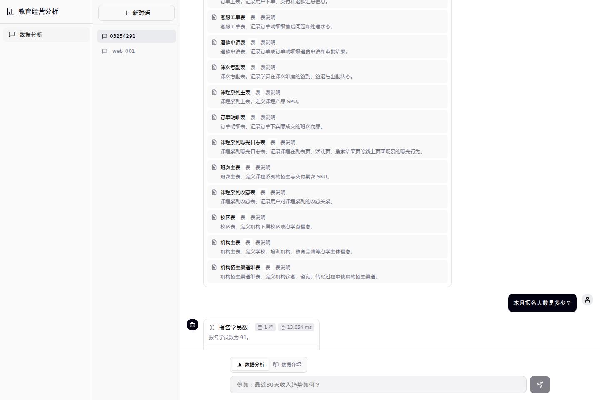

### Revenue Trend

Trend questions render as line charts with the result table preserved below the chart.

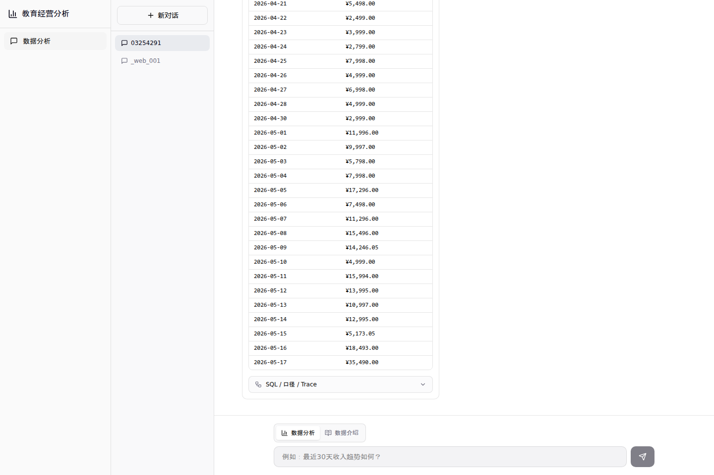

### Campus Ranking

Dimension and ranking questions render as bar charts with sorted rows.

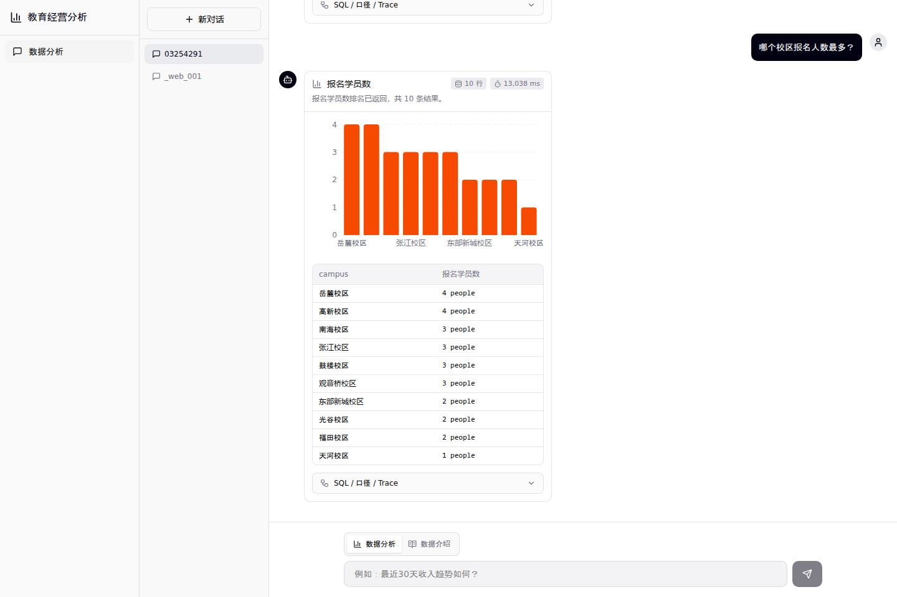

### Completion Trend

Teaching and learning metrics, such as completion rate, use the same traceable analysis flow.

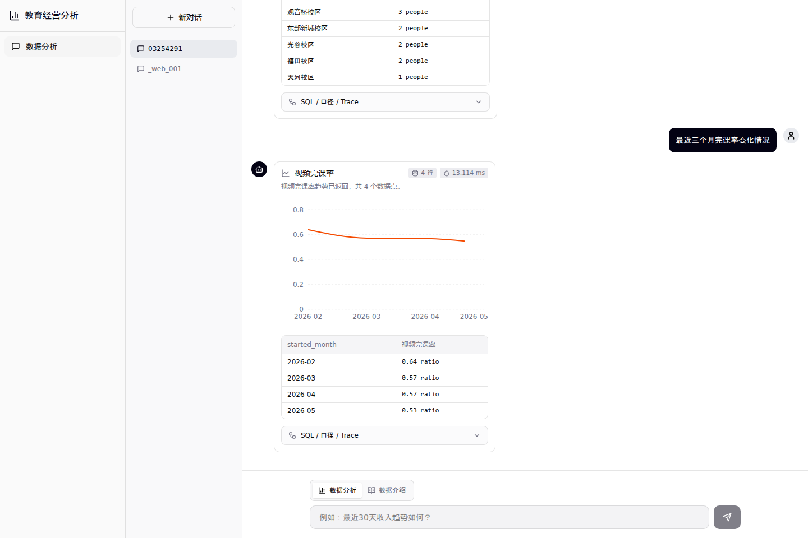

### Refund Metric

Refund-related metrics are returned as structured metric cards and tables.

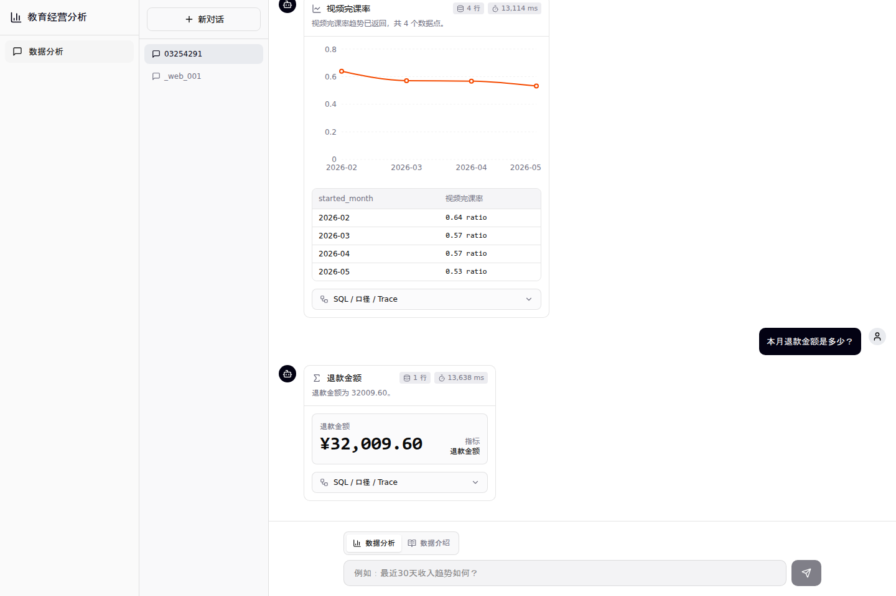

### Core Business Questions

Catalog discovery, refund-rate ranking, renewal comparison, and dimension breakdown questions render in one continuous chat flow.

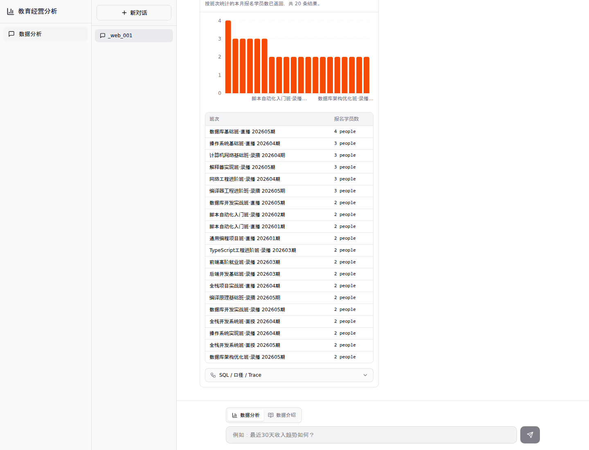

### Data Introduction

Ask what data exists, what metrics mean, or which questions are supported. The system answers from metadata without running SQL.

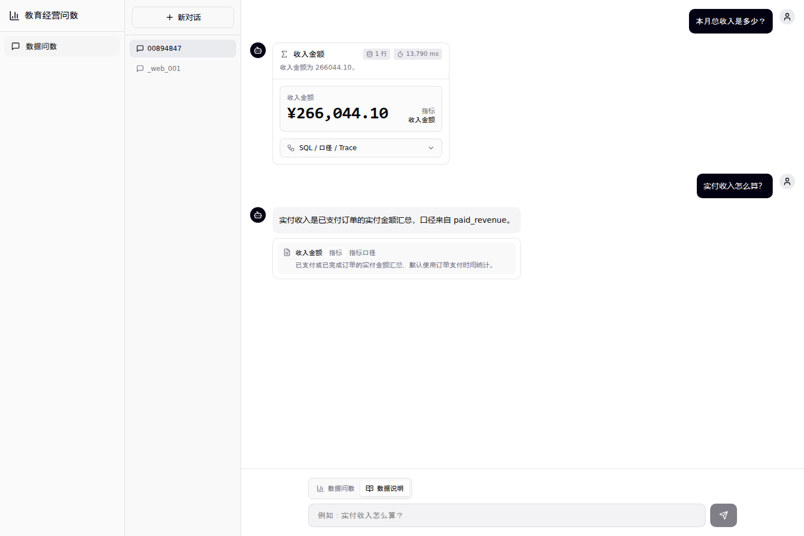

### Automatic Routing

Discovery questions such as "what tables are available?" are routed to data introduction even if the user is currently in analysis mode.

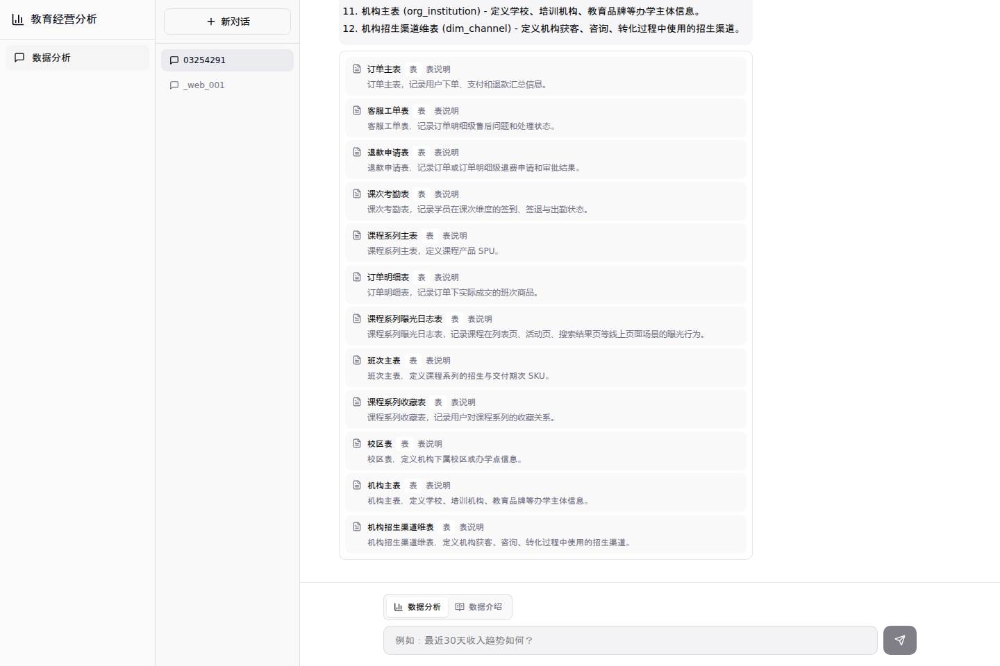

### Multi-turn History

Analysis and introduction answers share the same conversation history and can be restored after refresh.

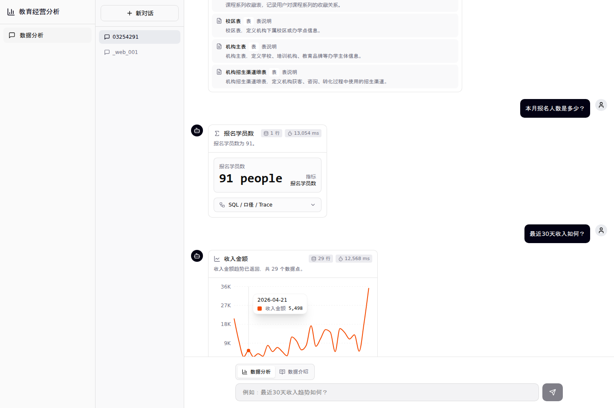

### Trace Panel

Every analysis result keeps SQL, metric lineage, table relationships, assumptions, and execution stages available for inspection.

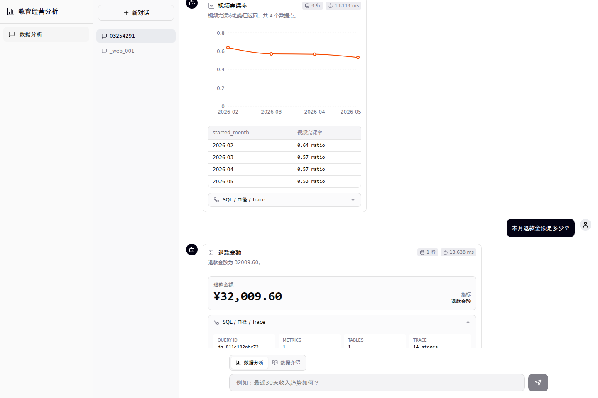

### Mobile Layout

The chat interface remains usable on narrow screens.

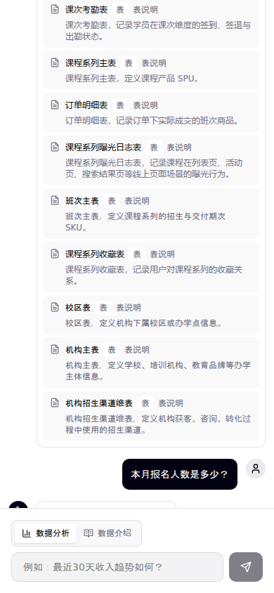

## Capabilities

- **Operational questions** — "What is this month's enrollment?", "How has revenue changed over the last 30 days?", "Which campus has the highest enrollment?", "What is this month's refund amount?", "How has completion rate changed over the last three months?"
- **Multiple result types** — single metric cards, line charts, bar charts, tables, and structured error states.
- **Metric explanations** — definitions, dimensions, fields, table relationships, and recommended analysis directions.
- **Traceable analysis** — generated SQL, metric lineage, joins, assumptions, and execution stages in an expandable debug panel.
- **Persistent history** — conversation blocks (including charts and metadata citations) survive page reload.
- **SQL safety** — unsafe SQL-style user input is blocked before execution.

## Architecture

```text
education_brain_fullstack/
├── education_brain/          # FastAPI backend – analytics pipeline, chat, metadata
├── education_brain_front/    # React/Vite frontend – chat UI, charts, trace panels
├── data_ge/edu-data/         # synthetic demo data generator and metadata definitions
└── assets/readme/            # README screenshots
```

```text
Chat request
  ├─ data-analysis question
  │   ├─ core business rule → SQL validation → query execution → chart / table response
  │   └─ general question → metadata recall → SQL generation → validation → execution → response
  └─ data-introduction question → metadata retrieval → catalog / metric explanation → citations
```

## Modes

### Data Analysis

For questions that need numbers, rankings, trends, or detailed records. Generates and executes read-only SQL.

> "What is this month's total revenue?" · "Show revenue trend for the last 30 days." · "Which campus has the highest revenue?" · "Compare renewal revenue this week and last week." · "Break down this month's enrollment by class cohort."

### Data Introduction

For understanding the data catalog, metric definitions, supported dimensions, and recommended analysis directions. Does not execute SQL.

> "What tables are available?" · "What does paid revenue mean?" · "Which metrics should I monitor every day?" · "What revenue-related questions can I ask?"

### Automatic Routing

Discovery-style questions ("What can I ask?", "What data is available?", "Which metrics should I monitor?") are automatically routed to Data Introduction, even if the user is in analysis mode.

## Tech Stack

| Layer | Technology |
|-------|-----------|
| Backend | Python 3.12, FastAPI, Pydantic |
| Frontend | React 18, Vite, Recharts, Tailwind-style CSS |
| Analytics store | MySQL-compatible |
| Chat history | MongoDB-compatible |
| Vector retrieval | Qdrant-compatible |
| Dimension search | Elasticsearch-compatible |
| LLM | OpenAI-compatible chat completion API |

## Local Development

This repository does not include private credentials or production configuration. Create local environment files from the example files and fill in your own values.

### Backend

```bash
cd education_brain
PYTHONPATH=. knowledge/.venv/bin/uvicorn knowledge.api.app:app --host 0.0.0.0 --port 8000
```

### Frontend

```bash
cd education_brain_front
VITE_API_BASE_URL=http://127.0.0.1:8000 VITE_USE_MOCK=false npm run dev -- --host 127.0.0.1 --port 5173
```

### Frontend Build

```bash
cd education_brain_front
npm test
npm run build
```

## Configuration

The backend requires connection details for: chat history database, analytics SQL database, vector retrieval endpoint, dimension-value search endpoint, embedding endpoint, and an OpenAI-compatible LLM. Copy the `.env.example` files to `.env` and fill in your values. Do not commit real credentials.

## API Surface

Primary endpoints:

- `POST /chat/query`
- `GET /chat/history`
- `POST /analytics/query`
- `GET /analytics/health`
- `GET /analytics/meta/metrics`
- `GET /analytics/meta/columns`
- `GET /analytics/meta/values`

`/chat/query` supports two product modes:

- `data_qa`: data analysis, may generate and execute read-only SQL
- `meta_qa`: data introduction, explains metadata and supported questions

## Verification Snapshot

Recent local verification covered:

- Backend route tests for chat, data analysis, metadata introduction, history, and automatic routing.
- Frontend unit tests and production build.
- Browser-driven flows: enrollment, revenue, refund, completion metrics; line/bar/stat/table/trace rendering; metadata introduction; automatic routing; history restore; mobile viewport.

Core demo questions use deterministic analytics rules where the metric definition is business-critical. Broader ad hoc questions use the metadata-driven SQL pipeline with validation and structured error handling.

## Security Notes

- No real API keys, passwords, or internal endpoints are required in the repository.
- SQL execution is validated; unsafe user input is blocked before execution.
- Data Introduction does not execute SQL.
- LLM trace data is summarized; full prompts and raw responses are not exposed to the frontend.
