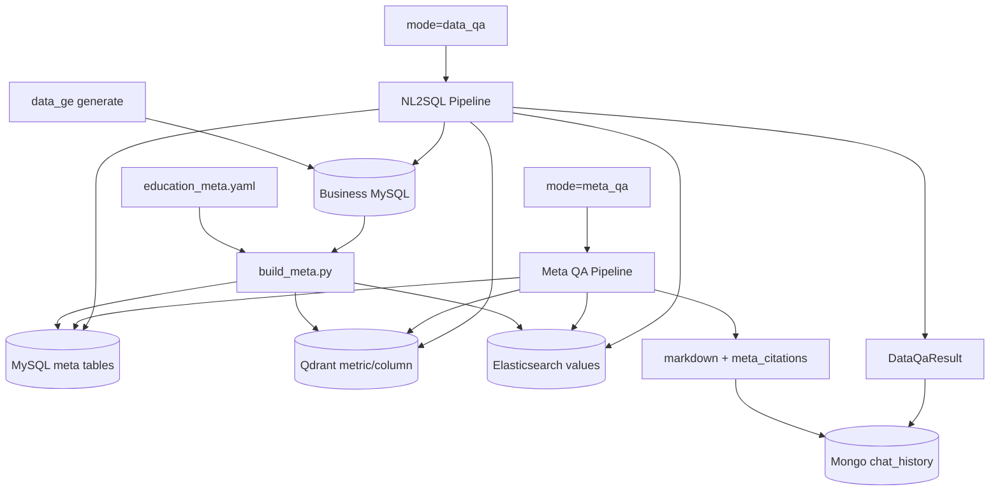

# Iteration 05：数据生成与 Meta QA 整合

> Status: superseded by `../05a-rag-freeze-and-bootstrap/` and `../05b-meta-qa/`.
> 本文件保留为整包设计参考；正式执行以 05A（旧 RAG 清理收束与数据准备标准化）→ 05B（Meta QA）为准。

## 背景

Iteration 04 完成后，旧 RAG 代码已全部删除，`/chat/query mode=data_qa` 已接入聊天体验，前后端真实联调完成。当前系统的数据链路为：

```text
edu-data generate
  -> MySQL 业务数据
  -> build_meta
  -> MySQL meta/metric 表 + Qdrant 语义召回 + ES 维度取值
  -> NL2SQL data_qa
```

本轮在此基础上标准化数据准备流程，并新增 Meta QA 问答模式：围绕数据库结构、指标口径、字段、维度和 join path 做问答。

## 目标

1. 数据准备流程以 `generate` 和 `build_meta` 为标准入口。
2. 增加 `mode=meta_qa`，用于解释”有哪些指标、怎么算、能按什么维度分析、为什么不能问某个口径”。
3. 复用当前 NL2SQL 的元数据资产：MySQL meta 表、Qdrant metric/column collection、ES 维度取值。

## 迭代边界

本轮分为两类工作：

- Task 1-2 是数据准备标准化：固定 `generate` 和 `build_meta` 入口。
- Task 3-7 是新功能：新增 `meta_qa` 模式、后端解释 pipeline、前端渲染、历史持久化和 smoke 门禁。

## 非目标

- 不让 `meta_qa` 查询真实统计值。
- 不让 `meta_qa` 生成 SQL。
- 不做自动意图识别。

## 关键设计

### 1. 数据准备链路

```text
data_ge/edu-data/init_db.py
  -> 建 MySQL 业务表和 meta 表 DDL

generate.main --profile smoke
  -> 生成教育经营业务数据

build_meta.py --config education_meta.yaml --recreate
  -> 写 MySQL meta/metric
  -> 写 Qdrant metric/column vectors
  -> 写 ES dimension values
```

这条链路与 `data_qa` 和 `meta_qa` 都直接相关。

### 2. Meta QA 是解释层，不是统计层

`meta_qa` 回答：

- 指标口径。
- 表字段含义。
- 指标支持的维度。
- join path 说明。
- 当前系统能问什么、不能问什么。
- 某个未定义指标为什么不能回答。

`meta_qa` 不回答：

- “本月收入是多少？”
- “哪个校区收入最高？”
- “最近30天趋势如何？”

这些必须走 `data_qa`。

### 3. Meta citations

Meta QA citation 指向 meta 对象：

```json
{
  "kind": "metric",
  "id": "paid_revenue",
  "name": "实付收入",
  "source": "meta_metric_info"
}
```

支持的 kind：

- `metric`
- `table`
- `column`
- `dimension`
- `join`
- `value`

### 4. Chat mode

产品只有两个模式：

```ts
type ChatMode = "data_qa" | "meta_qa"
```

规则：

- `data_qa`：真实统计问数，允许生成和执行 SQL。
- `meta_qa`：数据说明/指标字典问答，不生成 SQL、不执行 SQL。
- 未知 mode：返回 400，不得静默降级。

后端模型使用 `Literal["data_qa", "meta_qa"]`。

## 前置依赖

- Iteration 04 已完成：旧 RAG 代码已删除，`/chat/query mode=data_qa` 已接入聊天体验。
- `GET /chat/history` 返回 `mode`、`result_type` 和 `blocks`。
- `chat_history.py` 投影字段包含 `mode`、`blocks`、`summary`、`answer`、`citations`、`result_type`。
- `/analytics/health` 健康，meta counts 中 table、column、metric、join、dimension 非空。

## 实施计划

### Task 1：标准化数据生成链路

**文件：**

- `data_ge/edu-data/README.md`
- `docs/env-setup.md`
- `docs/education-data-qa/testing/smoke-test-metrics.md`

**工作：**

- 固定数据初始化和生成命令。
- 记录 profile 语义。
- 验证生成数据与首批指标相关表有行数。

**验收：**

```bash
cd data_ge/edu-data
uv run init_db.py
uv run -m generate.main --profile smoke
```

### Task 2：标准化 meta/metric 构建

**文件：**

- `data_ge/edu-data/meta/education_meta.yaml`
- `education_brain/knowledge/analytics/build_meta.py`
- `docs/education-data-qa/testing/smoke-test-metrics.md`

**工作：**

- 确认 `build_meta.py` 是 meta/metric/Qdrant/ES 的唯一构建入口。
- 构建输出应可重建、可覆盖、可诊断。
- smoke 中明确区分：
  - `meta`：已构建结果健康。
  - `bootstrap`：从数据生成到 meta 构建的完整准备链路。

**验收：**

```bash
cd education_brain
PYTHONPATH=. knowledge/.venv/bin/python -m knowledge.analytics.build_meta \
  --config ../data_ge/edu-data/meta/education_meta.yaml --recreate
SMOKE_STAGE=meta ./knowledge/tests/smoke_test_data_qa.sh
```

### Task 3：定义 Meta QA API 契约

**文件：**

- `docs/education-data-qa/api-contract.md`
- `education_brain/knowledge/models/chat.py`

**工作：**

- 增加 `mode=meta_qa`。
- 增加 `result_type=meta_answer`。
- 增加 `meta_citations` block。
- 明确后端 mode 处理策略：
  - `data_qa` 走 NL2SQL pipeline。
  - `meta_qa` 走 Meta QA pipeline。
  - 其他值返回 400。

TypeScript 契约：

```ts
type ChatMode = 'data_qa' | 'meta_qa'

type MetaCitation = {
  kind: 'metric' | 'column' | 'table' | 'dimension' | 'join' | 'value'
  id: string
  name: string
  source?: string
}

type ChatBlock =
  | { type: 'markdown'; content: string }
  | { type: 'data_qa_result'; data: DataQaResult }
  | { type: 'meta_citations'; data: MetaCitation[] }

type ChatResponse = {
  task_id: string
  intent: 'data_qa' | 'meta_qa'
  result_type: 'data_qa_result' | 'meta_answer'
  mode?: ChatMode
  answer: string
  summary: string
  blocks?: ChatBlock[]
}
```

**验收：**

契约中能表达 markdown 解释和 meta 引用，且不要求文档 chunk citation。

### Task 4：实现 Meta QA 检索和回答

**文件：**

- `education_brain/knowledge/analytics/search.py`
- 新建 `education_brain/knowledge/analytics/meta_qa/`
- `education_brain/knowledge/api/routes/chat.py`

**工作：**

- 使用 Qdrant metric/column 搜索、MySQL meta 上下文、ES 取值搜索。
- LLM 只生成解释，不生成 SQL。
- 引用必须来自检索结果或 meta 表。
- trace 必须记录 Meta QA 的 LLM 调用证据，例如：
  - `stage=meta_qa_llm`。
  - prompt 文件名或 prompt hash。
  - raw response 或结构化输出摘要。
  - token usage 或供应商返回的 usage。
- 禁止把指标公式模板拼接成最终回答后伪装成 LLM 输出；模板只能用于构造上下文或 fallback error。

**验收：**

```bash
curl -s -X POST http://localhost:8000/chat/query \
  -H 'Content-Type: application/json' \
  -d '{"query":"实付收入怎么算？","mode":"meta_qa","session_id":"meta_qa_smoke"}'
```

返回 `result_type=meta_answer`，包含 `markdown` 和 `meta_citations`。
trace 中包含 `meta_qa_llm` 调用记录；清空 LLM key 后不能返回正常 `meta_answer`。

### Task 5：前端整合

**文件：**

- `education_brain_front/src/app/api/chat.ts`
- `education_brain_front/src/app/pages/chat-page.tsx`
- `education_brain_front/src/app/types/*`

**工作：**

- UI 展示两个模式：
  - “数据问数” -> `mode=data_qa`
  - “数据说明” -> `mode=meta_qa`
- 渲染 `meta_citations`。
- 历史回放支持 `meta_qa`。
- `DataQaResultView` 只渲染 `data_qa_result`，`meta_qa` 使用 markdown + citations 专用视图。

**验收：**

同一会话中 `data_qa` 图表和 `meta_qa` 解释都能刷新恢复。

### Task 6：聊天历史持久化

**文件：**

- `education_brain/knowledge/service/chat_history.py`

**工作：**

- 持久化 `mode=meta_qa`、`result_type=meta_answer`、`blocks`、`meta_citations`。
- 保存失败只记录 warning，不影响 `meta_qa` 即时回答。
- 如果 `get_recent_messages` 或历史接口有投影字段列表，必须包含 `mode` 和 `blocks`，避免回放时丢失结构化 block。

**验收：**

`GET /chat/history` 能恢复 `meta_qa` block，不需要从 markdown 反推引用。

### Task 7：Smoke 和回归

**文件：**

- `education_brain/knowledge/tests/smoke_test_data_qa.sh`
- `docs/education-data-qa/testing/smoke-test-metrics.md`

**工作：**

- 新增 `SMOKE_STAGE=meta_qa`。
- 可选新增 `SMOKE_STAGE=bootstrap`。
- `SMOKE_STAGE=all` 纳入 meta_qa；是否纳入 bootstrap 视耗时决定。
- `SMOKE_STAGE=meta_qa` 至少验证：
  - `/chat/query mode=meta_qa` 返回 `result_type=meta_answer`。
  - `blocks` 中有 markdown 和 `meta_citations`。
  - `GET /chat/history` 能恢复 `mode=meta_qa` 和完整 blocks。
  - trace 中存在 Meta QA LLM 调用记录。
  - 清空 LLM key 后不能正常返回 `meta_answer`。

**验收：**

```bash
cd education_brain
SMOKE_STAGE=meta_qa ./knowledge/tests/smoke_test_data_qa.sh
SMOKE_STAGE=all ./knowledge/tests/smoke_test_data_qa.sh
```

## 数据流



## 风险与取舍

- `meta_qa` 的回答质量依赖 `education_meta.yaml` 的描述质量；如果 YAML 描述不足，应优先补 meta，而不是让 LLM 猜。
- `bootstrap` smoke 可能较慢，不一定默认纳入每次本地 `all`，但发布前必须跑。
- MongoDB 如果不可用，会影响历史，不应影响 `meta_qa` 的即时回答；保存失败只记录 warning。

## Stop / Ask

遇到以下情况先停下来对齐：

- `meta_qa` 需要回答真实数值统计。
- `generate` 和 `education_meta.yaml` 指标口径冲突。
- MongoDB 历史存储无法保存嵌套 blocks。
