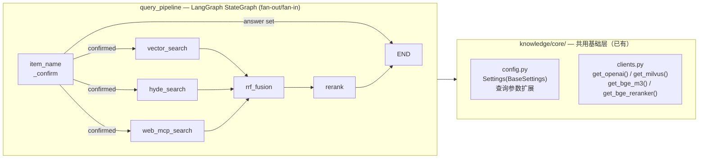

# Query Pipeline 查询管线实现计划

> 状态：旧参考实现 / 历史草案
>
> 本文档来自更早的查询管线设计背景，含有 legacy 方案和其他项目上下文，不应作为当前实现依据。

## Context

当前项目 `shopkeeper_brain` 已完成导入流程 (import pipeline) 的 Pythonic 重写，包括 `core/` 基础层、`processor/import_pipeline/` 全部节点。现在进入第二阶段：构建查询管线 (query pipeline)。

查询管线的职责：接收用户问题 → 确认商品名 → 多路并行检索 → 融合排序 → 精排截断 → 返回最终文档切片供答案生成使用。

**设计原则**：
- 复用已有 `core/` 基础设施（config、clients、base、exceptions），不重复造轮子
- 遵循 import pipeline 建立的 BaseNode + StateGraph 模式，保持架构一致性
- Pythonic — 模块级函数优于单方法类，`@cache` 优于手写单例，TypedDict 优于裸 dict
- 不过度设计 — 三行重复代码优于一个投机抽象，不为假设的未来需求预留接口

**用户要求**：不直接修改代码文件，而是在文档中逐步给出详细指引、代码和架构说明，由用户自己动手操作。

## 查询管线核心概念速览

| 概念 | 说明 |
|------|------|
| **商品名确认** | 拉取已有商品候选列表 → LLM 约束提取用户问题中的商品名 → 向量检索对齐数据库 → 多阈值评分决策 |
| **混合检索** | BGE-M3 同时生成稠密向量（语义）+ 稀疏向量（关键词），Milvus 两路融合 |
| **HyDE** | 让 LLM 先生成"假设性回答文档"，再用该文档的向量去检索——缩小查询与文档的语义鸿沟 |
| **Web MCP** | 通过 MCP 协议调用外部网络搜索，补充知识库盲区 |
| **RRF 融合** | Reciprocal Rank Fusion — 基于排名而非分数的融合算法，对不同度量尺度天然鲁棒 |
| **Rerank 重排序** | 交叉编码器逐对精排 + 悬崖检测动态截断，避免固定 TopK 的信息浪费或噪声引入 |

## 实现执行计划

### Phase 0: 准备
- 创建目录结构
- 安装新依赖（若有）

### Phase 1: 扩展基础层
1. `core/config.py` — 添加查询相关配置字段
2. `prompts/query_prompt.py` — 提示词模板
3. `util/embedding_util.py` — 共用稀疏向量工具

### Phase 2: 查询状态与图骨架
1. `processor/query_pipeline/state.py` — QueryGraphState
2. `processor/query_pipeline/graph.py` — 初版图定义

### Phase 3: 逐节点实现
1. `item_name_confirm.py` — 商品名确认（★ 最复杂）
2. `vector_search.py` — 向量混合检索
3. `hyde_search.py` — HyDE 假设文档检索
4. `web_mcp_search.py` — Web MCP 网络搜索
5. `rrf_fusion.py` — RRF 融合排序
6. `rerank.py` — Rerank 重排序 + 悬崖截断

### Phase 4: 并行搜索与图组装
1. LangGraph fan-out/fan-in 原生并行（推荐）— 更新 `graph.py`
2. ThreadPoolExecutor 备选方案 — `parallel_search.py`（可选）

### Phase 5: Web 层集成
1. `api/query_router.py` — FastAPI 查询接口

### Phase 6: 端到端验证

## 目标目录结构

```
knowledge/
├── core/                              ← 已有，扩展 config.py
│   ├── __init__.py
│   ├── config.py                      ← 添加查询相关配置
│   ├── clients.py                     ← 不变（已有 reranker）
│   ├── exceptions.py                  ← 不变
│   └── base.py                        ← 不变
│
├── prompts/                           ← 【新建】提示词模板
│   ├── __init__.py
│   └── query_prompt.py                ← 商品名提取 + HyDE 提示词
│
├── processor/
│   ├── import_pipeline/               ← 已有，不动
│   └── query_pipeline/                ← 【新建】查询管线
│       ├── __init__.py
│       ├── state.py                   ← QueryGraphState
│       ├── graph.py                   ← 查询图组装
│       └── nodes/
│           ├── __init__.py
│           ├── item_name_confirm.py   ← 商品名确认（★ 最复杂）
│           ├── vector_search.py       ← 向量混合检索
│           ├── hyde_search.py         ← HyDE 检索
│           ├── web_mcp_search.py      ← Web MCP 搜索
│           ├── parallel_search.py     ← 三路并行编排（ThreadPool 备选方案）
│           ├── rrf_fusion.py          ← RRF 融合
│           └── rerank.py             ← Rerank 重排序
│
├── api/                               ← 【新建】Web 层
│   ├── __init__.py
│   └── query_router.py               ← FastAPI 查询路由
│
└── util/
    ├── markdown_util.py               ← 已有，不动
    ├── markdown_index.py              ← 已有，不动
    └── embedding_util.py              ← 【新建】共用稀疏向量工具
```

## 验证方式
1. 每个文件写完后: `python -m py_compile <file>` 检查语法
2. Phase 1 完成后: 验证 `Settings()` 能加载新字段的默认值
3. Phase 3 每个节点完成后: 用 `if __name__ == "__main__"` 单节点测试
4. 全部完成后: 构造一条测试查询跑完整管线


## 查询管线架构总览

### 数据流全景

```
用户输入 "万用表怎么测电压？"
        ↓
┌─────────────────────────────────┐
│  商品名确认 (item_name_confirm) │  ← LLM 提取 + Milvus 向量对齐
│  • 确认 → 继续                  │      + 历史对话指代消解
│  • 不确定 → 反问用户            │
│  • 无法识别 → 拒绝              │
└──────────┬──────────────────────┘
           ↓ (确认成功, fan-out)
    ┌──────┼──────────────┐
    ↓      ↓              ↓
┌────────┐ ┌──────────┐ ┌───────────┐
│向量检索 │ │HyDE 检索 │ │Web MCP    │   ← LangGraph 原生并行
│vector  │ │hyde      │ │web_mcp    │     三路独立执行
│_search │ │_search   │ │_search    │
└───┬────┘ └────┬─────┘ └─────┬─────┘
    └──────┬────┘             │
           ↓ (fan-in)        │
  ┌─────────────────┐        │
  │  RRF 融合        │ ← 只融合 embedding + hyde
  │  rrf_chunks      │        │
  └────────┬────────┘        │
           ↓                  ↓
  ┌────────────────────────────┐
  │  Rerank 重排序              │ ← 合并 rrf_chunks + web_docs
  │  交叉编码器精排 + 悬崖截断   │
  │  → final_chunks            │
  └────────────────────────────┘
           ↓
     答案生成（下游）
```

## 查询管线流程图



### Insight

为什么查询管线和导入管线共用 `core/` 层？

- `core/config.py` 已经声明了 Milvus、BGE、OpenAI 等所有外部服务的连接参数。查询管线需要的客户端（向量检索用 Milvus、嵌入用 BGE-M3、重排用 Reranker、LLM 用 OpenAI）100% 与导入管线重合。
- `core/clients.py` 的 `get_bge_reranker()` 就是为查询管线预留的 — 导入管线不用 reranker，但 client 已经写好了。
- `core/base.py` 的 BaseNode 抽象（`__call__` → `process()`）对查询节点同样适用，LangGraph 无差别调用。

---

## 操作步骤

第 1 步: 创建目录结构：

```bash
cd /home/ccr/dev/LearningProject/shopkeeper_brain/knowledge

# 创建查询管线目录
mkdir -p processor/query_pipeline/nodes
touch processor/query_pipeline/__init__.py
touch processor/query_pipeline/nodes/__init__.py

# 创建提示词目录
mkdir -p prompts
touch prompts/__init__.py

# 创建 API 目录
mkdir -p api
touch api/__init__.py

# 确保 util 目录有 __init__.py
touch util/__init__.py
```

第 2 步: 确认依赖（pyproject.toml 中应已存在这些依赖）：

```bash
cd /home/ccr/dev/LearningProject/shopkeeper_brain/knowledge
# 检查关键依赖是否已安装
uv run python -c "import langgraph; import pymilvus; import openai; print('依赖检查通过')"
```

> **注意**：Web MCP 搜索节点需要 `openai-agents` 包（已在 pyproject.toml 中）。如果你暂时不实现 Web MCP 节点，可以跳过。


## Phase 1: 扩展基础层

### 1.1 修改 knowledge/core/config.py

在现有 `Settings` 类中添加查询管线所需的配置字段。

打开 `knowledge/core/config.py`，在 `# ── 处理参数 ──` 段落之后、`@property` 之前，添加以下字段：

```python
    # ━━━━━━━━━━━━━━━━━━━━━━━━━━━━━━━━━━━━━━━━━━━━
    # 以下为查询管线新增配置
    # ━━━━━━━━━━━━━━━━━━━━━━━━━━━━━━━━━━━━━━━━━━━━

    # ── 商品名确认 ──
    # WeightedRanker 开启 norm_score 后用 arctan 映射到 [0, 1]
    # 以下阈值基于该归一化分数
    item_name_high_confidence: float = 0.7   # ≥ 此值直接确认
    item_name_mid_confidence: float = 0.45   # ≥ 此值作为候选
    item_name_score_gap: float = 0.15        # 第一名与第二名分差阈值
    item_name_max_options: int = 5           # 反问时最多展示几个候选
    item_name_search_limit: int = 10         # Milvus 检索条数
    item_name_catalog_limit: int = 500       # 拉取已有商品名的上限（注入 LLM prompt）

    # ── 向量检索（查询管线共用） ──
    query_dense_weight: float = 0.5          # 混合检索中稠密向量权重
    query_sparse_weight: float = 0.5         # 混合检索中稀疏向量权重
    query_search_limit: int = 5              # 每路检索返回条数

    # ── HyDE ──
    hyde_model: str = ""                     # 默认 fallback 到 model 字段

    # ── Web MCP ──
    mcp_base_url: str = ""                   # MCP 服务端地址
    mcp_api_key: str = ""                    # MCP 认证密钥
    mcp_search_count: int = 3                # 网络搜索返回条数
    mcp_timeout: int = 300                   # MCP 超时（秒）

    # ── RRF 融合 ──
    rrf_k: int = 60                          # RRF 平滑常数
    rrf_max_results: int = 10                # RRF 融合后保留条数

    # ── Rerank 重排序 ──
    rerank_min_top_k: int = 3                # 悬崖截断最少保留
    rerank_max_top_k: int = 10               # 悬崖截断最多保留
    rerank_gap_abs: float = 0.5              # 绝对分差阈值
    rerank_gap_ratio: float = 0.25           # 相对分差阈值（|score|>1 时启用）
    rerank_min_score: float | None = None    # 绝对分数下限（None = 不启用）
```

> **设计要点**：
> - 所有字段都有合理默认值，不强制要求 `.env` 中配置 — 开箱即用
> - 字段名与环境变量自动映射（如 `rrf_k` ↔ `RRF_K`），pydantic-settings 负责转换
> - `hyde_model` 为空时代码中 fallback 到 `self.settings.model`，避免重复配置

### Insight

为什么不新建 QueryConfig 而是扩展现有 Settings？

原来 7 个 TODO 文档各自定义了 `QueryConfig` 类。但我们的 `core/config.py` 设计理念是**单一配置源**（Single Source of Truth）：
- 导入管线和查询管线共享 Milvus URL、BGE 模型路径等基础配置
- 如果拆成两个 Config 类，要么重复声明字段，要么搞出继承层级 — 都是复杂度
- pydantic-settings 天然支持几百个字段，不会有性能问题
- 测试时 `get_settings.cache_clear()` 一次性重置所有配置

### 1.2 创建 knowledge/prompts/query_prompt.py

提示词模板单独放一个模块，与节点代码解耦。换提示词不用动业务逻辑。

```python
"""
查询管线提示词模板

所有 LLM 调用的 system prompt 和 user prompt 集中管理。
修改提示词只需要改这个文件，不用动节点代码。
"""


# ━━━━━━━━━━━━━━━━━━━━━━━━━━━━━━━━━━━━━━━━━━━━
# 商品名提取
# ━━━━━━━━━━━━━━━━━━━━━━━━━━━━━━━━━━━━━━━━━━━━

ITEM_NAME_SYSTEM_PROMPT = """\
你是一位专业的商品名称提取助手。你的任务是：
1. 从用户问题中识别出所有提及的商品名称（包括品牌、型号）
2. 如果提供了产品目录，优先将用户提到的商品映射到目录中的已有名称
3. 将用户的口语化问题重写为更适合技术文档检索的查询

输出要求：严格按 JSON 格式返回，不要输出其他内容。"""

ITEM_NAME_USER_PROMPT = """\
请从以下用户问题中提取商品名称，并重写查询。

用户问题：{query}

当前产品目录中的已有商品：{catalog}
（如果目录为空，请仅从用户问题中提取）

请以 JSON 格式返回：
{{
    "item_names": ["商品名1", "商品名2"],
    "rewritten_query": "重写后的技术化查询"
}}

规则：
1. 优先匹配产品目录中的已有商品名。用户说的俗称、同义词、品类名应映射到目录中最接近的商品
   （如用户说"板凳"，目录中有"折叠椅 FC-200"→ 返回"折叠椅 FC-200"）
2. 如果目录中没有匹配项，按用户原话提取，包含品牌和型号
3. 如果无法识别具体商品名，返回空列表 []
4. rewritten_query 应去除"你们店里那款"等口语化表达，保留技术关键词
5. 如果涉及多个商品，全部提取到列表中
6. 允许纠正明显的错别字（如"苏伯尔"→品牌不变，只提取型号）"""


# ━━━━━━━━━━━━━━━━━━━━━━━━━━━━━━━━━━━━━━━━━━━━
# HyDE 假设文档生成
# ━━━━━━━━━━━━━━━━━━━━━━━━━━━━━━━━━━━━━━━━━━━━

HYDE_SYSTEM_PROMPT = """\
您是一位{item_hint}的技术文档领域的专家，\
主要擅长编写技术文档、操作手册、产品规格说明。"""

HYDE_USER_PROMPT = """\
请根据用户的问题，编写一段技术文档片段作为回答参考。

商品名称：{item_hint}
用户问题：{query}

要求：
1. 文档片段应当专业、准确，使用技术文档的正式风格
2. 内容应紧扣用户问题，提供具体操作步骤或技术说明
3. 适当使用专业术语，但避免过于晦涩
4. 篇幅控制在 200-300 字左右
5. 不要使用 Markdown 格式，直接输出纯文本"""
```

### Insight

为什么提示词单独放模块而不是写在节点代码里？

- **可维护性**：提示词是调参最频繁的部分。分离后，产品经理改提示词不需要看懂节点业务逻辑。
- **可测试性**：可以单独对提示词做 A/B 测试，换一套 prompt 只需 import 不同模块。
- **`{query}` 用 `.format()` 而非 f-string**：提示词模板是常量字符串，只在运行时填充变量。如果用 f-string，模板定义时变量必须存在，这不符合常量定义的语义。注意 JSON 中的花括号需要用 `{{}}` 转义。


### 1.3 创建 knowledge/util/embedding_util.py

将 `_csr_row_to_sparse_dict` 从 import_pipeline 中提取为共用工具。目前这个函数在 `import_pipeline/nodes/item_name.py` 中定义，被 `embedding.py` 跨节点 import — 这种耦合不干净。查询管线也需要同样的转换，所以提到 util 层。

```python
"""
BGE-M3 向量工具

稀疏向量格式转换 — 导入/查询两条管线共用。
"""

from scipy.sparse import csr_array, csr_matrix


def csr_row_to_sparse_dict(
    sparse_csr: csr_array | csr_matrix,
    row: int = 0,
) -> dict[int, float]:
    """将 scipy CSR 稀疏矩阵的指定行转为 Milvus 入库格式

    BGE-M3 返回的稀疏向量是 scipy CSR 矩阵（整个 batch 合在一起），
    Milvus SPARSE_FLOAT_VECTOR 字段要求 {token_id: weight} 字典格式。
    这个函数做的就是这个适配。

    注意：pymilvus BGE-M3 封装实际返回 csr_array（非 csr_matrix），
    csr_array 没有 .getrow() 方法，所以这里直接操作 indptr/indices/data。

    Args:
        sparse_csr: BGE-M3 encode 返回的 CSR 矩阵（result["sparse"]）
        row: 要提取的行号（batch 中第几个文档，默认 0）

    Returns:
        {token_id: weight} 格式的稀疏向量字典

    Example:
        >>> result = bge_m3.encode_documents(["测试文本"])
        >>> sparse = csr_row_to_sparse_dict(result["sparse"], row=0)
        >>> # sparse = {12345: 0.85, 67890: 0.62, ...}
    """
    start = sparse_csr.indptr[row]
    end = sparse_csr.indptr[row + 1]
    return dict(zip(
        sparse_csr.indices[start:end].tolist(),
        sparse_csr.data[start:end].tolist(),
        strict=True,
    ))
```

> **迁移要点**：
> - 提取后，`import_pipeline/nodes/item_name.py` 和 `embedding.py` 中的 `_csr_row_to_sparse_dict` 可以改为 `from knowledge.util.embedding_util import csr_row_to_sparse_dict`
> - 函数名去掉了前缀下划线 `_`，因为它现在是公共 API
> - 这个改动是可选的，不影响查询管线的实现 — 查询管线直接 import 新位置即可


## Phase 2: 查询状态与图骨架

### 2.1 创建 knowledge/processor/query_pipeline/state.py

```python
"""
查询流程状态类型定义

所有查询节点通过 state dict 传递数据。
TypedDict 提供类型提示，但运行时不强制 — LangGraph 负责合并。

Annotated Reducer:
    三路并行检索的输出字段使用 Annotated[..., reducer] 声明合并策略。
    LangGraph fan-out/fan-in 中，多个并行节点可能写同一个 state key，
    Reducer 告诉框架"多个值到达时如何合并"而非使用默认的"后写覆盖"。
"""

import copy
from typing import Annotated, TypedDict


def _merge_list(existing: list, new: list) -> list:
    """列表合并 Reducer — 追加而非覆盖

    为什么不用 operator.add？
    operator.add 在 existing 为 None / 未初始化时可能报错。
    自定义函数更安全，且能处理边界情况。
    """
    return (existing or []) + (new or [])


class QueryGraphState(TypedDict, total=False):
    """查询流程图状态 — 从用户输入到最终文档切片的完整数据流

    字段按流转顺序排列，方便追踪数据在管线中的演变：
    1. 用户输入 → 2. 商品名确认 → 3. 三路检索 → 4. 融合重排 → 5. 输出

    带 Annotated[..., _merge_list] 的字段: 并行节点写入时追加合并
    普通字段: 后写覆盖（默认语义）
    """

    # ── 1. 用户输入 ──
    session_id: str                  # 会话 ID（追踪用）
    original_query: str              # 用户原始问题
    history: list[dict]              # 近期对话历史（由节点读取填充）

    # ── 2. 商品名确认产出 ──
    item_names: list[str]            # 已确认的商品名列表
    rewritten_query: str             # LLM 重写后的检索查询

    # ── 3. 三路检索结果（Reducer 合并） ──
    # fan-out 并行时，三个节点各写一个字段，Reducer 保证追加合并
    # 实际上每个节点只写自己的字段，不存在真正的多写竞争，
    # 但 Reducer 让并行语义更安全——即使未来某节点也产出 embedding_chunks 也不丢
    embedding_chunks: Annotated[list[dict], _merge_list]
    hyde_chunks: Annotated[list[dict], _merge_list]
    web_search_docs: Annotated[list[dict], _merge_list]

    # ── 4. 融合与重排序 ──
    rrf_chunks: list[dict]           # RRF 融合后的排序结果
    final_chunks: list[dict]         # Rerank 精排后的最终结果

    # ── 5. 输出 ──
    answer: str                      # 最终回答（或拦截信息）


# 默认状态模板
_DEFAULT_STATE: QueryGraphState = {
    "session_id": "",
    "original_query": "",
    "history": [],
    "item_names": [],
    "rewritten_query": "",
    "embedding_chunks": [],
    "hyde_chunks": [],
    "web_search_docs": [],
    "rrf_chunks": [],
    "final_chunks": [],
    "answer": "",
}


def create_default_state(**overrides) -> QueryGraphState:
    """创建默认查询状态副本，支持字段覆盖

    Examples:
        >>> state = create_default_state(
        ...     session_id="sess_001",
        ...     original_query="万用表怎么测电压？",
        ... )
    """
    state = copy.deepcopy(_DEFAULT_STATE)
    state.update(overrides)
    return state
```

### Insight

QueryGraphState 的两个关键设计:

1. **和 ImportGraphState 为什么不共用基类？**
   - 两者字段完全不同：导入关心 `pdf_path / md_content / chunks`，查询关心 `item_names / rewritten_query / embedding_chunks`
   - TypedDict 不支持常规继承（Python 限制），强行共用反而增加复杂度
   - 它们唯一的共同点是都被 LangGraph StateGraph 消费 — 这是 LangGraph 的契约，不是我们需要抽象的层
   - `total=False` 让所有字段可选 — 节点只需返回它修改的字段，LangGraph 负责合并

2. **为什么三路检索字段用 Annotated Reducer？**
   - LangGraph fan-out 中，三个并行节点的返回值需要合并到同一个 state
   - 默认合并策略是"后写覆盖前写"，在并行场景下执行顺序不确定 → 竞态隐患
   - `Annotated[list[dict], _merge_list]` 声明"多个值到达时追加合并" → 框架级保证安全
   - 如果使用 ThreadPool 备选方案，Reducer 不起作用但也不碍事（只有一个节点写 state）


### 2.2 创建 knowledge/processor/query_pipeline/graph.py（初版）

先搭骨架，节点用占位符。Phase 3/4 完成后回来更新。

```python
"""
查询流程编排

构建 LangGraph 状态图（fan-out/fan-in 并行）。
初版: 骨架结构 + 路由逻辑，节点待 Phase 3 填充。
"""

import logging

from langgraph.graph import StateGraph, END
from langgraph.graph.state import CompiledStateGraph

from knowledge.processor.query_pipeline.state import QueryGraphState

logger = logging.getLogger(__name__)


def _query_router(state: QueryGraphState) -> list[str]:
    """商品名确认后的路由 — 条件 fan-out

    返回列表: LangGraph 同时触发列表中的所有节点（并行执行）
    - 确认失败 → [END]
    - 确认成功 → ["vector_search", "hyde_search", "web_mcp_search"]
    """
    if state.get("answer"):
        return [END]
    return ["vector_search", "hyde_search", "web_mcp_search"]


def build_query_graph() -> CompiledStateGraph:
    """构建并编译查询流程图

    流程:
        item_name_confirm → [router] → vector_search  ─┐
                                     → hyde_search     ─┤ → rrf_fusion → rerank → END
                                     → web_mcp_search  ─┘
                                     → END (确认失败)
    """
    wf = StateGraph(QueryGraphState)

    # --- 节点注册（Phase 3/4 完成后取消注释） ---
    # wf.add_node("item_name_confirm", ItemNameConfirmNode())
    # wf.add_node("vector_search", _safe_node(VectorSearchNode()))
    # wf.add_node("hyde_search", _safe_node(HyDeSearchNode()))
    # wf.add_node("web_mcp_search", _safe_node(WebMcpSearchNode()))
    # wf.add_node("rrf_fusion", RrfNode())
    # wf.add_node("rerank", RerankerNode())

    # --- 入口 ---
    # wf.set_entry_point("item_name_confirm")

    # --- 条件 fan-out: router 返回列表 → 三路并行 ---
    # wf.add_conditional_edges("item_name_confirm", _query_router)

    # --- fan-in: 三路完成 → rrf_fusion ---
    # wf.add_edge("vector_search", "rrf_fusion")
    # wf.add_edge("hyde_search", "rrf_fusion")
    # wf.add_edge("web_mcp_search", "rrf_fusion")

    # --- 线性: 融合 → 重排 → 结束 ---
    # wf.add_edge("rrf_fusion", "rerank")
    # wf.add_edge("rerank", END)

    # return wf.compile()

    # Phase 2 临时: 返回 None，等节点就绪后启用
    return None  # type: ignore
```

> **设计要点**：
> - `_query_router` 返回 **列表** — LangGraph 的 conditional fan-out 模式: 返回一个节点名列表表示并行触发所有目标。
> - `_query_router` 只检查 `answer` 字段 — 这是 item_name_confirm 节点的"信号量"。确认失败时节点会设置 `answer`（拦截信息），路由据此决定是否继续。
> - 三路检索不再封装在一个 `ParallelSearchNode` 中，而是作为图中的独立节点，LangGraph 调度器原生理解它们的并行关系。


## Phase 1-2 验证

```bash
cd /home/ccr/dev/LearningProject/shopkeeper_brain/knowledge

# 1. 语法检查
uv run python -m py_compile knowledge/core/config.py
uv run python -m py_compile knowledge/prompts/query_prompt.py
uv run python -m py_compile knowledge/util/embedding_util.py
uv run python -m py_compile knowledge/processor/query_pipeline/state.py
uv run python -m py_compile knowledge/processor/query_pipeline/graph.py

# 2. 验证配置能加载新字段
uv run python -c "
from knowledge.core.config import get_settings
s = get_settings()
print(f'rrf_k = {s.rrf_k}')
print(f'item_name_high_confidence = {s.item_name_high_confidence}')
print(f'rerank_gap_abs = {s.rerank_gap_abs}')
print('查询配置加载成功')
"

# 3. 验证状态创建
uv run python -c "
from knowledge.processor.query_pipeline.state import create_default_state
state = create_default_state(session_id='test', original_query='万用表怎么用？')
print(f'session_id = {state[\"session_id\"]}')
print(f'query = {state[\"original_query\"]}')
print('查询状态创建成功')
"
```

#### 预期输出
```
rrf_k = 60
item_name_high_confidence = 0.7
rerank_gap_abs = 0.5
查询配置加载成功

session_id = test
query = 万用表怎么用？
查询状态创建成功
```


## Phase 3: 逐节点实现

### 3.0 设计规则

在写具体节点之前，先统一约定。

#### 校验策略

| 层次 | 谁做 | 检查什么 | 示例 |
|------|------|----------|------|
| 入口 | 当前节点 | 自己需要的 state 字段存在且类型正确 | `rewritten_query` 是非空 str |
| 出口 | 不做 | 下游节点的入口校验会自然覆盖 | — |

#### 节点契约总表

| 节点 | 读取 state | 写入 state | 校验内容 |
|------|-----------|-----------|---------|
| item_name_confirm | `original_query` | `item_names`, `rewritten_query`, `answer` | original_query 非空 |
| vector_search | `rewritten_query`, `item_names` | `embedding_chunks` | rewritten_query 非空, item_names 非空 |
| hyde_search | `rewritten_query`, `item_names` | `hyde_chunks` | 同上 |
| web_mcp_search | `rewritten_query`, `item_names` | `web_search_docs` | rewritten_query 非空 |
| parallel_search | 同上三个 | 同上三个 | 委托给子节点 |
| rrf_fusion | `embedding_chunks`, `hyde_chunks` | `rrf_chunks` | 至少一路有结果 |
| rerank | `rewritten_query`, `rrf_chunks`, `web_search_docs` | `final_chunks` | rrf_chunks 非空 |

#### 错误处理原则

- 校验失败: `raise ValidationError("描述", node=self.name)`
- 外部服务失败: `raise ExternalServiceError("描述", node=self.name) from e`
- 不 catch 后 re-raise — BaseNode.__call__ 已经做了日志记录，让异常直接冒泡

---

### 3.1 item_name_confirm.py — 商品名确认（★ 最复杂）

这是查询管线的入口守门员。错了，下游全错；拦了，用户体验受损。所以它必须精准。

**核心逻辑**：
1. 从 Milvus item_name 集合拉取已有商品名列表，作为候选提供给 LLM
2. LLM 在候选列表约束下提取商品名（JSON mode）+ 查询重写 — 解决同义词/俗称/品类名匹配问题
3. 对每个候选名称，在 Milvus item_name 集合中做混合检索（向量对齐）
4. 根据分数阈值决策：确认 / 候选 / 拒绝
5. 分数间距过滤：防止低置信商品污染下游

```python
"""
商品名确认节点

三阶段策略:
- 第〇阶段: 从 Milvus 拉取已有商品名列表，供 LLM 做约束提取
- 第一阶段: LLM 在候选列表约束下提取商品名 + 重写查询（解决同义词/俗称问题）
- 第二阶段: 在 Milvus 中混合检索，对齐到数据库中的精确名称

三种结果:
- confirmed: 高置信匹配 → 设置 item_names，继续检索
- options:   中置信匹配 → 设置 answer 反问用户
- nothing:   无匹配     → 设置 answer 拒绝
"""

import json
import logging

from pymilvus import AnnSearchRequest, WeightedRanker

from knowledge.core.base import BaseNode
from knowledge.core.clients import get_bge_m3, get_milvus, get_openai
from knowledge.core.config import Settings
from knowledge.core.exceptions import ExternalServiceError, ValidationError
from knowledge.processor.query_pipeline.state import QueryGraphState
from knowledge.prompts.query_prompt import (
    ITEM_NAME_SYSTEM_PROMPT,
    ITEM_NAME_USER_PROMPT,
)
from knowledge.util.embedding_util import csr_row_to_sparse_dict

logger = logging.getLogger(__name__)


class ItemNameConfirmNode(BaseNode):
    """商品名确认 — 查询管线入口守门员

    设计原则: 准确性优先于覆盖率。
    宁可拦截不确定的问题去反问用户，
    也不放行一个可能匹配错误的商品名到下游。
    """

    name = "item_name_confirm"

    def process(self, state: QueryGraphState) -> dict:
        query = state.get("original_query", "")
        if not query or not isinstance(query, str):
            raise ValidationError("original_query 不能为空", node=self.name)

        session_id = state.get("session_id", "")

        # ── 读取对话历史 ──
        # TODO: 接入实际的历史存储（如 Redis / DB）
        # chat_history = get_recent_messages(session_id, limit=10)
        # history_text = "\n".join(
        #     f"{m['role']}: {m['content']}" for m in chat_history
        # )
        chat_history: list[dict] = []
        history_text = ""

        # ── 第〇阶段: 拉取已有商品名候选列表 ──
        # 让 LLM 知道数据库里有什么，才能把"板凳"映射到"折叠椅 FC-200"
        known_items = _fetch_known_item_names(self.settings)

        # ── 第一阶段: LLM 约束提取 ──
        # history_text 传入 LLM，让它理解"这个怎么用"中"这个"指代什么
        # known_items 传入 LLM，让它在已有商品名中做约束匹配
        extraction = _extract_item_names(query, self.settings, history_text, known_items)
        raw_names = extraction.get("item_names", [])
        rewritten = extraction.get("rewritten_query", query)

        self.logger.info(f"LLM 提取: names={raw_names}, rewritten={rewritten!r}")

        # 没提取到任何商品名 → 直接拦截
        if not raw_names:
            return {
                "answer": "抱歉，我无法从您的问题中识别出具体的商品名称。"
                          "请提供更详细的产品信息，例如品牌和型号。",
                "rewritten_query": rewritten,
                "history": chat_history,
            }

        # ── 第二阶段: 向量对齐 ──
        confirmed, options = _align_item_names(raw_names, self.settings)
        self.logger.info(f"对齐结果: confirmed={confirmed}, options={options}")

        # ── 第三阶段: 决策 ──
        if confirmed:
            # TODO: 回填历史消息中的商品名（接入历史存储后启用）
            # _backfill_history_item_names(chat_history, confirmed)
            return {
                "item_names": confirmed,
                "rewritten_query": rewritten,
                "history": chat_history,
            }

        if options:
            names_str = "、".join(options[:self.settings.item_name_max_options])
            return {
                "answer": f"我不确定您指的是哪款产品。您是在询问以下产品吗：{names_str}？",
                "rewritten_query": rewritten,
                "history": chat_history,
            }

        return {
            "answer": "抱歉，我无法在产品库中找到匹配的产品。请确认产品名称后重试。",
            "rewritten_query": rewritten,
            "history": chat_history,
        }


# ━━━━━━━━━━━━━━━━━━━━━━━━━━━━━━━━━━━━━━━━━━━━
# 第一阶段: LLM 提取
# ━━━━━━━━━━━━━━━━━━━━━━━━━━━━━━━━━━━━━━━━━━━━

def _extract_item_names(
    query: str,
    settings: Settings,
    history_text: str = "",
    known_items: list[str] | None = None,
) -> dict:
    """调用 LLM 从用户问题中提取商品名 + 重写查询

    使用 JSON mode 确保输出是结构化数据。
    防御性处理 LLM 常见的格式问题（markdown 包裹、null 值等）。

    当 known_items 非空时，prompt 中会注入已有商品名列表，
    让 LLM 做"约束提取"— 能将用户口语（板凳、笔记本）
    映射到数据库中的精确名称（折叠椅 FC-200、ThinkPad X1 Carbon）。

    Args:
        query: 用户原始问题
        settings: 全局配置
        history_text: 近期对话历史文本（用于指代消解，如"这个怎么用"→ 推断"这个"指代的商品）
        known_items: Milvus 中已有的商品名列表（用于约束提取）
    """
    client = get_openai()
    model = settings.item_model or settings.model
    if not model:
        raise ValidationError("item_model 和 model 均未配置", node="item_name_confirm")

    # 构建消息列表 — 如果有历史，插入到 system 和 user 之间
    # 让 LLM 看到上下文，从而解析"这个"、"那个"等指代
    messages = [{"role": "system", "content": ITEM_NAME_SYSTEM_PROMPT}]
    if history_text:
        messages.append({
            "role": "user",
            "content": f"以下是用户近期的对话历史，供你理解上下文:\n{history_text}",
        })
        messages.append({
            "role": "assistant",
            "content": "好的，我已了解对话上下文。请提供需要分析的问题。",
        })

    # 注入已有商品名列表 — 约束 LLM 在已知范围内匹配
    catalog_hint = ""
    if known_items:
        catalog_hint = "、".join(known_items)
    messages.append({"role": "user", "content": ITEM_NAME_USER_PROMPT.format(
        query=query, catalog=catalog_hint,
    )})

    try:
        response = client.chat.completions.create(
            model=model,
            messages=messages,
            response_format={"type": "json_object"},
            temperature=0.1,  # 低温度 → 更确定性的输出
        )
    except Exception as e:
        raise ExternalServiceError(
            f"LLM 调用失败: {e}", node="item_name_confirm"
        ) from e

    text = response.choices[0].message.content.strip()
    text = _clean_json_response(text)

    try:
        result = json.loads(text)
    except json.JSONDecodeError:
        logger.warning(f"LLM 返回非法 JSON: {text!r}")
        return {"item_names": [], "rewritten_query": query}

    # 防御性提取: LLM 可能返回 null、非列表、非字符串元素
    names = result.get("item_names") or []
    if not isinstance(names, list):
        names = []
    names = [n.strip() for n in names if isinstance(n, str) and n.strip()]

    rewritten = result.get("rewritten_query") or query
    if not isinstance(rewritten, str) or not rewritten.strip():
        rewritten = query

    return {"item_names": names, "rewritten_query": rewritten}


def _clean_json_response(text: str) -> str:
    """清洗 LLM 返回的 JSON 文本

    常见问题: LLM 会用 ```json ... ``` 包裹输出，
    即使 response_format 设置了 json_object 也可能出现。
    """
    if text.startswith("```"):
        lines = text.split("\n")
        # 去掉首尾的 ``` 行
        lines = [l for l in lines if not l.strip().startswith("```")]
        text = "\n".join(lines)
    return text.strip()


# ━━━━━━━━━━━━━━━━━━━━━━━━━━━━━━━━━━━━━━━━━━━━
# 第〇阶段: 拉取已有商品名候选列表
# ━━━━━━━━━━━━━━━━━━━━━━━━━━━━━━━━━━━━━━━━━━━━

def _fetch_known_item_names(settings: Settings) -> list[str]:
    """从 Milvus item_name 集合中拉取所有已有商品名

    用于注入到 LLM prompt 中，让 LLM 做约束提取。
    这解决了"盲提取"的核心问题：LLM 不知道数据库里有什么，
    无法将用户的俗称/同义词/品类名映射到精确商品名。

    例如：
    - 用户说"板凳" → LLM 看到目录中有"折叠椅 FC-200" → 映射成功
    - 用户说"笔记本" → LLM 看到目录中有"ThinkPad X1 Carbon" → 映射成功
    - 用户说"万用表" → LLM 看到目录中有"RS-12 数字万用表" → 映射成功

    注意:
    - 商品数量较少（几十到几百）时直接全量拉取
    - 如果未来商品数量增长到上千，可改为先用用户 query
      做一轮宽松向量预检索（低阈值、高 topK），只召回候选子集
    - 拉取失败时返回空列表，不阻断管线（降级为原来的盲提取）

    Returns:
        商品名字符串列表，如 ["RS-12 数字万用表", "折叠椅 FC-200", ...]
    """
    try:
        milvus = get_milvus()
    except Exception as e:
        logger.warning(f"Milvus 客户端获取失败，降级为盲提取: {e}")
        return []

    collection = settings.item_name_collection
    if not milvus.has_collection(collection):
        logger.warning(f"集合 {collection} 不存在，降级为盲提取")
        return []

    try:
        results = milvus.query(
            collection_name=collection,
            filter="",  # 无过滤 = 全量
            output_fields=["item_name"],
            limit=settings.item_name_catalog_limit,  # 默认 500，可配置
        )
        names = [r["item_name"] for r in results if r.get("item_name")]
        # 去重并保持顺序
        return list(dict.fromkeys(names))
    except Exception as e:
        logger.warning(f"拉取已有商品名失败，降级为盲提取: {e}")
        return []


# ━━━━━━━━━━━━━━━━━━━━━━━━━━━━━━━━━━━━━━━━━━━━
# 第二阶段: 向量对齐
# ━━━━━━━━━━━━━━━━━━━━━━━━━━━━━━━━━━━━━━━━━━━━

def _align_item_names(
    raw_names: list[str],
    settings: Settings,
) -> tuple[list[str], list[str]]:
    """对每个 LLM 提取的候选名称，在 Milvus item_name 集合中混合检索对齐

    流程:
    1. 逐个提取名 → Milvus 混合检索 → 返回 matches
    2. 逐个提取名 → _score_align（含精确匹配优先 + 循环内去重）
    3. 全部轮次结束 → _score_filter（全局分数差异过滤）

    Returns:
        (confirmed, options):
        - confirmed: 高置信匹配的商品名列表（直接用于下游检索）
        - options: 中置信匹配的候选列表（展示给用户选择）
    """
    confirmed: list[str] = []
    options: list[str] = []

    # 保留每轮检索结果，供 _score_filter 做全局过滤
    all_search_results: list[dict] = []

    for name in raw_names:
        matches = _search_item_name(name, settings)
        if not matches:
            continue

        all_search_results.append({
            "extracted_name": name,
            "matches": matches,
        })

        # 逐轮对齐，循环内去重由 _score_align 保证
        _score_align(name, matches, settings, confirmed, options)

    # ── 全局分数差异过滤 ──
    # 不同轮次各自通过 A/B 场景进入 confirmed 的商品，
    # 可能存在分数悬殊（如 LLM 过度提取的噪声），需要全局兜底
    if len(confirmed) > 1:
        confirmed = _score_filter(confirmed, all_search_results, settings)

    return confirmed, options[:settings.item_name_max_options]


def _search_item_name(name: str, settings: Settings) -> list[dict]:
    """在 Milvus item_name_collection 中混合搜索一个候选名称

    Returns:
        [{"item_name": str, "file_title": str, "score": float}, ...]
        按 score 降序排列
    """
    bge = get_bge_m3()
    milvus = get_milvus()

    # 查询编码: 用 encode_queries（语义上是"查询"而非"文档"）
    result = bge.encode_queries([name])
    dense = result["dense"][0]
    sparse = csr_row_to_sparse_dict(result["sparse"], row=0)

    if not sparse:
        # 极端情况: 稀疏向量为空（名称太短或 tokenizer 异常）
        # 只用稠密向量搜索
        logger.warning(f"稀疏向量为空，降级为稠密检索: {name!r}")

    limit = settings.item_name_search_limit

    # 构建两路搜索请求
    dense_req = AnnSearchRequest(
        data=[dense.tolist() if hasattr(dense, "tolist") else dense],
        anns_field="dense_vector",
        param={"metric_type": "COSINE"},
        limit=limit,
    )

    reqs = [dense_req]

    if sparse:
        sparse_req = AnnSearchRequest(
            data=[sparse],
            anns_field="sparse_vector",
            param={"metric_type": "IP"},
            limit=limit,
        )
        reqs.append(sparse_req)

    # 构建加权融合器
    # 只有一路时权重无意义，但 API 要求必须传
    weights = (
        (settings.query_dense_weight, settings.query_sparse_weight)
        if len(reqs) == 2
        else (1.0,)
    )
    ranker = WeightedRanker(*weights)

    try:
        results = milvus.hybrid_search(
            collection_name=settings.item_name_collection,
            reqs=reqs,
            ranker=ranker,
            limit=limit,
            output_fields=["item_name", "file_title"],
        )
    except Exception as e:
        raise ExternalServiceError(
            f"Milvus 商品名检索失败: {e}", node="item_name_confirm"
        ) from e

    # 解析结果
    matches = []
    for hit in results[0]:
        matches.append({
            "item_name": hit.get("entity", {}).get("item_name", ""),
            "file_title": hit.get("entity", {}).get("file_title", ""),
            "score": hit.get("distance", 0.0),
        })

    return matches


def _score_align(
    extracted_name: str,
    matches: list[dict],
    settings: Settings,
    confirmed: list[str],
    options: list[str],
) -> None:
    """多阈值评分对齐 — 六个场景（含精确匹配优先）

    分数轴 (WeightedRanker norm_score 归一化到 [0, 1]):
        0 ──────── 0.45 ─────── 0.7 ──────── 1.0
          丢弃        候选(options)   确认(confirmed)

    场景优先级:
    A: 精确匹配命中 → 直接确认（extracted_name == item_name 且在 high 中）
    B: 唯一高置信（无精确匹配）→ 确认
    C: 多个高置信，分差大（≥ gap）→ 只确认第一名
    C': 多个高置信，分差小（< gap）→ 全部作为候选
    D: 无高置信，有中置信 → 候选
    E: 都低于 mid → 丢弃

    为什么精确匹配要优先？
    用户说"DT-9205A"，向量库返回 DT-9205A(0.95) 和 DT-9205B(0.72)，
    两个都过了 0.7 阈值。但 extracted_name 和第一个完全相同——
    这说明 LLM 提取和向量库完全一致，置信度最高，
    不需要再走分差判断，直接确认。

    去重规则（循环内实时去重）:
    - confirmed 对 confirmed 去重: 两个提取名指向同一商品 → 只确认一次
    - options 对 confirmed 去重: 已确认的不需要再反问用户
    - options 对 options 去重: 同一候选不需要问两遍
    """
    high_threshold = settings.item_name_high_confidence
    mid_threshold = settings.item_name_mid_confidence
    gap_threshold = settings.item_name_score_gap

    # matches 已按 score 降序排列
    high = [m for m in matches if m["score"] >= high_threshold]

    if high:
        # ── 场景 A: 精确匹配命中 ──
        exact = next(
            (h for h in high if str(h["item_name"]) == extracted_name),
            None,
        )
        if exact:
            picked = exact["item_name"]
            if picked not in confirmed:
                confirmed.append(picked)
            return

        # ── 场景 B: 唯一高置信 ──
        if len(high) == 1:
            picked = high[0]["item_name"]
            if picked not in confirmed:
                confirmed.append(picked)
            return

        # ── 场景 C / C': 多个高置信 ──
        top_gap = high[0]["score"] - high[1]["score"]
        if top_gap >= gap_threshold:
            # C: 第一名远超 → 直接确认
            picked = high[0]["item_name"]
            if picked not in confirmed:
                confirmed.append(picked)
        else:
            # C': 分数接近 → 全部作为候选（尊重去重）
            for h in high[:settings.item_name_max_options]:
                picked = h["item_name"]
                if picked not in options and picked not in confirmed:
                    options.append(picked)
        return

    # ── 场景 D: 无高置信，有中置信 → 候选 ──
    mid = [
        m for m in matches
        if m["score"] >= mid_threshold
        and m["item_name"] not in confirmed  # 已确认的不降级
        and m["item_name"] not in options     # 自身去重
    ]
    for m in mid[:settings.item_name_max_options]:
        options.append(m["item_name"])

    # 场景 E: 都低于 mid_threshold → 什么也不做（丢弃）


def _score_filter(
    confirmed: list[str],
    search_results: list[dict],
    settings: Settings,
) -> list[str]:
    """全局分数差异过滤 — 踢掉 confirmed 中置信度明显偏低的商品

    触发条件: confirmed 有多个商品时
    触发时机: 所有轮次的 _score_align 结束后

    为什么需要这一步？
    不同轮次各自通过场景 A/B 的判断进入 confirmed，但其中某些可能是
    LLM 过度提取的噪声。例如:
        第一轮精确匹配 "RS-12"(0.95) 进入 confirmed
        第二轮唯一高置信 "万用表UT61E"(0.78) 也进入 confirmed
        差距 0.17 > score_gap(0.15) → "万用表UT61E" 可能是噪声

    和场景 C 的分差判断有什么区别？
    - 场景 C: 单轮循环内部，同一个 LLM 提取名下多个高分匹配的局部判断
    - _score_filter: 所有轮次结束后，不同 LLM 提取名各自独立进入 confirmed 的全局过滤
    两者是「局部判断」和「全局过滤」的关系，不能互相替代。
    """
    # 1. 构建 商品名 → 最高分数 的映射
    item_best_score: dict[str, float] = {}
    for sr in search_results:
        for m in sr.get("matches", []):
            name = m.get("item_name", "")
            score = m.get("score", 0.0)
            if name in confirmed:
                item_best_score[name] = max(item_best_score.get(name, 0.0), score)

    # 2. 防御: 如果没有收集到任何分数，直接返回
    if not item_best_score:
        return confirmed

    # 3. 以最高分为基准，过滤分数差距过大的
    max_score = max(item_best_score.values())
    return [
        name for name in confirmed
        if name in item_best_score
        and max_score - item_best_score[name] <= settings.item_name_score_gap
    ]
```

### Insight

商品名确认节点的五个关键设计决策:

1. **为什么要先拉取已有商品名给 LLM 看（约束提取）？**
   - 盲提取的致命缺陷: 用户说"板凳"，LLM 提取"板凳"，但数据库里存的是"折叠椅 FC-200"。向量相似度可能不足以跨越俗称→正式名的鸿沟，导致匹配失败。
   - 约束提取: 把已有商品名列表注入 prompt，LLM 拥有推理能力，能判断"板凳"最可能指的是"折叠椅 FC-200"→ 直接输出数据库中的精确名称。
   - 这是经典的"先检索再推理"模式（constrained extraction），让 LLM 的语言理解能力和数据库的真实数据结合。
   - 降级安全: 拉取失败时 `known_items` 为空列表，prompt 退化为原来的盲提取，不阻断管线。
   - 扩展性: 商品少时全量拉取；商品多时可改为先用 query 做宽松向量预检索，只召回候选子集再给 LLM。

2. **为什么约束提取之后仍然需要向量对齐（第二阶段）？**
   - LLM 提取不是 100% 可靠——它可能返回目录中不存在的名称（幻觉）、拼写变体、或遗漏。
   - 向量对齐是"校验层": 验证 LLM 提取的名称确实在数据库中有高置信匹配，防止幻觉穿透到下游。
   - 约束提取大幅提高了向量对齐的命中率（LLM 输出已经接近数据库原名），但不能完全替代它。

3. **为什么精确匹配要优先于所有其他场景？**
   - 用户说"DT-9205A"，LLM 提取"DT-9205A"，向量库返回 DT-9205A(0.95) + DT-9205B(0.72)。两个都过了 0.7 阈值。
   - 如果只看分差: 0.95 - 0.72 = 0.23 ≥ 0.15 → 确认第一名 → 结果正确但走了不必要的分差逻辑。
   - 精确匹配优先: extracted_name == "DT-9205A" 直接命中 → 短路返回，语义上更可靠（LLM 提取和数据库完全一致 = 最高置信度）。
   - 关键区别: 如果分数是 DT-9205A(0.72) 和 DT-9205B(0.71)——分差很小，走 C' 场景会把两个都降为候选。但精确匹配说"用户就是在说 DT-9205A"，应该直接确认。

4. **为什么需要两层分数过滤（局部 + 全局）？**
   - `_score_align` 场景 C 的分差: 单轮循环内，同一个 LLM 提取名下多个高分匹配的局部判断
   - `_score_filter`: 所有轮次结束后，不同 LLM 提取名各自独立进入 confirmed 的全局过滤
   - 场景 C 根本不触发的情况下（两轮各走场景 A 和 B），confirmed 仍可能有分数悬殊的商品 → 只有 `_score_filter` 能兜住

5. **为什么返回 partial dict 而不是完整 state？**
   - LangGraph StateGraph 的合并语义: 节点返回的 dict 会 **覆盖** state 中对应的 key。只返回修改的字段，避免意外覆盖其他节点写入的数据。
   - 例如: 确认成功时只返回 `{"item_names": [...], "rewritten_query": "..."}`，不动 `answer` 字段（保持为空 → 路由继续检索）。

---

### 3.2 vector_search.py — 向量混合检索

向量检索是三路并行中的"主力"。它直接用用户查询的向量在 Milvus chunks 集合中搜索。

```python
"""
向量检索节点

核心逻辑:
1. 用 BGE-M3 将 rewritten_query 编码为 稠密+稀疏 向量
2. 根据 item_names 构建 Milvus 过滤表达式
3. 执行混合检索（WeightedRanker 融合两路分数）
4. 返回 top-k 相关文档切片
"""

import logging

from pymilvus import AnnSearchRequest, WeightedRanker

from knowledge.core.base import BaseNode
from knowledge.core.clients import get_bge_m3, get_milvus
from knowledge.core.exceptions import ExternalServiceError, ValidationError
from knowledge.processor.query_pipeline.state import QueryGraphState
from knowledge.util.embedding_util import csr_row_to_sparse_dict

logger = logging.getLogger(__name__)


class VectorSearchNode(BaseNode):
    """向量混合检索 — 稠密(语义) + 稀疏(关键词) 双通道"""

    name = "vector_search"

    def process(self, state: QueryGraphState) -> dict:
        query, item_names = _validate_search_inputs(state, self.name)

        # 1. 查询向量化
        dense, sparse = _encode_query(query)

        # 2. 构建过滤表达式
        filter_expr = _build_filter_expr(item_names)

        # 3. 执行混合检索
        results = _hybrid_search(
            dense, sparse, filter_expr,
            collection=self.settings.chunks_collection,
            limit=self.settings.query_search_limit,
            dense_weight=self.settings.query_dense_weight,
            sparse_weight=self.settings.query_sparse_weight,
        )

        self.logger.info(f"向量检索返回 {len(results)} 条结果")
        return {"embedding_chunks": results}


# ── 共用工具函数（vector_search 和 hyde_search 都用） ──

def _validate_search_inputs(
    state: QueryGraphState, node_name: str
) -> tuple[str, list[str]]:
    """校验检索节点的公共输入"""
    query = state.get("rewritten_query", "")
    if not query or not isinstance(query, str):
        raise ValidationError("rewritten_query 不能为空", node=node_name)

    item_names = state.get("item_names", [])
    if not item_names or not isinstance(item_names, list):
        raise ValidationError("item_names 不能为空", node=node_name)

    return query, item_names


def _encode_query(text: str) -> tuple[list, dict]:
    """用 BGE-M3 编码查询文本，返回 (稠密向量, 稀疏字典)"""
    bge = get_bge_m3()
    result = bge.encode_queries([text])

    dense = result["dense"][0]
    dense_list = dense.tolist() if hasattr(dense, "tolist") else dense

    sparse = csr_row_to_sparse_dict(result["sparse"], row=0)

    return dense_list, sparse


def _build_filter_expr(item_names: list[str]) -> str:
    """构建 Milvus 过滤表达式

    单个商品: item_name == "RS-12 数字万用表"
    多个商品: item_name in ["RS-12 数字万用表", "DT-9205A"]
    """
    if len(item_names) == 1:
        # 单值用 == 更高效
        escaped = item_names[0].replace('"', '\\"')
        return f'item_name == "{escaped}"'

    # 多值用 in
    escaped = [n.replace('"', '\\"') for n in item_names]
    names_str = ", ".join(f'"{n}"' for n in escaped)
    return f"item_name in [{names_str}]"


def _hybrid_search(
    dense: list,
    sparse: dict,
    filter_expr: str,
    *,
    collection: str,
    limit: int,
    dense_weight: float,
    sparse_weight: float,
) -> list[dict]:
    """执行 Milvus 混合检索，返回标准化结果列表"""
    milvus = get_milvus()

    dense_req = AnnSearchRequest(
        data=[dense],
        anns_field="dense_vector",
        param={"metric_type": "COSINE"},
        expr=filter_expr,
        limit=limit,
    )

    reqs = [dense_req]
    weights = [dense_weight]

    if sparse:
        sparse_req = AnnSearchRequest(
            data=[sparse],
            anns_field="sparse_vector",
            param={"metric_type": "IP"},
            expr=filter_expr,
            limit=limit,
        )
        reqs.append(sparse_req)
        weights.append(sparse_weight)

    ranker = WeightedRanker(*weights)

    try:
        raw = milvus.hybrid_search(
            collection_name=collection,
            reqs=reqs,
            ranker=ranker,
            limit=limit,
            output_fields=["chunk_id", "content", "title", "item_name"],
        )
    except Exception as e:
        raise ExternalServiceError(f"Milvus 混合检索失败: {e}") from e

    # 标准化输出格式
    results = []
    for hit in raw[0]:
        entity = hit.get("entity", {})
        results.append({
            "chunk_id": hit.get("id"),
            "content": entity.get("content", ""),
            "title": entity.get("title", ""),
            "item_name": entity.get("item_name", ""),
            "distance": hit.get("distance", 0.0),
        })

    return results
```

### Insight

向量检索节点的工具函数为什么定义在模块级而不是类方法？

- `_validate_search_inputs`、`_encode_query`、`_build_filter_expr`、`_hybrid_search` 这四个函数会被 **hyde_search 节点复用**。如果作为 VectorSearchNode 的方法，hyde_search 就得继承它或跨类引用——两种都很丑。
- 模块级函数天然可复用。hyde_search.py 直接 `from .vector_search import _encode_query, _build_filter_expr, _hybrid_search`。
- 这不是过度设计：代码完全相同的函数抽出来是合理的工程实践（Rule of Three — 两个节点共用就已经值得提取了）。

---

### 3.3 hyde_search.py — HyDE 假设文档检索

HyDE (Hypothetical Document Embedding) 的核心思路：用户的查询通常很短（"怎么测电压？"），与知识库文档的长度和语言风格差距很大。让 LLM 先生成一段"假设性回答"，再用 查询+假设文档 的拼接文本去检索——向量会更接近目标文档空间。

```python
"""
HyDE 假设文档检索节点

工作流程:
    传统:  Query → 向量化 → 搜索
    HyDE:  Query → LLM 生成假设文档 → 拼接(Query + 假设文档) → 向量化 → 搜索

LLM 生成的"假设文档"可能不准确，但它的向量表示
比短查询更接近真实文档的分布——这就是 HyDE 的价值。
"""

import logging

from knowledge.core.base import BaseNode
from knowledge.core.clients import get_openai
from knowledge.core.exceptions import ExternalServiceError
from knowledge.processor.query_pipeline.state import QueryGraphState
from knowledge.prompts.query_prompt import HYDE_SYSTEM_PROMPT, HYDE_USER_PROMPT

# 复用 vector_search 的共用函数（避免重复代码）
from knowledge.processor.query_pipeline.nodes.vector_search import (
    _build_filter_expr,
    _hybrid_search,
    _validate_search_inputs,
)
from knowledge.util.embedding_util import csr_row_to_sparse_dict

logger = logging.getLogger(__name__)


class HyDeSearchNode(BaseNode):
    """HyDE 检索 — 先生成假设文档，再拼接检索"""

    name = "hyde_search"

    def process(self, state: QueryGraphState) -> dict:
        query, item_names = _validate_search_inputs(state, self.name)

        # 1. LLM 生成假设文档
        hypothesis = _generate_hypothesis(query, item_names, self.settings)
        self.logger.info(f"HyDE 假设文档({len(hypothesis)}字): {hypothesis[:80]}...")

        # 2. 拼接查询 + 假设文档，一起向量化
        #    保留原始查询确保关键词不丢失
        combined_text = f"{query}\n{hypothesis}"

        bge = get_bge_m3()
        result = bge.encode_queries([combined_text])
        dense = result["dense"][0]
        dense_list = dense.tolist() if hasattr(dense, "tolist") else dense
        sparse = csr_row_to_sparse_dict(result["sparse"], row=0)

        # 3. 构建过滤 + 混合检索
        filter_expr = _build_filter_expr(item_names)
        results = _hybrid_search(
            dense_list, sparse, filter_expr,
            collection=self.settings.chunks_collection,
            limit=self.settings.query_search_limit,
            dense_weight=self.settings.query_dense_weight,
            sparse_weight=self.settings.query_sparse_weight,
        )

        self.logger.info(f"HyDE 检索返回 {len(results)} 条结果")
        return {"hyde_chunks": results}


def _generate_hypothesis(
    query: str,
    item_names: list[str],
    settings,
) -> str:
    """调用 LLM 生成假设性技术文档片段

    即使生成失败也不中断管线 — HyDE 是补充检索通道，
    退化为空字符串后等价于普通向量检索。
    """
    client = get_openai()
    model = settings.hyde_model or settings.model

    # 构建商品名提示
    item_hint = "、".join(item_names) if item_names else "相关产品"

    try:
        response = client.chat.completions.create(
            model=model,
            messages=[
                {
                    "role": "system",
                    "content": HYDE_SYSTEM_PROMPT.format(item_hint=item_hint),
                },
                {
                    "role": "user",
                    "content": HYDE_USER_PROMPT.format(
                        item_hint=item_hint, query=query
                    ),
                },
            ],
            temperature=0.7,  # 较高温度 → 更丰富的假设文档
        )
        return response.choices[0].message.content.strip()
    except Exception as e:
        # HyDE 不是关键路径，失败时优雅降级
        logger.warning(f"HyDE 假设文档生成失败，降级为空文档: {e}")
        return ""
```

> **迁移要点**：
> - 从 `vector_search` 模块 import 共用函数（`_validate_search_inputs`, `_build_filter_expr`, `_hybrid_search`），不重复实现
> - HyDE 失败时降级为空字符串 — 此时 `combined_text` 退化为原始 query，等价于普通向量检索，不会中断管线
> - `temperature=0.7` 让假设文档更多样化（相比商品名提取的 0.1），因为这里需要的是"接近文档风格的文本"而不是精确答案

### Insight

HyDE 的直觉理解:

想象你在图书馆找一本书，但你只记得"怎么测电压"这个模糊问题。
- **传统检索**: 拿着"怎么测电压"这几个字去目录里匹配 — 能找到标题里有"测电压"的书，但找不到标题写"电压测量原理与实践"的。
- **HyDE**: 先自己凭经验写一段"测电压大概是这样的步骤..."，然后拿这段更长、更具体的文本去匹配 — 更容易命中真正的技术文档。
- **为什么保留原始查询？** 假设文档可能跑偏（LLM 幻觉），保留原始查询确保关键词不丢失。`query + "\n" + hypothesis` 的拼接让向量同时编码了用户意图和假设内容。

---

### 3.4 web_mcp_search.py — Web MCP 网络搜索

通过 MCP (Model Context Protocol) 调用外部网络搜索服务，补充知识库盲区。

```python
"""
Web MCP 搜索节点

通过 MCP Streamable HTTP 协议调用 DashScope 网络搜索。

为什么用 MCP 而不直接调搜索 API？
- MCP 是标准化的 AI-工具协议，一次集成可接多个搜索后端
- Streamable HTTP 模式: 小响应走普通 HTTP，大响应自动切 SSE
- 无状态，适合负载均衡和 serverless 部署

本节点是三路并行中的补充通道 —— 网络搜索结果不参与 RRF 融合
（因为没有 chunk_id，无法投票），直接在 Rerank 阶段与本地结果统一精排。
"""

import asyncio
import json
import logging

from knowledge.core.base import BaseNode
from knowledge.core.exceptions import ExternalServiceError, ValidationError
from knowledge.processor.query_pipeline.state import QueryGraphState

logger = logging.getLogger(__name__)


class WebMcpSearchNode(BaseNode):
    """Web MCP 搜索 — 外部网络补充"""

    name = "web_mcp_search"

    def process(self, state: QueryGraphState) -> dict:
        query = state.get("rewritten_query", "")
        if not query or not isinstance(query, str):
            raise ValidationError("rewritten_query 不能为空", node=self.name)

        # 检查 MCP 配置是否就绪
        if not self.settings.mcp_base_url or not self.settings.mcp_api_key:
            self.logger.warning("MCP 未配置，跳过网络搜索")
            return {"web_search_docs": []}

        # asyncio.run() 在同步上下文中运行异步搜索
        try:
            results = asyncio.run(
                _async_mcp_search(query, self.settings)
            )
        except Exception as e:
            # 网络搜索不是关键路径，失败时降级为空结果
            self.logger.warning(f"Web MCP 搜索失败，降级为空结果: {e}")
            results = []

        self.logger.info(f"Web 搜索返回 {len(results)} 条结果")
        return {"web_search_docs": results}


async def _async_mcp_search(query: str, settings) -> list[dict]:
    """异步执行 MCP 搜索

    使用 openai-agents SDK 的 MCPServerStreamableHttp 客户端。
    async with 确保连接清理。
    """
    # 延迟导入: openai-agents 不是所有环境都安装
    from agents.mcp import MCPServerStreamableHttp

    async with MCPServerStreamableHttp(
        name="search_mcp",
        params={
            "url": settings.mcp_base_url,
            "headers": {"Authorization": f"Bearer {settings.mcp_api_key}"},
            "timeout": settings.mcp_timeout,
        },
    ) as client:
        # 调用搜索工具
        result = await client.call_tool(
            tool_name="bailian_web_search",
            arguments={"query": query, "count": settings.mcp_search_count},
        )

        return _parse_mcp_response(result)


def _parse_mcp_response(result) -> list[dict]:
    """解析 MCP 搜索响应

    多层防御性检查 — 外部服务响应格式不可控。
    """
    if not result or not result.content:
        return []

    first = result.content[0]
    if not hasattr(first, "text") or not first.text:
        return []

    try:
        parsed = json.loads(first.text)
    except json.JSONDecodeError:
        logger.warning(f"MCP 返回非法 JSON: {first.text[:200]}")
        return []

    docs = []
    for page in parsed.get("pages", []):
        title = (page.get("title") or "").strip()
        url = (page.get("url") or "").strip()
        snippet = (page.get("snippet") or "").strip()

        if snippet:  # 至少要有摘要
            docs.append({"title": title, "url": url, "snippet": snippet})

    return docs
```

### Insight

Web 搜索结果为什么不参与 RRF 融合，而是直接去 Rerank？

- **RRF 的核心是"投票"**: 同一个 chunk_id 在多路检索中出现 → 分数叠加。Web 搜索结果的 URL 是全局唯一的，永远不会和本地 chunk 重复，所以 RRF 投票机制对它完全无效。
- **Reranker 不依赖 ID**: 交叉编码器直接对 (query, content) 做相关性评分，不管内容来自哪里。本地 chunk 和 Web snippet 在 Reranker 面前是平等的。
- **实际效果**: 如果 Web 结果真的相关，Reranker 会给高分；如果不相关，会被悬崖截断丢弃。这比强行把 Web 结果塞进 RRF 更合理。

---

### 3.5 rrf_fusion.py — RRF 融合排序

RRF (Reciprocal Rank Fusion) 把 vector_search 和 hyde_search 两路结果合并成一个排序列表。

```python
"""
RRF 融合节点

Reciprocal Rank Fusion 公式:
    RRF_score(doc) = Σ weight_i / (k + rank_i(doc))

优势:
- 基于排名而非原始分数 → 不需要跨路归一化
- 常数 k 平滑头部排名差异 → 抗噪声
- 多路命中的文档自然获得更高分 → 奖励共识

这是一个纯算法节点，不依赖任何外部服务。
"""

import logging

from knowledge.core.base import BaseNode
from knowledge.core.exceptions import ValidationError
from knowledge.processor.query_pipeline.state import QueryGraphState

logger = logging.getLogger(__name__)


class RrfNode(BaseNode):
    """RRF 融合 — 合并 vector + hyde 两路检索结果"""

    name = "rrf_fusion"

    def process(self, state: QueryGraphState) -> dict:
        vector_chunks = state.get("embedding_chunks") or []
        hyde_chunks = state.get("hyde_chunks") or []

        # 两路都为空时不报错 — 降级为空列表
        # 为什么不 raise？因为并行搜索中 vector/hyde 可能都失败了，
        # 但 web_mcp 可能成功。如果这里报错，web 结果也无法到达 rerank。
        # 下游 rerank 会统一处理 rrf_chunks=[] + web_search_docs 的情况。
        if not vector_chunks and not hyde_chunks:
            self.logger.warning("embedding_chunks 和 hyde_chunks 均为空，RRF 跳过")
            return {"rrf_chunks": []}

        # 定义各路权重
        # 两路互补: vector 擅长精确匹配，hyde 擅长语义扩展
        # 等权让 RRF 的"共识奖励"自然发挥作用
        sources = {
            "vector": (vector_chunks, 1.0),
            "hyde": (hyde_chunks, 1.0),
        }

        rrf_results = _rrf_merge(
            sources,
            k=self.settings.rrf_k,
            top_k=self.settings.rrf_max_results,
        )

        self.logger.info(
            f"RRF 融合: vector={len(vector_chunks)}, "
            f"hyde={len(hyde_chunks)} → {len(rrf_results)} 条"
        )
        return {"rrf_chunks": rrf_results}


def _rrf_merge(
    sources: dict[str, tuple[list[dict], float]],
    *,
    k: int = 60,
    top_k: int = 10,
) -> list[dict]:
    """执行 RRF 融合

    Args:
        sources: {"路名": (文档列表, 权重)} 字典
        k: RRF 平滑常数（经典值 60）
        top_k: 返回前 top_k 条

    Returns:
        按 RRF 分数降序排列的文档列表

    RRF 计算示例 (k=60):
        文档 A: vector 排名 #1, hyde 排名 #3
            score = 1.0/(60+1) + 1.0/(60+3) = 0.01639 + 0.01587 = 0.03226

        文档 B: vector 排名 #2, hyde 不在
            score = 1.0/(60+2) + 0 = 0.01613

        结果: A > B（A 在两路都出现，获得"共识奖励"）
    """
    chunk_scores: dict[int, float] = {}   # chunk_id → 累计 RRF 分数
    chunk_data: dict[int, dict] = {}      # chunk_id → 文档内容（取首次出现）

    for source_name, (docs, weight) in sources.items():
        for rank, doc in enumerate(docs, start=1):
            chunk_id = doc.get("chunk_id")
            if chunk_id is None:
                continue

            # RRF 公式: weight / (k + rank)
            chunk_scores[chunk_id] = (
                chunk_scores.get(chunk_id, 0.0) + weight / (k + rank)
            )

            # 保留首次出现的完整数据，避免后续覆盖
            chunk_data.setdefault(chunk_id, doc)

    # 按 RRF 分数降序排列
    sorted_ids = sorted(chunk_scores, key=chunk_scores.get, reverse=True)

    return [chunk_data[cid] for cid in sorted_ids[:top_k]]
```

### Insight

为什么 k=60 是经典选择？

- k 的作用是"平滑排名差异"。k=60 时，排名 #1 的 RRF 分数 = 1/(60+1) = 0.01639，排名 #2 = 1/(60+2) = 0.01613，差距仅 1.6%。
- 这意味着单路排名的微小差异几乎不影响最终结果 — 真正起决定作用的是"这个文档在几路检索中出现了"（共识信号）。
- 如果 k 太小（比如 1），排名 #1 和 #2 的差距变成 50%，单路排名的波动会主导结果，违背了"融合多路信号"的初衷。
- k=60 是学术论文 [Cormack et al., 2009] 的推荐值，在大多数信息检索场景下效果稳健。

---

### 3.6 rerank.py — Rerank 重排序 + 悬崖截断（★ 精排）

Rerank 是管线最后一道关卡。它用交叉编码器 (Cross-Encoder) 重新评估每个文档与查询的相关性，然后用"悬崖检测"智能截断。

```python
"""
Rerank 重排序节点

两步操作:
1. 交叉编码器精排: 对 (query, doc) 逐对打分
2. 悬崖截断: 找分数断崖，动态决定保留几条

为什么不用固定 TopK?
- TopK=5: 如果只有 3 条相关，后 2 条是噪声 → 浪费 token + 污染答案
- TopK=3: 如果有 7 条都相关，丢掉 4 条 → 信息损失
- 悬崖截断: 找到分数"断崖"（急剧下降点）动态决定 → 数据驱动

Reranker 同时接收:
- rrf_chunks (本地文档, 经过 RRF 融合)
- web_search_docs (网络文档, 直接进入)
两类文档在 Reranker 面前平等 — 按内容相关性统一排序。
"""

import logging

from knowledge.core.base import BaseNode
from knowledge.core.clients import get_bge_reranker
from knowledge.core.exceptions import ExternalServiceError, ValidationError
from knowledge.processor.query_pipeline.state import QueryGraphState

logger = logging.getLogger(__name__)


class RerankerNode(BaseNode):
    """Rerank 重排序 — 交叉编码器精排 + 悬崖截断"""

    name = "rerank"

    def process(self, state: QueryGraphState) -> dict:
        # 优先使用重写后的查询（更适合检索），退化用原始查询
        query = state.get("rewritten_query") or state.get("original_query", "")
        if not query:
            raise ValidationError("rewritten_query 和 original_query 均为空", node=self.name)

        # 1. 合并多源文档（本地 + 网络）
        merged = _merge_multi_source(state)
        if not merged:
            self.logger.warning("无可重排文档，返回空结果")
            return {"final_chunks": []}

        # 2. 交叉编码器打分
        scored = _rerank_docs(query, merged)

        # 3. 悬崖截断
        final = _cliff_cutoff(scored, self.settings)

        self.logger.info(
            f"Rerank: {len(merged)} 候选 → {len(scored)} 打分 → {len(final)} 最终"
        )
        return {"final_chunks": final}


def _merge_multi_source(state: QueryGraphState) -> list[dict]:
    """合并 RRF 本地文档 + Web 搜索文档

    统一格式:
    - source: "local" 或 "web"
    - content: 用于 Reranker 打分的文本
    - 其余字段保留原样
    """
    docs = []

    # 本地 RRF 结果
    for chunk in (state.get("rrf_chunks") or []):
        docs.append({
            **chunk,
            "source": "local",
        })

    # Web 搜索结果
    for web_doc in (state.get("web_search_docs") or []):
        docs.append({
            "content": web_doc.get("snippet", ""),
            "title": web_doc.get("title", ""),
            "url": web_doc.get("url", ""),
            "source": "web",
        })

    return docs


def _rerank_docs(query: str, docs: list[dict]) -> list[dict]:
    """用交叉编码器为每个文档打分，返回按分数降序排列的列表"""
    reranker = get_bge_reranker()

    # 构建 (query, doc_content) 对
    pairs = [(query, doc.get("content", "")) for doc in docs]

    try:
        scores = reranker.compute_score(pairs)
    except Exception as e:
        raise ExternalServiceError(f"Reranker 打分失败: {e}", node="rerank") from e

    # 防御: 单文档时 reranker 可能返回 float 而非 list
    if isinstance(scores, (int, float)):
        scores = [scores]

    # 附加分数并排序
    for doc, score in zip(docs, scores):
        doc["score"] = float(score)

    return sorted(docs, key=lambda d: d["score"], reverse=True)


def _cliff_cutoff(ranked_docs: list[dict], settings) -> list[dict]:
    """悬崖截断 — 在 [min_top_k, max_top_k] 范围内找最大分数断崖

    算法:
    1. 在 min_top_k 到 max_top_k 的窗口内扫描相邻分数差
    2. 找到最大断崖位置（绝对分差 ≥ gap_abs 或 相对分差 ≥ gap_ratio）
    3. 在断崖处截断
    4. （可选）用 min_score 绝对下限做二次过滤

    示例:
        scores = [0.95, 0.92, 0.88, 0.12, 0.08]
        gaps:          0.03   0.04   0.76   0.04
        → 0.76 是最大断崖 → 截断后保留 [0.95, 0.92, 0.88]
    """
    if not ranked_docs:
        return []

    upper = min(settings.rerank_max_top_k, len(ranked_docs))
    lower = min(settings.rerank_min_top_k, upper)

    # 如果文档数不超过 min_top_k，全部保留
    if upper <= lower:
        return ranked_docs[:upper]

    # ── 扫描断崖 ──
    max_gap = 0.0
    cutoff_pos = upper  # 默认: 不截断，保留到 max_top_k

    for i in range(lower - 1, upper - 1):
        current = ranked_docs[i].get("score")
        next_val = ranked_docs[i + 1].get("score")

        if current is None or next_val is None:
            continue

        abs_gap = current - next_val
        should_cut = abs_gap >= settings.rerank_gap_abs

        # 相对分差检查: 只在 |score| > 1.0 时启用
        # （Reranker 的 logit 分数可能 >1 或 <0，
        #   当分数接近 0 时相对分差不稳定）
        if not should_cut and abs(current) > 1.0:
            rel_gap = abs_gap / (abs(current) + 1e-6)
            if rel_gap >= settings.rerank_gap_ratio:
                should_cut = True

        if should_cut and abs_gap > max_gap:
            max_gap = abs_gap
            cutoff_pos = i + 1

    result = ranked_docs[:cutoff_pos]

    # ── 绝对分数下限过滤 ──
    if settings.rerank_min_score is not None:
        filtered = [d for d in result if d["score"] >= settings.rerank_min_score]
        # 但至少保留 min_top_k 条（避免全被过滤掉）
        if len(filtered) >= lower:
            result = filtered

    return result
```

### Insight

交叉编码器 (Cross-Encoder) vs 双塔编码器 (Bi-Encoder) 为什么重排序用 Cross-Encoder？

```
Bi-Encoder (用于召回阶段 — BGE-M3):
  Query ──[Encoder]──→ Query_Vec  ┐
                                  ├→ cos(Q, D)  ← 快但粗
  Doc   ──[Encoder]──→ Doc_Vec   ┘

Cross-Encoder (用于精排阶段 — Reranker):
  [CLS] Query [SEP] Doc [SEP] ──[Transformer]──→ Score  ← 慢但精
```

- **Bi-Encoder**: Query 和 Doc 独立编码，只在最后算余弦相似度。优点是 Doc 向量可以预计算（离线索引），缺点是 Query 和 Doc 之间没有交互注意力，"理解"有限。
- **Cross-Encoder**: Query 和 Doc 拼接后一起过 Transformer，每一层 Query token 都能 attend 到 Doc token。理解更深，但必须在线计算（不能预计算）。
- **为什么不全用 Cross-Encoder？** 知识库有 10 万条 chunk，逐个过 Cross-Encoder 需要几分钟。所以召回阶段用 Bi-Encoder（快，处理全量），精排阶段用 Cross-Encoder（精，只处理 Top-10）。
- 悬崖截断的 `rerank_gap_abs=0.5` 是基于 BGE-Reranker 的 logit 分数分布调整的。不同模型的分数范围不同，换模型时需要重新校准。

---

## Phase 4: 并行搜索与图组装

### 4.1 LangGraph 原生 fan-out/fan-in 并行（推荐方案）

三路检索节点（vector、hyde、web_mcp）在逻辑上是独立的——它们读相同的 state 字段，写不同的结果字段。
使用 LangGraph 的 **Annotated Reducer** + **fan-out/fan-in** 拓扑，让图结构本身表达并行语义。

#### 为什么用 LangGraph 原生并行而不是 ThreadPoolExecutor？

| 维度 | ThreadPoolExecutor | LangGraph fan-out/fan-in |
|------|-------------------|-------------------------|
| 并行语义 | 应用层线程池，LangGraph 看到的是一个黑盒节点 | 图结构级并行，LangGraph 调度器原生理解 |
| 可观测性 | 只能在 ParallelSearchNode 内部打日志 | LangSmith 直接看到三个并行分支的耗时、输入输出 |
| 状态安全 | 需手动浅拷贝 + 约定"只读输入" | Reducer 声明式合并，框架保证安全 |
| 错误隔离 | 手动 try/except per future | 每个节点独立的异常边界，LangGraph 原生支持 |
| 图结构 | 线性（黑盒内并行） | 显式 fan-out/fan-in（结构即文档） |
| 扩展 | 改代码加节点 | 改图结构加节点（声明式） |

**核心概念**:
- **Annotated Reducer**: `Annotated[list[dict], _merge_list]` 告诉 LangGraph "多个节点写同一个字段时，用自定义合并函数而不是覆盖"
- **fan-out**: item_name_confirm 后，图分叉成三条并行边
- **fan-in**: 三条边汇聚到 rrf_fusion 节点，LangGraph 等所有分支完成后再执行

#### 4.1.1 State 已支持 Reducer

`QueryGraphState` 在 Phase 2 中已经定义了 `Annotated[list[dict], _merge_list]` Reducer（见上方 state.py 代码）。
三路检索字段（`embedding_chunks`、`hyde_chunks`、`web_search_docs`）在并行写入时会追加合并而非覆盖。

#### 4.1.2 三路节点的容错包装

三路检索在 fan-out 中独立运行，单路失败不应中断其他路。每个节点自身已有内部容错（如 WebMcpSearchNode 在 MCP 失败时返回空列表），但为了统一处理"节点本身抛出意外异常"的情况，在图层面加一个容错包装：

```python
# 在 graph.py 中定义

def _safe_node(node: BaseNode):
    """容错包装 — 并行节点异常时返回空结果而非炸掉整条管线

    为什么包在图层面而不是节点内部？
    - 节点的 process() 应该在"已知错误"时返回空结果（如 MCP 未配置）
    - 但"未知异常"（如网络超时、OOM）不应该由节点自己吞掉
    - 这个包装只在并行 fan-out 中使用，确保单路未知异常不杀死整个图
    """
    def wrapper(state: QueryGraphState) -> dict:
        try:
            return node(state)  # 通过 __call__ 调用，保留 BaseNode 的统一日志
        except Exception as e:
            logger.warning(f"{node.name} 并行执行失败，降级为空结果: {e}")
            return {}
    return wrapper
```

> **注意**: 包装函数调用 `node(state)` 而非 `node.process(state)`，保留了 `BaseNode.__call__` 的统一日志入口（`---xxx 开始---` / `---xxx 完成---` + `exc_info`）。

#### 4.1.3 更新 knowledge/processor/query_pipeline/graph.py（完整版）

```python
"""
查询流程编排

构建 LangGraph 状态图，使用原生 fan-out/fan-in 实现三路并行:

    item_name_confirm → [router]
        ├─ answer set → END
        └─ no answer  → ┌─ vector_search  ─┐
                        ├─ hyde_search     ─┤ → rrf_fusion → rerank → END
                        └─ web_mcp_search  ─┘

为什么用 LangGraph 原生并行？
- 可观测性: LangSmith 自动追踪每个并行分支的耗时和 I/O
- 状态安全: Annotated Reducer 声明式合并，框架保证无竞态
- 声明式: 图结构就是并行策略的文档，新成员一看图就懂
"""

import logging

from langgraph.graph import StateGraph, END
from langgraph.graph.state import CompiledStateGraph

from knowledge.core.base import BaseNode
from knowledge.processor.query_pipeline.nodes.hyde_search import HyDeSearchNode
from knowledge.processor.query_pipeline.nodes.item_name_confirm import (
    ItemNameConfirmNode,
)
from knowledge.processor.query_pipeline.nodes.rerank import RerankerNode
from knowledge.processor.query_pipeline.nodes.rrf_fusion import RrfNode
from knowledge.processor.query_pipeline.nodes.vector_search import VectorSearchNode
from knowledge.processor.query_pipeline.nodes.web_mcp_search import WebMcpSearchNode
from knowledge.processor.query_pipeline.state import QueryGraphState

logger = logging.getLogger(__name__)


def _safe_node(node: BaseNode):
    """容错包装 — 并行节点异常时返回空结果而非中断管线"""
    def wrapper(state: QueryGraphState) -> dict:
        try:
            return node(state)  # 通过 __call__ 调用，保留 BaseNode 日志
        except Exception as e:
            logger.warning(f"{node.name} 并行执行失败，降级为空结果: {e}")
            return {}
    return wrapper


def _query_router(state: QueryGraphState) -> list[str]:
    """商品名确认后的路由 — 条件 fan-out

    返回值:
    - [END]: 确认失败（拦截/反问），直接结束
    - ["vector_search", "hyde_search", "web_mcp_search"]: 确认成功，fan-out 三路并行

    为什么返回 list 而非 str？
    LangGraph conditional_edges 支持返回列表 → 同时触发多个目标节点。
    这是官方支持的 conditional fan-out 模式，比混用 conditional_edges + add_edge 更安全
    （后者的 add_edge 是无条件的，即使 router 返回 END 也会触发）。
    """
    if state.get("answer"):
        return [END]
    return ["vector_search", "hyde_search", "web_mcp_search"]


def build_query_graph() -> CompiledStateGraph:
    """构建并编译查询流程图

    图结构:
        item_name_confirm → [router decision]
            ├─ answer set (拦截) → END
            └─ no answer (通过) → vector_search  ─┐
                                → hyde_search     ─┤ → rrf_fusion → rerank → END
                                → web_mcp_search  ─┘

    并行策略:
        路由函数返回三个节点名列表 → LangGraph 同时触发三个节点。
        rrf_fusion 有三个入边 → 调度器等三个都完成后才执行（fan-in）。
        Reducer 保证并行写入时追加合并而非覆盖。
    """
    wf = StateGraph(QueryGraphState)

    # ── 注册节点 ──
    wf.add_node("item_name_confirm", ItemNameConfirmNode())
    # 三路检索: 用 _safe_node 包装，单路异常返回空 dict 而非中断
    wf.add_node("vector_search", _safe_node(VectorSearchNode()))
    wf.add_node("hyde_search", _safe_node(HyDeSearchNode()))
    wf.add_node("web_mcp_search", _safe_node(WebMcpSearchNode()))
    wf.add_node("rrf_fusion", RrfNode())
    wf.add_node("rerank", RerankerNode())

    # ── 入口 ──
    wf.set_entry_point("item_name_confirm")

    # ── 条件 fan-out: router 返回列表 → 并行触发多个节点 ──
    # 路由返回 ["vector_search", "hyde_search", "web_mcp_search"] 时三路并行
    # 路由返回 [END] 时直接结束
    wf.add_conditional_edges("item_name_confirm", _query_router)

    # ── fan-in: 三路都完成后才执行 rrf_fusion ──
    wf.add_edge("vector_search", "rrf_fusion")
    wf.add_edge("hyde_search", "rrf_fusion")
    wf.add_edge("web_mcp_search", "rrf_fusion")

    # ── 线性流程: 融合 → 重排 → 结束 ──
    wf.add_edge("rrf_fusion", "rerank")
    wf.add_edge("rerank", END)

    return wf.compile()
```

> **fan-out/fan-in 工作原理**:
>
> ```
> item_name_confirm
>     │ (_query_router 返回列表 → 三路同时触发)
>     ├──→ vector_search   ──┐
>     ├──→ hyde_search      ──┤──→ rrf_fusion → rerank → END
>     └──→ web_mcp_search   ──┘
> ```
>
> - **conditional fan-out**: `_query_router` 返回 `["vector_search", "hyde_search", "web_mcp_search"]`，LangGraph 同时调度三个节点
> - **fan-in**: `rrf_fusion` 有三个入边，调度器等三个都完成后才执行
> - **条件 END**: 当 `_query_router` 返回 `[END]` 时，三路检索都不触发，图直接结束
>
> **注意**: 这里的"并行"由 LangGraph 调度器实现（默认用 asyncio / ThreadPool），
> 不需要我们手动管理线程。LangGraph 保证:
> - 所有入边的节点都完成后才执行目标节点
> - State 更新通过 Reducer 合并，无竞态

### Insight

LangGraph fan-out/fan-in vs ThreadPoolExecutor 的本质区别:

1. **并行的表达层级不同**: ThreadPool 是"应用代码内的并行"——LangGraph 看到一个黑盒节点，不知道里面在并行跑三个任务。fan-out 是"图结构级的并行"——LangGraph 调度器本身理解并行关系。
2. **可观测性差异巨大**: 在 LangSmith 中，fan-out 方案你能看到三个独立节点的执行时间线（类似 Gantt 图），哪个慢一目了然。ThreadPool 方案只能看到一个 `parallel_search` 节点的总耗时。
3. **Reducer 是声明式的并发安全**: `Annotated[list[dict], _merge_list]` 一行声明，比手动 `dict(state)` + 约定"只读输入" 更不容易出错。
4. **`_safe_node` 的角色**: 替代了 ThreadPool 方案中 `try/except per future` 的容错逻辑，但更干净——每个节点有自己的异常边界。

---

### 4.2 可选方案: ThreadPoolExecutor 并行（备选）

如果不想引入 LangGraph 高级特性（如部署环境不支持 LangSmith、或团队更熟悉标准库），
也可以用 `ThreadPoolExecutor` 将三路检索封装在一个节点内。

```python
"""
并行搜索编排节点（ThreadPoolExecutor 备选方案）

用标准库 ThreadPoolExecutor 并行运行三路检索:
- vector_search:   ~100ms (Milvus 向量查询)
- hyde_search:     ~2s   (LLM 生成 + Milvus 查询)
- web_mcp_search:  ~1-3s (外部网络 API)

串行: 3-5s 总延迟
并行: max(100ms, 2s, 3s) ≈ 3s 总延迟

注意: 使用此方案时，state 不需要 Annotated Reducer，
因为并行逻辑在单个节点内部，LangGraph 看到的仍然是串行图。
"""

import logging
from concurrent.futures import ThreadPoolExecutor, as_completed

from knowledge.core.base import BaseNode
from knowledge.processor.query_pipeline.nodes.hyde_search import HyDeSearchNode
from knowledge.processor.query_pipeline.nodes.vector_search import VectorSearchNode
from knowledge.processor.query_pipeline.nodes.web_mcp_search import WebMcpSearchNode
from knowledge.processor.query_pipeline.state import QueryGraphState

logger = logging.getLogger(__name__)


class ParallelSearchNode(BaseNode):
    """三路并行搜索编排 — vector + hyde + web_mcp（ThreadPool 方案）"""

    name = "parallel_search"

    def __init__(self, settings=None):
        super().__init__(settings)
        # 子节点共享同一份 settings
        self._vector = VectorSearchNode(self.settings)
        self._hyde = HyDeSearchNode(self.settings)
        self._web = WebMcpSearchNode(self.settings)

    def process(self, state: QueryGraphState) -> dict:
        # 子节点必须视输入 state 为只读，只返回 partial dict
        # 注意: state 中含有 list[dict] 等可变类型，dict(state) 只是浅拷贝，
        # 不能保证深层数据隔离。安全性靠约定: 子节点不修改输入，只返回新数据。
        nodes = [self._vector, self._hyde, self._web]

        merged_results: dict = {}

        with ThreadPoolExecutor(max_workers=3) as pool:
            futures = {
                # 注意: 用 node（调用 __call__）而非 node.process
                # 保留 BaseNode.__call__ 的统一日志入口
                pool.submit(node, dict(state)): node.name
                for node in nodes
            }

            for future in as_completed(futures):
                node_name = futures[future]
                try:
                    result = future.result()
                    merged_results.update(result)
                    self.logger.info(f"  {node_name} 完成")
                except Exception as e:
                    # 单路失败不中断整个搜索
                    self.logger.warning(f"  {node_name} 失败，跳过: {e}")

        return merged_results
```

> **对比 fan-out 方案的设计要点**:
> - 子节点通过 `node`（即 `__call__`）调用，而非 `node.process` — 保留 BaseNode 的统一日志
> - `dict(state)` 是浅拷贝 — `list[dict]` 等可变值不会被深拷贝。安全性靠约定: **子节点必须视输入 state 为只读，只返回 partial dict**
> - 子节点返回 partial dict（如 `{"embedding_chunks": [...]}`），不包含其他字段，`update` 不会相互覆盖
> - 如果三路全部失败，`merged_results` 为空 → 下游 `rrf_fusion` 返回空 `rrf_chunks` → rerank 统一处理
> - 此方案不需要 State 中的 Annotated Reducer（并行在节点内部发生，LangGraph 不感知）

使用 ThreadPool 方案时，graph.py 恢复为简单的线性图（注意路由函数也要改回返回 str）:

```python
def _query_router_linear(state: QueryGraphState) -> str:
    """线性图路由 — ThreadPool 方案使用"""
    if state.get("answer"):
        return END
    return "parallel_search"


def build_query_graph() -> CompiledStateGraph:
    """ThreadPool 备选方案的图结构（线性图）"""
    wf = StateGraph(QueryGraphState)

    wf.add_node("item_name_confirm", ItemNameConfirmNode())
    wf.add_node("parallel_search", ParallelSearchNode())  # 黑盒内并行
    wf.add_node("rrf_fusion", RrfNode())
    wf.add_node("rerank", RerankerNode())

    wf.set_entry_point("item_name_confirm")
    wf.add_conditional_edges(
        "item_name_confirm",
        _query_router_linear,
        {"parallel_search": "parallel_search", END: END},
    )
    wf.add_edge("parallel_search", "rrf_fusion")
    wf.add_edge("rrf_fusion", "rerank")
    wf.add_edge("rerank", END)

    return wf.compile()
```

#### 两种方案如何选择？

| 场景 | 推荐方案 |
|------|---------|
| 接入 LangSmith、需要可观测性 | fan-out/fan-in（推荐） |
| 团队熟悉 LangGraph 高级特性 | fan-out/fan-in（推荐） |
| 快速原型、不需要追踪并行分支 | ThreadPoolExecutor |
| 部署环境限制（不能用 LangSmith） | ThreadPoolExecutor |
| 未来可能扩展到 5+ 路搜索 | 两种都行，fan-out 更声明式 |

---

## Phase 5: Web 层集成

### 5.1 创建 knowledge/api/query_router.py

FastAPI 路由，提供 REST 接口供前端调用。

```python
"""
查询 API 路由

提供两种模式:
- POST /query       — 同步查询，等待完整结果返回
- POST /query/stream — SSE 流式，逐步返回中间状态（预留）

生产建议: 长查询（>3s）应使用 SSE 模式，避免前端超时。
"""

import logging
import time
from typing import Any

from fastapi import APIRouter, HTTPException
from pydantic import BaseModel, Field

from knowledge.processor.query_pipeline.graph import build_query_graph
from knowledge.processor.query_pipeline.state import create_default_state

logger = logging.getLogger(__name__)
router = APIRouter(prefix="/query", tags=["query"])


# ── 请求/响应模型 ──

class QueryRequest(BaseModel):
    """查询请求"""
    query: str = Field(..., min_length=1, max_length=500, description="用户问题")
    session_id: str = Field(default="", description="会话 ID（可选）")


class QueryResponse(BaseModel):
    """查询响应"""
    answer: str = Field(default="", description="回答文本或拦截信息")
    item_names: list[str] = Field(default_factory=list, description="已确认的商品名")
    final_chunks: list[dict[str, Any]] = Field(
        default_factory=list, description="最终文档切片"
    )
    elapsed_ms: int = Field(default=0, description="耗时（毫秒）")


# ── 编译图（模块级单例） ──
_graph = None


def _get_graph():
    """懒加载编译图 — 避免模块导入时就触发 BGE 模型加载"""
    global _graph
    if _graph is None:
        _graph = build_query_graph()
    return _graph


# ── 路由 ──

@router.post("", response_model=QueryResponse)
def query(req: QueryRequest) -> QueryResponse:
    """同步查询接口

    完整走完 item_name_confirm → parallel_search → rrf → rerank 管线，
    返回最终结果。

    典型延迟: 3-8s（取决于 LLM 响应速度和网络搜索耗时）
    """
    start = time.monotonic()

    state = create_default_state(
        session_id=req.session_id,
        original_query=req.query,
    )

    try:
        graph = _get_graph()
        final_state = graph.invoke(state)
    except Exception as e:
        logger.error(f"查询管线执行失败: {e}", exc_info=True)
        raise HTTPException(status_code=500, detail=f"查询处理失败: {e}") from e

    elapsed = int((time.monotonic() - start) * 1000)

    return QueryResponse(
        answer=final_state.get("answer", ""),
        item_names=final_state.get("item_names", []),
        final_chunks=final_state.get("final_chunks", []),
        elapsed_ms=elapsed,
    )
```

> **设计要点**：
> - 图实例用模块级懒加载 (`_get_graph()`)，不是 `@cache` — 因为 `build_query_graph()` 内部会创建节点实例，节点又会触发 BGE 模型加载。放在模块导入时太早，放在每次请求时太频繁。
> - `QueryRequest` 用 Pydantic 做边界校验（min_length=1，max_length=500），节点代码中不再重复校验输入长度。
> - `graph.invoke(state)` 是 LangGraph 的同步执行入口，它会按图定义的顺序走完所有节点。
> - 如果 item_name_confirm 拦截了查询（设置了 answer），管线直接到 END — 此时 `final_chunks` 为空，前端根据 `answer` 字段展示提示信息。

### Insight

为什么不直接把路由写在 main.py 的 FastAPI app 里？

和导入管线的 Web 层一样，路由单独放 `api/query_router.py` 模块：
- **关注点分离**: `main.py` 负责 app 创建、中间件配置、路由挂载；`query_router.py` 只管查询逻辑。
- **可测试性**: 可以单独 import router 做集成测试，不需要启动整个 FastAPI app。
- **渐进增强**: 后续加 SSE 流式接口时，在同一个文件里加一个 `/query/stream` 路由即可。

---

## Phase 6: 端到端验证

### 6.1 单节点测试

每个节点文件底部可以加 `if __name__ == "__main__"` 做快速验证:

```python
# 在 vector_search.py 底部
if __name__ == "__main__":
    from knowledge.processor.query_pipeline.state import create_default_state

    state = create_default_state(
        rewritten_query="RS-12 数字万用表 电压测量方法",
        item_names=["RS-12 数字万用表"],
    )

    node = VectorSearchNode()
    result = node(state)
    print(f"检索到 {len(result.get('embedding_chunks', []))} 条结果")
    for chunk in result.get("embedding_chunks", []):
        print(f"  [{chunk.get('distance', 0):.3f}] {chunk.get('content', '')[:60]}...")
```

```bash
# 运行单节点测试
cd /home/ccr/dev/LearningProject/shopkeeper_brain/knowledge
uv run python -m knowledge.processor.query_pipeline.nodes.vector_search
```

### 6.2 完整流程测试

```python
# test_query_pipeline.py
"""端到端查询管线测试"""

from knowledge.processor.query_pipeline.graph import build_query_graph
from knowledge.processor.query_pipeline.state import create_default_state


def test_query():
    graph = build_query_graph()

    state = create_default_state(
        session_id="test_001",
        original_query="万用表怎么测电压？",
    )

    final = graph.invoke(state)

    print("=" * 60)
    print(f"原始查询: {state['original_query']}")
    print(f"确认商品: {final.get('item_names', [])}")
    print(f"重写查询: {final.get('rewritten_query', '')}")
    print(f"回答/拦截: {final.get('answer', '(无)')}")
    print(f"最终文档数: {len(final.get('final_chunks', []))}")
    print("=" * 60)

    for i, chunk in enumerate(final.get("final_chunks", []), 1):
        source = chunk.get("source", "unknown")
        score = chunk.get("score", 0)
        content = chunk.get("content", "")[:80]
        print(f"  #{i} [{source}] score={score:.3f} | {content}...")


if __name__ == "__main__":
    test_query()
```

```bash
cd /home/ccr/dev/LearningProject/shopkeeper_brain/knowledge
uv run python test_query_pipeline.py
```

#### 预期输出（确认成功时）
```
============================================================
原始查询: 万用表怎么测电压？
确认商品: ['RS-12 数字万用表']
重写查询: RS-12 数字万用表 电压测量方法
回答/拦截: (无)
最终文档数: 4
============================================================
  #1 [local] score=0.915 | RS-12 数字万用表测量电压时，首先将功能旋钮转到直流电压（V-）...
  #2 [local] score=0.882 | 测量交流电压时，将旋钮转到 V~ 档位，选择合适的量程...
  #3 [web]   score=0.756 | 数字万用表使用指南：测量电压的通用步骤包括...
  #4 [local] score=0.723 | 注意事项：测量前确认量程选择正确，避免超量程损坏...
```

#### 预期输出（确认失败时）
```
============================================================
原始查询: 这个怎么用？
确认商品: []
重写查询: 这个怎么用？
回答/拦截: 抱歉，我无法从您的问题中识别出具体的商品名称。请提供更详细的产品信息，例如品牌和型号。
最终文档数: 0
============================================================
```

---

## 总结

### 新增文件清单

| 文件 | 行数(约) | 用途 |
|------|---------|------|
| `prompts/__init__.py` | 0 | 包标记 |
| `prompts/query_prompt.py` | ~50 | 提示词模板 |
| `util/embedding_util.py` | ~20 | 稀疏向量工具 |
| `processor/query_pipeline/__init__.py` | 0 | 包标记 |
| `processor/query_pipeline/state.py` | ~50 | 查询状态定义 |
| `processor/query_pipeline/graph.py` | ~55 | 图组装 |
| `processor/query_pipeline/nodes/__init__.py` | 0 | 包标记 |
| `processor/query_pipeline/nodes/item_name_confirm.py` | ~200 | 商品名确认 |
| `processor/query_pipeline/nodes/vector_search.py` | ~130 | 向量检索 |
| `processor/query_pipeline/nodes/hyde_search.py` | ~90 | HyDE 检索 |
| `processor/query_pipeline/nodes/web_mcp_search.py` | ~100 | Web 搜索 |
| `processor/query_pipeline/nodes/parallel_search.py` | ~55 | 并行编排 |
| `processor/query_pipeline/nodes/rrf_fusion.py` | ~90 | RRF 融合 |
| `processor/query_pipeline/nodes/rerank.py` | ~140 | Rerank 重排 |
| `api/__init__.py` | 0 | 包标记 |
| `api/query_router.py` | ~80 | FastAPI 路由 |
| **合计** | **~1060** | |

### 修改文件清单

| 文件 | 改动 |
|------|------|
| `core/config.py` | 新增 ~30 个查询相关字段 |

### 推荐的操作顺序

```
Phase 0  → 创建目录（5 分钟）
Phase 1  → config + prompts + util（验证配置加载）
Phase 2  → state + graph 骨架（验证状态创建）
Phase 3.1 → item_name_confirm（单独测试 LLM 提取 + Milvus 对齐）
Phase 3.2 → vector_search（单独测试向量检索）
Phase 3.3 → hyde_search（单独测试 HyDE）
Phase 3.4 → web_mcp_search（需要 MCP 服务，可选跳过）
Phase 3.5 → rrf_fusion（纯算法，容易测试）
Phase 3.6 → rerank（需要 Reranker 模型）
Phase 4  → parallel_search + 完整 graph
Phase 5  → API 路由
Phase 6  → 端到端测试
```

> 每完成一个 Phase，用 `python -m py_compile` 验证语法，用 `if __name__` 测试功能。遇到问题就停下来排查，不要跳到下一步。
