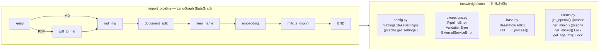

# Import Pipeline Pythonic 重写计划

> 状态：旧参考实现 / 历史草案
>
> 本文档包含迁移早期的 Pythonic 重写思路，且引用了其他项目背景；当前项目请仅将其视为参考材料。

## Context

当前项目 `shopkeeper_brain` 只有导入流程 (import pipeline) 部分的代码。用户希望按照 `docs/pythonic-rewrite-roadmap.md` 的指导思想，对现有代码进行 Pythonic 重写。重写目标：去除 Java 式样板代码，用 Python 最佳实践替代。

**用户要求**：不直接修改代码文件，而是在对话中逐步给出详细指引、代码和架构流程图，由用户自己动手操作。

## 当前问题总结

| # | 文件 | 问题 |
|---|------|------|
| 1 | config.py | 14 个 `os.getenv` 包在 `field(default_factory=lambda:...)` 中，应改用 pydantic-settings |
| 2 | util/client/ | BaseClientManager 用 getattr/setattr DCL，ai_clients.py 第 21 行语法错误，storage_client.py 文件截断 |
| 3 | exceptions.py | 12 个异常类，多数空 `pass`，从未被区分捕获 |
| 4 | base.py | 用 ImportProcessError 包装所有异常（隐藏原始堆栈） |
| 5 | md_to_img_node.py | 4 个单方法内部类应改为模块级函数 |
| 6 | item_name_recognition_node.py | 未完成，process() 使用未定义变量，多个 bug |
| 7 | import_milvus_node.py | index builder 是 stub（只有 `...`）|
| 8 | embedding_chunks_node.py | 第 46 行 `len(batch)` 应为 `len(batch_chunks)` |

## 重写执行计划

### Phase 0: 准备
- 添加 `pydantic-settings>=2.0.0` 到 pyproject.toml
- `uv sync`

### Phase 1: 构建 `knowledge/core/` 基础层
1. `core/config.py` — pydantic-settings Settings + @cache
2. `core/exceptions.py` — 3 个异常类
3. `core/base.py` — 简化 BaseNode
4. `core/clients.py` — 合并所有客户端 (@cache / Lock)

### Phase 2: 创建新 pipeline 骨架
1. `processor/import_pipeline/` 目录结构
2. `state.py` 迁移 + 修正拼写
3. `graph.py` 重命名 + 补全节点连线

### Phase 3: 逐节点迁移重构
1. `entry.py` — 最小改动
2. `pdf_to_md.py` — 清理变量名
3. `md_img.py` — **重点**: 4 个类 → 模块级函数
4. `document_split.py` — 保留核心算法
5. `item_name.py` — 修 bug + NotImplementedError fallback
6. `embedding.py` — 修 bug + 更新 imports
7. `milvus_import.py` — 补全 index builder + 类 → 函数

### Phase 4: 工具迁移
- `markdown_util.py` 的 @classmethod → 模块级函数

### Phase 5: 测试更新 + 清理
- 更新 test imports
- 删除旧目录

## 目标目录结构

```
knowledge/
├── core/
│   ├── __init__.py
│   ├── config.py
│   ├── clients.py
│   ├── exceptions.py
│   └── base.py
├── processor/
│   └── import_pipeline/
│       ├── state.py
│       ├── graph.py
│       └── nodes/
│           ├── entry.py
│           ├── pdf_to_md.py
│           ├── md_img.py
│           ├── document_split.py
│           ├── item_name.py
│           ├── embedding.py
│           └── milvus_import.py
├── util/
│   └── markdown_util.py
└── test/
```

## 验证方式
1. 每个文件写完后: `python -m py_compile <file>` 检查语法
2. Phase 1 完成后: 验证 `Settings()` 能正确加载 `.env`
3. 全部完成后: 用 `temp_dir/万用表的使用` 测试数据跑完整 pipeline


## 重写后的架构总览
### 目录结构变化

```
knowledge/                         
├── core/                          ← 【新建】共用基础设施
│   ├── __init__.py               
│   ├── config.py                  ← 替代 import_processor/config.py
│   ├── exceptions.py              ← 替代 import_processor/exceptions.py (12→3)
│   ├── base.py                    ← 替代 import_processor/base.py
│   └── clients.py                 ← 替代 util/client/ 整个目录 (3文件→1文件)
│
├── processor/
│   └── import_pipeline/           ← 【重命名】从 import_processor
│       ├── __init__.py
│       ├── state.py               ← 迁移 + 修正拼写
│       ├── graph.py               ← 重命名自 main_graph.py + 补全连线
│       └── nodes/
│           ├── __init__.py
│           ├── entry.py           ← 重命名自 entry_node.py
│           ├── pdf_to_md.py       ← 重命名自 pdf_to_md_node.py
│           ├── md_img.py          ← 【重点重构】4个类→函数
│           ├── document_split.py  ← 保留核心算法
│           ├── item_name.py       ← 修bug + 补结构
│           ├── embedding.py       ← 修bug
│           └── milvus_import.py   ← 补全stub + 类→函数
│
├── util/
│   ├── __init__.py                ← 【新建】
│   └── markdown_util.py           ← @classmethod → 模块级函数
│
└── test/                          ← 更新 import 路径
```

## 重写后的管线流程图




### Insight

为什么要抽出 core/ 层？

- 当前 config.py、exceptions.py、base.py 只服务 import，但 roadmap 中 query pipeline 需要完全相同的基础设施。提前抽到 core/ 避免将来复制第二份。
- util/client/ 的 3 个文件 (base.py + ai_clients.py + storage_client.py) 总共 225 行，合并后 ~90 行。关键变化：删除 BaseClientManager 的 getattr/setattr 黑魔法，改用 Python 标准的 @cache 和 Lock。


## 操作步骤
第 1 步: 编辑 knowledge/pyproject.toml，在 dependencies 列表中添加 pydantic-settings：


```toml
dependencies = [
    # ... 现有依赖 ...
    "pydantic>=2.0.0",
    "pydantic-settings>=2.0.0",   # ← 新增这一行
]
```
第 2 步: 安装依赖：


```bash
cd /home/ccr/dev/LearningProject/shopkeeper_brain/knowledge
uv sync
```
第 3 步: 创建目录结构：


```bash
# 创建 core/ 目录
mkdir -p knowledge/core
touch knowledge/core/__init__.py

# 创建新的 import_pipeline 目录
mkdir -p knowledge/processor/import_pipeline/nodes
touch knowledge/processor/import_pipeline/__init__.py
touch knowledge/processor/import_pipeline/nodes/__init__.py

# 确保 util 有 __init__.py
touch knowledge/util/__init__.py
```
## Phase 1: 构建 core/ 基础层


这是整个重写的地基。所有后续文件都依赖这 4 个模块。

### 1.1 创建 knowledge/core/config.py
替代: knowledge/processor/import_processor/config.py (107 行 → ~55 行)


```python
"""
统一配置管理

使用 pydantic-settings 自动从 .env 和环境变量读取，
自动类型转换和校验，缺少必需字段时报清晰错误。
"""

from functools import cache
from pathlib import Path

from pydantic_settings import BaseSettings, SettingsConfigDict


# .env 文件路径: knowledge/.env
_ENV_FILE = Path(__file__).resolve().parents[1] / ".env"


class Settings(BaseSettings):
    """全局配置 — 合并 import/query 两套 config 为一个"""

    # pydantic-settings 会自动读取 .env 文件和环境变量
    # 字段名自动匹配环境变量（不区分大小写）
    model_config = SettingsConfigDict(
        env_file=str(_ENV_FILE),
        env_file_encoding="utf-8",
    )

    # ── LLM ──
    openai_api_key: str = ""
    openai_api_base: str = ""
    vl_model: str = ""
    item_model: str = ""
    model: str = ""                    # 通用模型（环境变量 MODEL）

    # ── Milvus ──
    milvus_url: str = "http://localhost:19530"
    chunks_collection: str = "chunks"
    item_name_collection: str = "item_names"
    entity_name_collection: str = "entity_names"

    # ── MinIO ──
    minio_endpoint: str = "127.0.0.1:9000"
    minio_access_key: str = "minioadmin"
    minio_secret_key: str = "minioadmin"
    minio_bucket_name: str = "shopkeeper-knowledge"
    minio_secure: bool = False

    # ── BGE 模型 ──
    bge_m3_path: str = "BAAI/bge-m3"
    bge_reranker_path: str = "BAAI/bge-reranker-v2-m3"
    bge_device: str = "cuda"
    bge_fp16: bool = True
    embedding_dim: int = 1024

    # ── 处理参数 ──
    max_content_length: int = 2000     # 切片最大长度
    img_content_length: int = 200      # 图片上下文最大长度
    min_content_length: int = 500      # 合并短内容的最小长度
    overlap_sentences: int = 1
    item_name_chunk_k: int = 3
    item_name_chunk_size: int = 2500
    embedding_batch_size: int = 8
    requests_per_minute: int = 15      # VLM 速率限制

    @property
    def minio_base_url(self) -> str:
        """MinIO 的完整 HTTP 基础 URL"""
        scheme = "https" if self.minio_secure else "http"
        return f"{scheme}://{self.minio_endpoint}"


# 图片扩展名常量（不属于环境变量配置）
IMAGE_EXTENSIONS: frozenset[str] = frozenset({".jpg", ".jpeg", ".png"})


@cache
def get_settings() -> Settings:
    """模块级单例 — @cache 保证只创建一次"""
    return Settings()
```
### Insight

pydantic-settings 为什么优于手写 os.getenv？

自动类型转换: bge_fp16: bool = True 会自动把环境变量字符串 "true" 转成 Python True。原来你需要 os.getenv("BGE_FP16").lower() == "true" 这样手动转。
缺失校验: 如果一个 str 字段没有默认值且 .env 中也没有，pydantic 会抛出清晰的 ValidationError，精确告诉你缺了哪个变量。
@cache vs 全局变量单例: @cache 是 Python 标准库提供的装饰器，底层用 C 实现的 dict 缓存结果。比 _config = None; if not _config 模式更简洁，且天然线程安全（CPython GIL 保护 dict 操作）。测试时调用 get_settings.cache_clear() 即可重置。
### 1.2 创建 knowledge/core/exceptions.py
替代: knowledge/processor/import_processor/exceptions.py (107 行 → ~25 行)


```python
"""
管线异常定义

原则: 只在调用方需要区分 catch 时才建子类。
原项目 12 个异常类，所有 except 都是 except Exception，
子类从未被区分捕获 — 精简到 3 个。
"""


class PipelineError(Exception):
    """管线基础异常 — 携带节点名，便于定位"""

    def __init__(self, message: str, *, node: str = ""):
        self.node = node
        super().__init__(f"[{node}] {message}" if node else message)


class ValidationError(PipelineError):
    """输入校验失败 — 状态字段缺失、类型不符、配置无效

    合并了原来的 StateFieldError / ValidationError / ConfigurationError。
    API 层可据此返回 400。
    """


class ExternalServiceError(PipelineError):
    """外部服务失败 — LLM / Milvus / MinIO / MinerU / BGE

    合并了原来的 LLMError / MilvusError / MinioError / EmbeddingError /
    PdfConversionError / StorageError。
    调用方可据此决定是否重试。
    """
```
### Insight

为什么从 12 个异常减到 3 个？

看你原来的代码，所有 except 都写的是 except Exception as e 或 except ConnectionError，从来没有 except MilvusError 或 except PdfConversionError 这样区分捕获的地方。
异常子类的唯一目的是让调用方能按类型区分处理。如果没人区分捕获，子类就是死代码。
保留 ValidationError（可以映射 HTTP 400）和 ExternalServiceError（可以触发重试），这两个有明确的调用方行为差异。
### 1.3 创建 knowledge/core/base.py
替代: knowledge/processor/import_processor/base.py (118 行 → ~35 行)


```python
"""
管线节点基类

所有导入/查询节点继承 BaseNode，实现 process() 方法。
LangGraph 通过 __call__ 调用节点。
"""

from abc import ABC, abstractmethod
import logging

from knowledge.core.config import Settings, get_settings


class BaseNode(ABC):
    """管线节点基类 — import 和 query 共用"""

    name: str = "base_node"  # 子类覆盖

    def __init__(self, settings: Settings | None = None):
        self.settings = settings or get_settings()
        self.logger = logging.getLogger(f"pipeline.{self.name}")

    def __call__(self, state: dict) -> dict:
        """LangGraph 调用入口 — 统一日志，不包装异常"""
        self.logger.info(f"--- {self.name} 开始 ---")
        try:
            result = self.process(state)
        except Exception:
            self.logger.error(f"{self.name} 执行失败", exc_info=True)
            raise  # 让原始异常冒泡，保留完整堆栈
        self.logger.info(f"--- {self.name} 完成 ---")
        return result

    @abstractmethod
    def process(self, state: dict) -> dict:
        """子类实现的核心逻辑"""
        ...
```
### Insight

关键变化: raise vs raise ImportProcessError(...) from e

原来的 base.py 把所有异常包装成 ImportProcessError，导致真正的异常类型和堆栈被隐藏。调试时你看到的总是 ImportProcessError 而不是具体原因。
新版用 bare raise 让原始异常直接冒泡。exc_info=True 确保日志里记录了完整堆栈。
删掉了 log_step() 辅助方法 — 它只是 self.logger.info(f"[{step}] {msg}") 的包装，直接调 logger 更清晰。
删掉了 setup_logging() — 日志配置应该在应用入口（main.py 或 graph.py 的 if __name__）做，不应该藏在基类模块里。
### 1.4 创建 knowledge/core/clients.py
替代: knowledge/util/client/ 整个目录 (225 行 → ~95 行)


```python
"""
所有外部客户端的统一入口

线程安全策略:

- 无状态 HTTP 客户端 (OpenAI, MinIO): @cache
  底层是 C 实现的 dict 查找，线程安全；最坏并发多创建一次，无副作用
- 重量级资源 (Milvus gRPC, BGE GPU 模型): Lock + 二次检查
  内部维护连接池或 GPU 显存，重复创建浪费资源，必须严格单例
"""

import threading
from functools import cache
from urllib.parse import urlparse

import httpx
from minio import Minio
from openai import OpenAI

from knowledge.core.config import get_settings


# ━━━━━━━━━━━━━━━━━━━━━━━━━━━━━━━━━━━━━━━━━━━━
# 无状态 HTTP 客户端 — @cache 即可
# ━━━━━━━━━━━━━━━━━━━━━━━━━━━━━━━━━━━━━━━━━━━━

@cache
def get_openai() -> OpenAI:
    """OpenAI 兼容客户端（Ollama / vLLM / 其他）"""
    s = get_settings()
    hostname = (urlparse(s.openai_api_base).hostname or "").lower()
    is_local = hostname in {"localhost", "127.0.0.1", "0.0.0.0"}

    kwargs: dict = {"api_key": s.openai_api_key, "base_url": s.openai_api_base}
    if is_local:
        # 本地端点不应继承 shell 的代理设置
        kwargs["http_client"] = httpx.Client(trust_env=False)

    return OpenAI(**kwargs)


@cache
def get_minio() -> Minio:
    """MinIO 对象存储客户端"""
    s = get_settings()
    return Minio(
        s.minio_endpoint,
        access_key=s.minio_access_key,
        secret_key=s.minio_secret_key,
        secure=s.minio_secure,
    )


# ━━━━━━━━━━━━━━━━━━━━━━━━━━━━━━━━━━━━━━━━━━━━
# 重量级资源 — Lock + 二次检查
# ━━━━━━━━━━━━━━━━━━━━━━━━━━━━━━━━━━━━━━━━━━━━

_milvus_lock = threading.Lock()
_milvus_client = None


def get_milvus():
    """Milvus 客户端 — 维护 gRPC channel，严格单例"""
    global _milvus_client
    if _milvus_client is not None:
        return _milvus_client
    with _milvus_lock:
        if _milvus_client is None:
            from pymilvus import MilvusClient
            _milvus_client = MilvusClient(uri=get_settings().milvus_url)
    return _milvus_client


_bge_m3_lock = threading.Lock()
_bge_m3_client = None


def get_bge_m3():
    """BGE-M3 嵌入模型 — 加载 ~2.2GB 到 GPU，严格单例"""
    global _bge_m3_client
    if _bge_m3_client is not None:
        return _bge_m3_client
    with _bge_m3_lock:
        if _bge_m3_client is None:
            from pymilvus.model.hybrid import BGEM3EmbeddingFunction
            s = get_settings()
            _bge_m3_client = BGEM3EmbeddingFunction(
                model_name=s.bge_m3_path,
                device=s.bge_device,
                use_fp16=s.bge_fp16,
            )
    return _bge_m3_client


_bge_reranker_lock = threading.Lock()
_bge_reranker_client = None


def get_bge_reranker():
    """BGE Reranker — 加载 ~2.2GB 到 GPU，严格单例"""
    global _bge_reranker_client
    if _bge_reranker_client is not None:
        return _bge_reranker_client
    with _bge_reranker_lock:
        if _bge_reranker_client is None:
            from pymilvus.model.reranker import BGERerankFunction
            s = get_settings()
            _bge_reranker_client = BGERerankFunction(
                model_name=s.bge_reranker_path,
                device=s.bge_device,
                use_fp16=s.bge_fp16,
            )
    return _bge_reranker_client
```
### Insight

为什么 OpenAI 用 @cache 而 Milvus 用 Lock？

OpenAI 客户端内部就是一个 httpx.Client，无状态。即使并发时 @cache 短暂多创建了一次，也只是浪费一个 HTTP client 对象，几乎零成本。
MilvusClient 内部维护一个 gRPC channel + 连接池。创建两个就意味着两套 TCP 连接，浪费系统资源且可能引起端口耗尽。所以用 Lock 严格保证只创建一次。
BGEM3EmbeddingFunction 加载 2.2GB 的模型到 GPU 显存。重复创建 = 显存翻倍 → OOM。必须 Lock。
测试友好: @cache 的客户端测试时调 get_openai.cache_clear() 即可重置。Lock 的客户端需要手动 _milvus_client = None。
## Phase 1 验证
写完以上 4 个文件后，在项目根目录运行：


```bash
cd /home/ccr/dev/LearningProject/shopkeeper_brain
knowledge/.venv/bin/python -c "
from knowledge.core.config import get_settings
s = get_settings()
print(f'openai_api_base = {s.openai_api_base}')
print(f'minio_endpoint  = {s.minio_endpoint}')
print(f'bge_fp16        = {s.bge_fp16} (type: {type(s.bge_fp16).__name__})')
print(f'minio_base_url  = {s.minio_base_url}')
"
```
#### 预期输出


```text
openai_api_base = http://localhost:11434/v1
minio_endpoint  = 127.0.0.1:9000
bge_fp16        = True (type: bool)
minio_base_url  = http://127.0.0.1:9000
```
如果这步通过，core/ 层就建好了。

## Phase 2: 新 pipeline 骨架


### 2.1 创建 knowledge/processor/import_pipeline/state.py
迁移自: import_processor/state.py — 改动极少


```python
"""
导入流程状态类型定义
"""

import copy
from typing import TypedDict


class ImportGraphState(TypedDict, total=False):
    """导入流程图状态 — 整个管线中节点间传递的共享数据容器
    
    total=False: 所有字段都是可选的（不是每个节点都会写入全部字段）
    
    数据流向:
    - entry 写入: file_title, is_pdf/md_read_enabled, pdf/md_path, file_dir
    - pdf_to_md 写入: md_path
    - md_img 写入: md_content
    - document_split 写入: chunks
    - item_name 写入: item_name, chunks[*].item_name
    - embedding 写入: chunks[*].dense_vector, chunks[*].sparse_vector
    - milvus_import 写��: chunks[*].chunk_id
    """

    # ── 任务标识 ──
    task_id: str                   # 用于日志追踪和去重

    # ── 控制标志（entry 设置，graph 路由读取）──
    is_md_read_enabled: bool       # True → 直接走 md_img
    is_pdf_read_enabled: bool      # True → 先走 pdf_to_md

    # ── 路���信息 ──
    import_file_path: str          # 用户传入的原始文件路径（唯一必填项）
    file_dir: str                  # 输出目录（备份、日志、调试用）
    pdf_path: str                  # PDF 文件路径（entry 设置）
    md_path: str                   # MD 文件路径（entry 或 pdf_to_md 设置）

    # ── 文件信息 ──
    file_title: str                # 文件名去后缀（用作文档标识、MinIO 路径前缀）
    item_name: str                 # 识别出的商品名

    # ── 处理中间数据 ──
    md_content: str                # MD 文本内容（md_img 处理后的版本）
    chunks: list                   # chunk 字典列表（逐步被各节点填充向量和元数据）


# 默认状态模板
_DEFAULT_STATE: ImportGraphState = {
    "task_id": "",
    "is_pdf_read_enabled": False,
    "is_md_read_enabled": False,
    "file_dir": "",
    "import_file_path": "",
    "pdf_path": "",
    "md_path": "",
    "file_title": "",
    "md_content": "",
    "chunks": [],
    "item_name": "",
}


def create_default_state(**overrides) -> ImportGraphState:
    """创建默认状态副本，支持字段覆盖

    Examples:
        >>> state = create_default_state(task_id="task_001", import_file_path="doc.pdf")
    """
    state = copy.deepcopy(_DEFAULT_STATE)
    state.update(overrides)
    return state
```
#### 变化说明

修正函数名拼写: creat_default_state → create_default_state
删除 Unpack import（实际无运行时效果）
删除 get_default_state() 冗余函数（和 create_default_state() 无参调用一样）
默认状态变量名加下划线 _DEFAULT_STATE（模块私有）
### 2.2 创建 knowledge/processor/import_pipeline/graph.py
迁移自: import_processor/main_graph.py — 补全节点连线


```python
"""
导入流程编排

构建 LangGraph 状态图:
    entry → (PDF) → pdf_to_md → md_img → document_split → item_name
                                          → embedding → milvus_import → END
    entry → (MD)  →              md_img → ...同上...
"""

from langgraph.graph import StateGraph, END
from langgraph.graph.state import CompiledStateGraph

from knowledge.processor.import_pipeline.state import ImportGraphState
from knowledge.processor.import_pipeline.nodes.entry import EntryNode
from knowledge.processor.import_pipeline.nodes.pdf_to_md import PdfToMdNode
from knowledge.processor.import_pipeline.nodes.md_img import MdImgNode
from knowledge.processor.import_pipeline.nodes.document_split import DocumentSplitNode
from knowledge.processor.import_pipeline.nodes.item_name import ItemNameNode
from knowledge.processor.import_pipeline.nodes.embedding import EmbeddingNode
from knowledge.processor.import_pipeline.nodes.milvus_import import MilvusImportNode


def _import_router(state: ImportGraphState) -> str:
    """条件路由函数 — 根据 entry 设置的标志位决定走哪个分支
    
    路由逻辑:
    - PDF 文件 → pdf_to_md（先解析为 MD，再走后续流程）
    - MD 文件  → md_img（直接跳到图片处理，跳过 PDF 解析）
    - 都不是   → END（entry 校验失败的情况不应到达这里，但防御性兜底）
    """
    if state.get("is_pdf_read_enabled"):
        return "pdf_to_md"
    if state.get("is_md_read_enabled"):
        return "md_img"
    return END


def build_import_graph() -> CompiledStateGraph:
    """构建并编译 LangGraph 导入流程图
    
    流程图结构:
        entry ──(PDF)──→ pdf_to_md ──→ md_img ──→ document_split ──→ item_name
              ──(MD)───────────────→ md_img     ↓                     ↓
                                              embedding ──→ milvus_import ──→ END
    
    每个节点是一个 BaseNode 实例，LangGraph 通过 __call__ 调用其 process() 方法。
    状态 (ImportGraphState) 在节点间传递，每个节点读取所需字段、写入产出字段。
    """
    wf = StateGraph(ImportGraphState)

    # ── 注册所有节点（顺序无关，连线才决定执行顺序）──
    wf.add_node("entry", EntryNode())
    wf.add_node("pdf_to_md", PdfToMdNode())
    wf.add_node("md_img", MdImgNode())
    wf.add_node("document_split", DocumentSplitNode())
    wf.add_node("item_name", ItemNameNode())
    wf.add_node("embedding", EmbeddingNode())
    wf.add_node("milvus_import", MilvusImportNode())

    # ── 定义边（执行顺序）──
    wf.set_entry_point("entry")  # 流程从 entry 开始

    # 条件边: entry 之后根据文件类型分流到不同分支
    wf.add_conditional_edges("entry", _import_router, {
        "pdf_to_md": "pdf_to_md",   # PDF → 先解析
        "md_img": "md_img",          # MD → 直接处理图片
        END: END,                     # 兜底
    })

    # 顺序边: 两个分支在 md_img 汇合后，走同一条后续管线
    wf.add_edge("pdf_to_md", "md_img")
    wf.add_edge("md_img", "document_split")
    wf.add_edge("document_split", "item_name")
    wf.add_edge("item_name", "embedding")
    wf.add_edge("embedding", "milvus_import")
    wf.add_edge("milvus_import", END)

    return wf.compile()
```
#### 变化说明

节点初始化不再传 None — BaseNode.__init__ 的默认值已处理
补全了原来注释掉的 3 个节点 (item_name → embedding → milvus_import)
删掉了 if __name__ 测试代码
## Phase 3: 逐节点迁移重构

### 3.0 设计规则

在写节点代码之前，先确立三条规则，避免节点间校验职责不清、语义不一致。

#### 校验策略

管线共两层校验，职责不重叠：

| 层次 | 谁做 | 检查什么 | 示例 |
|------|------|---------|------|
| **入口校验** | `entry` | 外部输入：文件存在、格式支持、目录有效 | `import_file_path` 指向真实文件 |
| **中间产物校验** | 下游节点 | 本节点所需的 state 字段非空且类型正确 | `chunks` 是 `list[dict]` |

**原则**：下游节点**不重复**检查 entry 已保证的事实（如文件是否存在）。它们只校验自身依赖的中间产物是否就绪。

#### file_dir 语义

- `entry` 负责保证 `state["file_dir"]` 有值且**目录已存在**（用户传入或回退到文件所在目录）。
- 下游节点信任 `file_dir` 已存在。如需在其下创建子目录，使用 `os.makedirs(子路径, exist_ok=True)`。
- 下游节点不再对 `file_dir` 做 `exists()` 检查。

#### 节点契约总表

| 节点 | 读取 state | 写入 state | 校验内容 |
|------|-----------|-----------|---------|
| **entry** | `import_file_path`, `file_dir` | `file_title`, `is_pdf/md_read_enabled`, `pdf/md_path`, `file_dir` | 文件存在、格式支持、目录存在 |
| **pdf_to_md** | `pdf_path`, `file_dir` | `md_path` | `pdf_path` 非空 |
| **md_img** | `md_path` | `md_content` | `md_path` 非空 |
| **document_split** | `md_content`, `file_title`, `file_dir` | `chunks` | `md_content` / `file_title` 非空, 切片参数有效 |
| **item_name** | `chunks`, `file_title` | `item_name`, `chunks[*].item_name` | `chunks` 是 `list[dict]`, `file_title` 非空 |
| **embedding** | `chunks` | `chunks[*].dense_vector / sparse_vector` | `chunks` 是 `list[dict]` |
| **milvus_import** | `chunks` | `chunks[*].chunk_id` | 每个 chunk 有 `dense_vector` + `sparse_vector` |

#### 旧代码修复清单

迁移中修复的 bug，集中列出便于对照：

| 原文件 | 问题 | 修复 |
|--------|------|------|
| `embedding_chunks_node.py:46` | `len(batch)` 变量未定义（应为 `batch_chunks`） | 修正变量名 |
| `item_name_recognition_node.py:3,7` | `from readline import insert_text` / `from torch import chunk` 无用 import | 删除 |
| `item_name_recognition_node.py:22` | `process()` 中 `dense_vector` 等全是未定义变量 | 重构完整流程 |
| `item_name_recognition_node.py:143` | schema 字段名 `file_titi` 拼写错误 | 改为 `file_title` |
| `item_name_recognition_node.py:174` | `self.log.info()` 属性名错误 | 改为 `logger.info()` |
| `item_name_recognition_node.py:178` | `_fill_item_name` 调用签名与定义不匹配 | 内联到 `process()` |
| `import_milvus_node.py:94` | `build_index_params()` 是 stub（只有 `...`） | 补全索引配置 |
| `import_milvus_node.py:175` | 调用 `build_index_params(milvus_client)` 但方法不接受参数 | 合并为 `_ensure_collection()` |
| `import_milvus_node.py:105` | `process()` 缺少 `return state` | 添加 |

---

### 3.1 entry.py — 入口校验与路由

**迁移自**: `entry_node.py` (65 → ~45 行)

```python
"""入口节点 — 校验上传文件, 设置路由标志位"""

from pathlib import Path

from knowledge.core.base import BaseNode
from knowledge.core.exceptions import ValidationError

_SUPPORTED_SUFFIXES = {".pdf", ".md"}


class EntryNode(BaseNode):
    """入口节点 — 整个管线的第一个节点
    
    职责:
    1. 校验用户传入的文件路径（存在性、格式）
    2. 确定输出目录 file_dir
    3. 根据文件后缀设置路由标志位，决定走 PDF 分支还是 MD 分支
    
    是管线中唯一做"外部输入校验"的节点，下游节点不再重复检查文件是否存在。
    """
    name = "entry"

    def process(self, state: dict) -> dict:
        # ── 第一步: 校验外部输入 ──
        # import_file_path 是用户传入的唯一必填项
        import_file_path = state.get("import_file_path", "")
        if not import_file_path:
            raise ValidationError("import_file_path 缺失", node=self.name)

        file_path = Path(import_file_path)
        if not file_path.exists():
            raise ValidationError(f"文件不存在: {import_file_path}", node=self.name)

        # 只接受 .pdf 和 .md 两种格式
        suffix = file_path.suffix.lower()
        if suffix not in _SUPPORTED_SUFFIXES:
            raise ValidationError(f"不支持的文件格式: {suffix}", node=self.name)

        # ── 第二步: 确定输出目录 ──
        # 用户可通过 state["file_dir"] 指定；未指定则回退到文件所在目录
        # 下游所有节点信任 file_dir 已存在，不再做 exists() 检查
        file_dir = state.get("file_dir", "")
        if file_dir:
            if not Path(file_dir).exists():
                raise ValidationError(f"输出目录不存在: {file_dir}", node=self.name)
        else:
            state["file_dir"] = str(file_path.parent)

        # ── 第三步: 设置路由标志位 ──
        # file_title 取文件名（不含后缀），后续用作文档标识、MinIO 路径前缀等
        state["file_title"] = file_path.stem

        # 标志位决定 graph.py 中 _import_router 的分流方向:
        #   is_pdf_read_enabled → pdf_to_md 节点
        #   is_md_read_enabled  → 直接跳到 md_img 节点（跳过 PDF 解析）
        if suffix == ".pdf":
            state["is_pdf_read_enabled"] = True
            state["pdf_path"] = import_file_path
        elif suffix == ".md":
            state["is_md_read_enabled"] = True
            state["md_path"] = import_file_path

        return state
```

> **迁移要点**：`StateFieldError` → `ValidationError(node=...)`；state 类型标注改为 `dict`。

---

### 3.2 pdf_to_md.py — PDF 解析

**迁移自**: `pdf_to_md_node.py` (167 → ~80 行)

```python
"""PDF 转 Markdown — 通过 MinerU 子进程"""

import shutil
import subprocess
import sys
import time
from pathlib import Path

from knowledge.core.base import BaseNode
from knowledge.core.exceptions import ExternalServiceError, ValidationError


class PdfToMdNode(BaseNode):
    """PDF → Markdown 转换节点
    
    整体流程:
    1. 校验 state 中的 pdf_path（entry 已保证文件存在，这里只查字段非空）
    2. 调用 MinerU CLI 子进程将 PDF 解析为 Markdown + images/
    3. 根据 MinerU 的固定输出路径规则，计算生成的 .md 文件路径写入 state
    
    MinerU 输出结构:  {output_dir}/{stem}/hybrid_auto/{stem}.md
                      {output_dir}/{stem}/hybrid_auto/images/
    """
    name = "pdf_to_md"

    def process(self, state: dict) -> dict:
        pdf_path, file_dir = self._validate(state)

        # 调用 MinerU 外部工具，返回 exit code
        exit_code = self._run_mineru(pdf_path, file_dir)
        if exit_code != 0:
            raise ExternalServiceError("MinerU 解析 PDF 失败", node=self.name)

        # 将 MinerU 生成的 .md 路径写入 state，供下游 md_img 读取
        state["md_path"] = self._expected_md_path(pdf_path, file_dir)
        return state

    def _validate(self, state: dict) -> tuple[Path, Path]:
        """校验中间产物 — 只检查字段非空，不检查文件存在（entry 已保证）"""
        pdf_path = state.get("pdf_path", "")
        if not pdf_path:
            raise ValidationError("pdf_path 缺失", node=self.name)

        # file_dir 由 entry 保证存在；若为空则回退到 PDF 所在目录
        file_dir = state.get("file_dir", "")
        file_dir_obj = Path(file_dir) if file_dir else Path(pdf_path).parent

        return Path(pdf_path), file_dir_obj

    def _run_mineru(self, pdf_path: Path, output_dir: Path) -> int:
        """执行 MinerU CLI 子进程，实时流式输出日志
        
        使用 Popen 而非 subprocess.run，因为 MinerU 解析耗时较长（几十秒到几分钟），
        实时输出日志让用户能看到进度，而不是长时间无响应。
        """
        mineru_cmd = self._resolve_mineru()
        cmd = [mineru_cmd, "-p", str(pdf_path), "-o", str(output_dir), "--source", "local"]

        start = time.time()
        # stderr 合并到 stdout（MinerU 的进度信息混合在两个流中）
        # bufsize=1 启用行缓冲，确保日志实时输出
        proc = subprocess.Popen(
            cmd,
            stdout=subprocess.PIPE,
            stderr=subprocess.STDOUT,
            text=True,
            errors="replace",
            encoding="utf-8",
            bufsize=1,
        )

        # 逐行读取子进程输出，转发到 logger
        if proc.stdout:
            for line in proc.stdout:
                self.logger.info(line.rstrip())

        proc.wait()
        elapsed = time.time() - start

        if proc.returncode == 0:
            self.logger.info(f"MinerU 解析成功 ({elapsed:.1f}s)")
        else:
            self.logger.error(f"MinerU 解析失败 (exit={proc.returncode}, {elapsed:.1f}s)")

        return proc.returncode

    @staticmethod
    def _resolve_mineru() -> str:
        """查找 mineru 可执行文件路径
        
        优先级: 当前虚拟环境 > 系统 PATH
        避免意外调用到系统级安装的不同版本。
        """
        venv_mineru = Path(sys.prefix) / "bin" / "mineru"
        if venv_mineru.exists():
            return str(venv_mineru)

        found = shutil.which("mineru")
        if found:
            return found

        raise ExternalServiceError("未找到 mineru 命令，请确认已安装")

    @staticmethod
    def _expected_md_path(pdf_path: Path, file_dir: Path) -> str:
        """根据 MinerU 的固定输出路径规则计算 .md 文件位置
        
        MinerU 总是输出到: {output_dir}/{文件名}/hybrid_auto/{文件名}.md
        """
        stem = pdf_path.stem
        return str(file_dir / stem / "hybrid_auto" / f"{stem}.md")
```

> **迁移要点**：变量名 `import_file_obj_obj` → `pdf_path`；移除 `pdf_path.exists()` 重复校验（见 3.0 校验策略）；`_resolve_mineru` / `_expected_md_path` 改为 `@staticmethod`。

---

### 3.3 md_img.py — 图片处理（★ 重点重构）

**迁移自**: `md_to_img_node.py` (650 → ~380 行) — 4 个单方法内部类 → 模块级函数  
**本节新增**: `knowledge/util/markdown_index.py`，供 `md_img` 与 `document_split` 共用

| 原类 | 替代函数 |
|------|---------|
| `_MdFileHandler` | `backup_and_write()` |
| `_ImageScanner` | `scan_images()` / `_build_image_context()` |
| `_VLMSummarizer` | `summarize_images()` / `_summarize_one()` |
| `_ImageUploader` | `upload_and_replace()` |

> **设计调整**：这里不再为每张图片单独正则扫全文，也不再用 `_find_heading_up()` / `_find_heading_down()` 反复查找最近标题。改为先一次性构建 `MarkdownIndex`，得到 `sections`、`image_refs`、`line_to_section`、`lines` 四类结构信息，再供 `md_img` 与 `document_split` 复用。这样既能规避 code fence 里的伪标题 / 伪图片，又能把 Phase 3 中两处 Markdown 结构解析统一成一套逻辑。

```python
"""
Markdown 图片处理节点

流程:
1. 读取 MD
2. 构建 MarkdownIndex
3. 扫描 images/ 与 image_refs 做 join
4. 基于 section 提取图片上下文
5. VLM 生成摘要
6. 上传 MinIO 并按已解析的 image_refs 精准替换
7. 写回 MD
"""

import base64
import logging
import shutil
import time
from collections import deque
from dataclasses import dataclass
from pathlib import Path

from knowledge.core.base import BaseNode
from knowledge.core.config import Settings, IMAGE_EXTENSIONS
from knowledge.util.markdown_index import MarkdownImageRef, MarkdownIndex, build_markdown_index

logger = logging.getLogger(__name__)


@dataclass
class ImageContext:
    """图片的上下文信息（供 VLM 参考）"""
    heading: str
    pre_text: str
    post_text: str


@dataclass
class ImageInfo:
    """一张图片的完整信息"""
    name: str
    path: str
    context: ImageContext


class MdImgNode(BaseNode):
    """Markdown 图片处理节点
    
    整体流程（5 步）:
    1. 读取 MD 文件，构建 MarkdownIndex（统一解析 section 和图片引用）
    2. 扫描 images/ 目录，与 index 中的图片引用做 join → 得到有效图片列表
    3. 调用 VLM（视觉语言模型）为每张图片生成中文摘要标题
    4. 上传图片到 MinIO，用远程 URL + VLM 摘要替换 MD 中的本地图片引用
    5. 备份原文件，写回修改后的 MD
    
    设计要点:
    - 不再为每张图片单独正则扫全文（旧代码的做法），而是一次性构建 MarkdownIndex
    - MarkdownIndex 能正确跳过 code fence 中的伪图片引用
    - 同一个 index 后续会传给 document_split 复用，保证两个节点的结构理解一致
    """
    name = "md_img"

    def process(self, state: dict) -> dict:
        md_path = Path(state["md_path"])          # entry 已保证非空
        md_content = md_path.read_text(encoding="utf-8").replace("\r\n", "\n").replace("\r", "\n")
        img_dir = md_path.parent / "images"       # MinerU 固定在 .md 同级生成 images/

        # 没有图片目录 → 纯文本 MD，跳过整个图片流程
        if not img_dir.exists():
            self.logger.info("图片目录不存在，跳过图片处理")
            state["md_content"] = md_content
            return state

        # 步骤 1+2: 构建结构索引 → 扫描图片目录与 MD 引用做匹配
        index = build_markdown_index(md_content, file_title=md_path.stem)
        images = scan_images(img_dir, index, self.settings.img_content_length)
        if not images:
            self.logger.info("未找到有效图片引用，跳过")
            state["md_content"] = md_content
            return state

        # 步骤 3: VLM 生成摘要（含速率限制，避免打满 API）
        doc_name = md_path.stem
        summaries = summarize_images(
            images, doc_name,
            vl_model=self.settings.vl_model,
            rpm=self.settings.requests_per_minute,
        )

        # 步骤 4: 上传 MinIO + 精准替换 MD 中的图片引用
        # 基于 index.image_refs 做逐行替换，而不是全文正则 sub（避免误替换 code fence 中的内容）
        md_content = upload_and_replace(
            index=index,
            images=images,
            summaries=summaries,
            doc_name=doc_name,
            settings=self.settings,
        )

        # 步骤 5: 备份原文件 → 写回修改后的内容
        backup_and_write(md_path, md_content)
        state["md_content"] = md_content
        return state


# ── 扫描图片 ──

def scan_images(
    img_dir: Path,
    index: MarkdownIndex,
    img_content_length: int,
) -> list[ImageInfo]:
    """扫描图片目录，并与 MarkdownIndex 中的图片引用做 join
    
    思路: 以"磁盘上实际存在的图片文件"为驱动，去 index.image_refs 中查找对应引用。
    只有同时满足两个条件的图片才会进入后续流程:
      1. 文件在 images/ 目录中实际存在
      2. MD 文本中有对该文件的  引用
    """
    # 先把 index 中的图片引用按文件名分组，方便 O(1) 查找
    refs_by_name: dict[str, list[MarkdownImageRef]] = {}
    for ref in index.image_refs:
        refs_by_name.setdefault(ref.file_name, []).append(ref)

    results: list[ImageInfo] = []
    for img_path in img_dir.iterdir():
        if not img_path.is_file():
            continue
        if img_path.suffix.lower() not in IMAGE_EXTENSIONS:
            continue

        # 用文件名去 MD 引用中查找 — 找不到说明 MD 中没引用这张图
        refs = refs_by_name.get(img_path.name, [])
        if not refs:
            logger.info(f"MD 中未找到 {img_path.name} 的引用")
            continue

        # 取第一个引用位置来构建上下文（同一图片多次引用时，上下文取首次出现处）
        context = _build_image_context(index, refs[0], img_content_length)
        results.append(ImageInfo(name=img_path.name, path=str(img_path), context=context))

    logger.info(f"找到 {len(results)} 个有效图片引用")
    return results


def _build_image_context(
    index: MarkdownIndex,
    ref: MarkdownImageRef,
    max_len: int,
) -> ImageContext:
    """基于 section 边界提取图片的上下文，供 VLM 参考
    
    与旧代码的区别:
    - 旧代码: 从图片位置向上逐行搜索标题、向下逐行搜索标题，每张图片都要扫一遍
    - 新代码: 图片所在 section 的边界已在 index 中算好，直接切片取上下文
    
    上下文范围: [section.start_line, ref.line_idx) 为上文，
               (ref.line_idx, section.end_line) 为下文
    """
    section = index.sections[ref.section_idx]

    # 图片所在 section 内，图片行之前的内容 = 上文
    pre_lines = index.lines[section.start_line:ref.line_idx]
    # 图片行之后到 section 结束 = 下文
    post_lines = index.lines[ref.line_idx + 1:section.end_line]

    return ImageContext(
        heading=section.title,
        pre_text=_extract_limited_context(pre_lines, max_len, direction="up"),
        post_text=_extract_limited_context(post_lines, max_len, direction="down"),
    )


def _extract_limited_context(
    context_lines: list[str], max_len: int, direction: str,
) -> str:
    """按段落截取上下文，总字符数不超过 max_len
    
    算法思路:
    1. 先把行按空行/图片行分割成段落列表
    2. 根据 direction 决定从哪端开始选取段落（贪心）
    3. 逐段累加字符数，超过 max_len 时停止
    
    为什么按段落而不是按字符截断？
    - 按字符截断会把句子切断，VLM 看到的上下文不完整
    - 按段落截取保证语义完整性，宁可少给一段也不截断半句话

    direction: "up" 从底部向上取（取离图片最近的段落）, 
               "down" 从顶部向下取
    """
    # ── 第一步: 按空行和图片行分割成段落 ──
    current_paragraph: list[str] = []
    paragraphs: list[str] = []

    for line in context_lines:
        stripped = line.strip()
        is_blank = not stripped
        is_image = stripped.startswith("")

        # 空行或其他图片行作为段落分隔符（其他图片不要混入上下文）
        if is_blank or is_image:
            if current_paragraph:
                paragraphs.append("\n".join(current_paragraph))
                current_paragraph = []
            continue
        current_paragraph.append(line)

    if current_paragraph:
        paragraphs.append("\n".join(current_paragraph))

    # ── 第二步: 按方向贪心选取段落 ──
    # "up" 方向: 反转后从尾部开始取 → 优先选离图片最近的段落
    if direction == "up":
        paragraphs.reverse()

    total = 0
    selected: list[str] = []
    for para in paragraphs:
        if total + len(para) > max_len and selected:
            break  # 已有内容且再加就超限 → 停止（但至少保留一段）
        selected.append(para)
        total += len(para)

    # 恢复原始顺序（上文应该从上往下读）
    if direction == "up":
        selected.reverse()

    return "\n\n".join(selected)


# ── VLM 摘要 ──

def summarize_images(
    images: list[ImageInfo],
    doc_name: str,
    vl_model: str,
    rpm: int,
) -> dict[str, str]:
    """为所有图片调用 VLM 生成中文摘要标题
    
    返回 {图片文件名: 摘要文本} 字典。
    VLM 客户端获取失败时优雅降级 → 全部返回"暂无摘要"，不阻断管线。
    每次调用前经过滑动窗口速率限制，避免打满 API 配额。
    """
    from knowledge.core.clients import get_openai

    summaries: dict[str, str] = {}
    try:
        vlm_client = get_openai()
    except Exception:
        # 获取客户端失败 → 不中断管线，图片保留占位摘要
        logger.warning("VLM 客户端获取失败，所有图片使用默认摘要")
        return {img.name: "暂无摘要" for img in images}

    # timestamps 记录每次请求的时间戳，用于滑动窗口限速
    timestamps: deque[float] = deque()
    for img in images:
        _enforce_rate_limit(timestamps, rpm)
        summaries[img.name] = _summarize_one(img, vlm_client, vl_model, doc_name)

    logger.info(f"生成 {len(summaries)} 个图片摘要")
    return summaries


def _summarize_one(img: ImageInfo, client, vl_model: str, doc_name: str) -> str:
    """调用 VLM 为单张图片生成摘要
    
    构造多模态消息: text（文档标题 + 图片上下文） + image（base64 编码）
    VLM 结合图片视觉内容和文本上下文，生成一个精准的中文标题。
    """
    # 拼接上下文: 标题 + 上文 + 下文（过滤空值）
    parts = [p for p in (img.context.heading, img.context.pre_text, img.context.post_text) if p]
    context_text = "\n".join(parts) if parts else "暂无上下文"

    # 将图片文件读取为 base64 字符串（OpenAI 兼容 API 的图片传输方式）
    try:
        with open(img.path, "rb") as f:
            img_b64 = base64.b64encode(f.read()).decode("utf-8")
    except IOError:
        logger.error(f"读取图片文件失败: {img.path}")
        return "暂无图片描述"

    # 调用 VLM API — 使用 OpenAI 兼容的多模态消息格式
    try:
        resp = client.chat.completions.create(
            model=vl_model,
            messages=[{
                "role": "user",
                "content": [
                    {
                        "type": "text",
                        "text": (
                            f"任务：为Markdown文档中的图片生成一个简短的中文标题。\n"
                            f"背景信息：\n"
                            f"  1. 所属文档标题：\"{doc_name}\"\n"
                            f"  2. 图片上下文：{context_text}\n"
                            f"请结合图片内容和上述上下文信息，"
                            f"用中文简要总结这张图片的内容，"
                            f"生成一个精准的中文标题（不要包含图片二字）。"
                        ),
                    },
                    {
                        # data URI 方式内嵌图片，不需要图片有公网 URL
                        "type": "image_url",
                        "image_url": {"url": f"data:image/jpeg;base64,{img_b64}"},
                    },
                ],
            }],
        )
        return resp.choices[0].message.content.strip()
    except Exception as e:
        logger.error(f"图片摘要生成失败 {img.path}: {e}")
        return "暂无图片描述"


def _enforce_rate_limit(timestamps: deque[float], max_rpm: int, window: int = 60):
    """滑动窗口速率限制 — 确保 window 秒内请求不超过 max_rpm 次
    
    算法:
    1. 清除窗口外的过期时间戳
    2. 如果窗口内已满 → 计算需要等待的时间并 sleep
    3. 记录本次请求的时间戳
    
    使用 deque 而非 list: 清除过期时间戳时 popleft() 是 O(1)
    """
    now = time.time()
    # 清除超出窗口期的旧时间戳
    while timestamps and now - timestamps[0] >= window:
        timestamps.popleft()

    # 窗口内请求数已满 → 等到最早的请求过期
    if len(timestamps) >= max_rpm:
        sleep_dur = window - (now - timestamps[0])
        if sleep_dur > 0:
            logger.info(f"达到速率限制，暂停 {sleep_dur:.1f}s...")
            time.sleep(sleep_dur)
        # sleep 后重新清除过期时间戳
        now = time.time()
        while timestamps and now - timestamps[0] >= window:
            timestamps.popleft()

    timestamps.append(now)


# ── 上传 + 替换 ──

def upload_and_replace(
    index: MarkdownIndex,
    images: list[ImageInfo],
    summaries: dict[str, str],
    doc_name: str,
    settings: Settings,
) -> str:
    """上传图片到 MinIO，并替换 MD 中的图片引用为远程 URL + VLM 摘要
    
    两阶段设计:
      阶段 1: 上传所有图片到 MinIO，收集 {图片名: 远程URL} 映射
      阶段 2: 基于 index.image_refs 逐行精准替换（不用全文正则 sub）
    
    精准替换的好处:
    - 只替换 index 已识别的真实引用（code fence 中的伪引用已被排除）
    - 用 ref.raw 做字符串替换而非正则，避免特殊字符导致的误匹配
    - replace(..., 1) 确保同一行有多个引用时逐个替换，不会遗漏
    """
    from knowledge.core.clients import get_minio

    # MinIO 客户端获取失败 → 降级为保留本地路径（不阻断管线）
    try:
        minio_client = get_minio()
    except Exception:
        logger.warning("MinIO 客户端获取失败，保留本地路径")
        minio_client = None

    # 确保存储桶存在（幂等操作）
    bucket = settings.minio_bucket_name
    if minio_client:
        try:
            if not minio_client.bucket_exists(bucket):
                minio_client.make_bucket(bucket)
        except Exception as e:
            logger.error(f"MinIO 桶操作失败: {e}")

    # ── 阶段 1: 上传图片，构建 URL 映射 ──
    # MinIO 对象路径: knowledge/{文档名}/images/{图片名}
    url_map: dict[str, str] = {}
    for img in images:
        if minio_client:
            object_name = f"knowledge/{doc_name}/images/{img.name}"
            try:
                minio_client.fput_object(bucket, object_name, img.path)
                url_map[img.name] = f"{settings.minio_base_url}/{bucket}/{object_name}"
                logger.info(f"上传成功: {object_name}")
            except Exception as e:
                logger.error(f"上传失败 {object_name}: {e}")
                url_map[img.name] = img.path  # 上传失败 → 兜底用本地路径
        else:
            url_map[img.name] = img.path

    # ── 阶段 2: 基于 index 逐行替换图片引用 ──
    # 复制 lines 避免修改 index 的原始数据
    lines = index.lines.copy()
    replaced = 0

    # 按行号分组：同一行可能有多个图片引用
    refs_by_line: dict[int, list[MarkdownImageRef]] = {}
    for ref in index.image_refs:
        refs_by_line.setdefault(ref.line_idx, []).append(ref)

    for line_idx, refs in refs_by_line.items():
        line = lines[line_idx]
        for ref in refs:
            if ref.file_name not in url_map:
                continue
            summary = summaries.get(ref.file_name, "暂无描述")
            # 用 ref.raw（原始匹配文本）做精确替换:
            #    → 
            line = line.replace(ref.raw, f"", 1)
            replaced += 1
        lines[line_idx] = line

    logger.info(f"共替换 {replaced} 处图片引用")
    return "\n".join(lines)


# ── 备份 + 写回 ──

def backup_and_write(md_path: Path, new_content: str):
    """备份原文件后写入新内容"""
    backup_path = md_path.with_suffix(f".backup{md_path.suffix}")
    shutil.copyfile(md_path, backup_path)
    logger.info(f"已备份: {backup_path.name}")
    md_path.write_text(new_content, encoding="utf-8")
```

---

### 3.4 document_split.py — 文档切分

**迁移自**: `document_split_node.py` (343 → ~290 行)

核心算法仍是三级策略，但第一步不再自己重新解析 Markdown，而是直接消费 `MarkdownIndex.sections`。这样 `document_split` 与 `md_img` 会共享同一套标题层级、fence 识别、section 边界定义，避免 Phase 3 内部出现两套“谁算标题、谁在 code fence 外、section 从哪里开始到哪里结束”的规则。

这一节还有一个容易漏掉的迁移点: 旧实现里 `document_split_node.py` 依赖的是类接口 `MarkdownTableLinearizer.process()`；重写后应改成模块级函数导入:

```python
from knowledge.util.markdown_util import linearize_tables
```

也就是说，原来的:

```python
from knowledge.util.markdown_util import MarkdownTableLinearizer
```

以及调用:

```python
body = MarkdownTableLinearizer.process(body)
```

都要一起替换为模块级函数版本，避免文档前后出现“两套入口”并存。

```python
"""
文档切分节点

三级策略:
1. 复用 MarkdownIndex.sections
2. 长段拆分 (RecursiveCharacterTextSplitter)
3. 短段合并 (同父标题贪心累加)
"""

import json
import logging
import os
from dataclasses import dataclass, replace

from langchain_text_splitters import RecursiveCharacterTextSplitter

from knowledge.core.base import BaseNode
from knowledge.core.exceptions import ValidationError
from knowledge.util.markdown_index import MarkdownSection, build_markdown_index
from knowledge.util.markdown_util import linearize_tables

logger = logging.getLogger(__name__)


class DocumentSplitNode(BaseNode):
    """文档切分节点 — 将 Markdown 切成适合嵌入的 chunk
    
    三级策略:
    1. 一级切分: 复用 MarkdownIndex.sections（按标题拆分，与 md_img 共享同一套解析逻辑）
    2. 二级切分: 超过 max_len 的长 section → langchain RecursiveCharacterTextSplitter 再拆
    3. 合并: 过短的相邻 section（同父标题）→ 贪心累加合并
    
    设计要点:
    - 不再自己维护 _HEADING_RE / in_fence / _split_by_headings()
    - section 边界直接来自 MarkdownIndex，与 md_img 的结构理解完全一致
    """
    name = "document_split"

    def process(self, state: dict) -> dict:
        md_content, file_title = self._validate(state)

        max_len = self.settings.max_content_length   # 超过此长度的 section 需要二级拆分
        min_len = self.settings.min_content_length   # 低于此长度的 section 尝试合并

        # 第一步: 复用 MarkdownIndex 的 sections 作为一级切分结果
        index = build_markdown_index(md_content, file_title)
        # 第二步: 拆分过长的 section
        sections = _split_long_sections(index.sections, max_len)
        # 第三步: 合并过短的相邻 section
        sections = _merge_short_sections(sections, min_len)

        # 组装成下游节点（embedding）期望的 chunk 字典格式
        chunks = _assemble_chunks(sections)
        self.logger.info(f"最终 chunk 数: {len(chunks)}")

        self._backup_chunks(state.get("file_dir", ""), chunks)
        state["chunks"] = chunks
        return state

    def _validate(self, state: dict) -> tuple[str, str]:
        md_content = state.get("md_content", "")
        if not md_content:
            raise ValidationError("md_content 缺失", node=self.name)

        md_content = md_content.replace("\r\n", "\n").replace("\r", "\n")

        file_title = state.get("file_title", "")
        if not file_title:
            raise ValidationError("file_title 缺失", node=self.name)

        s = self.settings
        if s.max_content_length <= 0 or s.min_content_length <= 0:
            raise ValidationError("切片长度参数无效", node=self.name)

        return md_content, file_title

    def _backup_chunks(self, file_dir: str, chunks: list):
        """调试用备份 — file_dir 由 entry 保证存在，exist_ok 仅防御性保护"""
        if not file_dir:
            return
        try:
            os.makedirs(file_dir, exist_ok=True)
            output = os.path.join(file_dir, "chunks.json")
            with open(output, "w", encoding="utf-8") as f:
                json.dump(chunks, f, ensure_ascii=False, indent=2)
        except Exception as e:
            self.logger.warning(f"备份失败: {e}")


def _split_long_sections(
    sections: list[MarkdownSection],
    max_len: int,
) -> list[MarkdownSection]:
    """二级切分: 将超过 max_len 的 section 用 langchain 递归切分器拆分
    
    每个 chunk 的最终格式是 "标题\\n\\n内容"，所以 body 的可用长度 = max_len - len(标题前缀)
    
    拆分优先级（RecursiveCharacterTextSplitter 的 separators）:
    1. 双换行 \\n\\n（段落边界）→ 最优，语义完整
    2. 单换行 \\n（行边界）→ 次优
    3. 句号 。（句子边界）→ 兜底
    """
    result: list[MarkdownSection] = []
    for section in sections:
        body = section.body
        title = section.title

        # 如果 body 中包含 HTML 表格，先线性化为可读文本
        # 否则表格的 <td> 标签会占大量字符但信息密度低
        if "<table>" in body:
            body = linearize_tables(body)
            section = replace(section, body=body)

        # 防止超长标题占满 chunk 空间
        if len(title) > 80:
            title = title[:80]

        # 最终 chunk = "标题\n\n内容"，计算 body 的可用长度
        title_prefix = f"{title}\n\n"
        total = len(title_prefix) + len(body)

        # 未超限 → 不拆，直接保留
        if total <= max_len:
            result.append(section)
            continue

        # 标题本身就超长 → 无法拆分，原样保留（防御性保护）
        body_budget = max_len - len(title_prefix)
        if body_budget <= 0:
            result.append(section)
            continue

        # 使用 langchain 递归切分器按语义边界拆分
        splitter = RecursiveCharacterTextSplitter(
            chunk_size=body_budget,
            chunk_overlap=0,             # 不重叠（overlap 在嵌入阶段可能引入噪声）
            separators=["\n\n", "\n", "。"],
            keep_separator=False,
        )
        sub_texts = splitter.split_text(body)

        if len(sub_texts) <= 1:
            result.append(section)
            continue

        # 拆分后的每个子段都继承原 section 的元数据，标题加后缀 _0, _1, ...
        for i, text in enumerate(sub_texts):
            result.append(replace(section, body=text, title=f"{title}_{i}"))

    return result


def _merge_short_sections(
    sections: list[MarkdownSection],
    min_len: int,
) -> list[MarkdownSection]:
    """三级合并: 将同父标题下过短的相邻 sections 贪心累加合并
    
    算法: 维护一个"当前累积 section"，逐个检查下一个 section:
      - 同父标题 且 当前内容不够长 → 合并（body 拼接，标题回退为父标题）
      - 否则 → "封箱"当前，开始新的累积
    
    为什么要求同父标题？
    - 避免把不同章节的内容混在一起（如"安装"和"卸载"不应合并）
    - parent_title 来自 MarkdownIndex，保证和 md_img 的理解一致
    """
    if not sections:
        return []

    merged: list[MarkdownSection] = []
    current = sections[0]

    for next_sec in sections[1:]:
        same_parent = current.parent_title == next_sec.parent_title

        if same_parent and len(current.body) < min_len:
            # 合并: body 拼接，标题回退为共同的父标题，end_line 更新
            current = replace(
                current,
                body=current.body.rstrip() + "\n\n" + next_sec.body.lstrip(),
                title=current.parent_title,
                end_line=next_sec.end_line,
            )
        else:
            # 封箱: 当前 section 已足够长或不同源，存入结果
            merged.append(current)
            current = next_sec

    # 别忘了最后一个
    merged.append(current)
    return merged


def _assemble_chunks(sections: list[MarkdownSection]) -> list[dict[str, str]]:
    """将 sections 组装为下游节点（embedding/item_name）期望的 chunk 字典格式
    
    每个 chunk 的 content = "标题\\n\\n正文"，这样嵌入时标题信息也会被编码进向量。
    """
    return [
        {
            "content": f"{sec.title}\n\n{sec.body}",
            "title": sec.title,
            "parent_title": sec.parent_title,
            "file_title": sec.file_title,
        }
        for sec in sections
    ]
```

> **迁移要点**：
> `document_split` 不再维护自己的 `_HEADING_RE` / `in_fence` / `_split_by_headings()`；
> Phase 3 中只有 `md_img` 与 `document_split` 接入 `MarkdownIndex`，其它节点继续只消费 state，不引入额外复杂度；
> `MarkdownTableLinearizer.process()` → `linearize_tables()`（Phase 4 添加别名函数）。

### 3.4.1 markdown_index.py — 共用 Markdown 结构索引（新增）

这是 Phase 3 的结构化优化核心。职责很单一：一次扫描 Markdown，统一产出 section 边界和图片引用列表，不包含任何业务侧动作。

```python
"""
Markdown 结构索引 — 一次扫描，统一产出 section 边界和图片引用列表

职责: 纯结构解析，不包含任何业务动作（不上传、不切分、不调 VLM）
消费者: md_img（用 image_refs + sections 提取图片上下文）
        document_split（用 sections 做一级切分）

设计边界: 只服务这两个节点，其他节点不接入，避免全管线耦合。
"""

from dataclasses import dataclass
import re
from pathlib import Path


# CommonMark 标题正则: 允许标题前 0-3 个空格, #{1,6} + 至少一个空格 + 标题文本
_HEADING_RE = re.compile(r"^\s{0,3}(#{1,6})\s+(.+?)\s*$")
# Markdown 图片引用: 
_IMAGE_RE = re.compile(r"!\[(.*?)\]\((.*?)\)")


@dataclass
class MarkdownSection:
    """一个标题下的内容区间"""
    title: str            # 该 section 的标题行原文（如 "## 安装步骤"）
    parent_title: str     # 父级标题（用于 document_split 合并短段时判断是否同源）
    file_title: str       # 文档标题（文件名去后缀），作为顶层兜底标题
    level: int            # 标题层级: 0=文档开头无标题, 1-6 对应 #-######
    start_line: int       # section 内容的起始行号（不含标题行本身）
    end_line: int         # section 内容的结束行号（不含，左闭右开）
    body: str             # section 内容文本（不含标题行）


@dataclass
class MarkdownImageRef:
    """一个图片引用的解析结果"""
    alt: str              # alt 文本: 
    target: str           # 图片路径: 
    file_name: str        # 从 target 中提取的文件名（用于和 images/ 目录匹配）
    raw: str              # 原始匹配文本，如 ""，用于精确替换
    line_idx: int         # 所在行号
    section_idx: int      # 所属 section 的索引（用于快速定位上下文）


@dataclass
class MarkdownIndex:
    """Markdown 结构索引 — build_markdown_index() 的返回值"""
    lines: list[str]                  # 原文按行拆分的列表
    sections: list[MarkdownSection]   # 所有 section（按出现顺序）
    image_refs: list[MarkdownImageRef] # 所有图片引用（已排除 code fence 中的伪引用）
    line_to_section: list[int]        # line_to_section[i] = 第 i 行属于哪个 section 的索引


def build_markdown_index(md_content: str, file_title: str) -> MarkdownIndex:
    """一次扫描 Markdown 文本，构建完整的结构索引
    
    算法分两趟:
      第一趟: 逐行扫描，识别标题 → 切分 sections，同时处理 code fence 状态
      第二趟: 遍历所有行，在非 code-fence 区域提取图片引用
    
    为什么要两趟？
    - 第一趟建立 section 边界和 line_to_section 映射
    - 第二趟提取图片引用时需要 line_to_section 来标注每个引用属于哪个 section
    
    Args:
        md_content: Markdown 文本（已统一换行符为 \\n）
        file_title: 文档标题（文件名去后缀），用于无标题内容的兜底
    """
    lines = md_content.split("\n")
    sections: list[MarkdownSection] = []
    image_refs: list[MarkdownImageRef] = []
    # line_to_section[i] = 第 i 行属于第几个 section，-1 表示标题行本身
    line_to_section = [-1] * len(lines)

    # ── 第一趟: 切分 sections ──
    body_lines: list[str] = []      # 当前 section 正在收集的内容行
    body_start = 0                   # 当前 section 内容的起始行号
    current_title = file_title       # 当前 section 的标题（文档开头默认用 file_title）
    current_level = 0                # 当前标题层级（0 = 文档开头无标题区域）
    hierarchy = [""] * 7             # hierarchy[level] = 该层级最近出现的标题文本
    in_fence = False                 # code fence 状态追踪（``` 或 ~~~）

    def flush(end_line: int):
        """将已收集的内容行打包成一个 MarkdownSection 并存入 sections 列表
        
        parent_title 的查找逻辑: 从当前层级向上找最近的非空标题
        例如: 当前是 ### 三级标题，向上找 ##、# 中最近有值的那个
        找不到时回退到 current_title 或 file_title
        """
        nonlocal body_lines, body_start
        body = "\n".join(body_lines)
        # 向上查找父标题: range(current_level-1, 0, -1) 即从上一级往顶级方向找
        parent_title = next((hierarchy[i] for i in range(current_level - 1, 0, -1) if hierarchy[i]), "")
        if not parent_title:
            parent_title = current_title or file_title

        section_idx = len(sections)
        sections.append(MarkdownSection(
            title=current_title or file_title,
            parent_title=parent_title,
            file_title=file_title,
            level=current_level,
            start_line=body_start,
            end_line=end_line,
            body=body,
        ))
        # 回填 line_to_section 映射: 这个范围内的所有行都属于这个 section
        for i in range(body_start, end_line):
            line_to_section[i] = section_idx
        body_lines = []
        body_start = end_line + 1

    for idx, line in enumerate(lines):
        stripped = line.strip()
        # code fence 检测: ``` 或 ~~~ 切换状态（toggle）
        # 在 fence 内部的内容不做标题/图片解析，避免误判
        if stripped.startswith("```") or stripped.startswith("~~~"):
            in_fence = not in_fence

        # 只在非 fence 区域尝试匹配标题
        match = _HEADING_RE.match(line) if not in_fence else None
        if match:
            # 遇到新标题 → 把之前收集的内容打包成一个 section
            flush(idx)
            current_title = line                       # 记录标题原文
            current_level = len(match.group(1))        # "#" 的个数 = 标题层级
            hierarchy[current_level] = current_title   # 更新该层级的标题
            # 清除所有下级标题（遇到 ## 时，###/####/... 的记录已过时）
            for i in range(current_level + 1, 7):
                hierarchy[i] = ""
            body_start = idx + 1  # 下一行开始收集新 section 的内容
            continue

        # 非标题行 → 作为当前 section 的内容行收集
        body_lines.append(line)

    # 处理最后一个 section（文件末尾不会再遇到新标题来触发 flush）
    flush(len(lines))

    # ── 第二趟: 提取图片引用 ──
    # 只在有效 section 范围内（line_to_section >= 0）提取
    # 标题行本身 line_to_section = -1，会被跳过（标题行中的图片引用不处理）
    for idx, line in enumerate(lines):
        section_idx = line_to_section[idx]
        if section_idx < 0:
            continue  # 标题行或未分配行，跳过
        for match in _IMAGE_RE.finditer(line):
            target = match.group(2)             # 图片路径部分
            image_refs.append(MarkdownImageRef(
                alt=match.group(1),             # alt 文本
                target=target,
                file_name=Path(target).name,    # 提取纯文件名（去掉路径前缀）
                raw=match.group(0),             # 完整匹配文本，供后续精确替换
                line_idx=idx,
                section_idx=section_idx,         # 标注属于哪个 section
            ))

    return MarkdownIndex(
        lines=lines,
        sections=sections,
        image_refs=image_refs,
        line_to_section=line_to_section,
    )
```

> **设计边界**：`MarkdownIndex` 只服务 `md_img` 与 `document_split`。`entry` / `pdf_to_md` / `item_name` / `embedding` / `milvus_import` 不接入这一层，避免 Phase 3 为局部优化引入全管线耦合。

---

### 3.5 item_name.py — 商品名识别（修复最多）

**迁移自**: `item_name_recognition_node.py` (204 → ~160 行)

原文件有 6 处 bug（详见 3.0 修复清单）。LLM 识别功能已实现：从前 K 个 chunk 中拼接上下文，调用 LLM 提取商品名，LLM 不可用时回退到 `file_title`。

```python
"""
商品名识别节点

流程: chunks → LLM 识别商品名 → BGE 嵌入 → 存 Milvus → 回填 state
LLM 识别失败时自动回退使用 file_title，不阻断管线。
"""

import logging
from typing import Any

from pymilvus import DataType

from knowledge.core.base import BaseNode
from knowledge.core.clients import get_bge_m3, get_milvus
from knowledge.core.config import Settings
from knowledge.core.exceptions import ExternalServiceError, ValidationError

logger = logging.getLogger(__name__)


class ItemNameNode(BaseNode):
    """商品名识别节点
    
    整体流程:
    1. 从前 K 个 chunk 中拼接上下文，调用 LLM 识别商品名（失败时回退用 file_title）
    2. 用 BGE-M3 为商品名生成稠密+稀疏双向量
    3. 将商品名向量存入 Milvus 的 item_names 集合（用于后续查询时的商品匹配）
    4. 将 item_name 回填到每个 chunk 中（embedding 节点需要用它拼接嵌入文本）
    
    为什么不直接用 file_title 作为商品名？
    - file_title 是文件名（如"万用表的使用"），可能是用户随手起的
    - 真正的商品名藏在文档内容里（如"RS-12 数字万用表"），需要 LLM 提取
    
    为什么要单独存商品名向量？
    - 查询时先用商品名向量做粗筛（快速匹配到相关商品），
      再用 chunk 向量做精排（定位具体段落）—— 两级检索策略
    """
    name = "item_name"

    def process(self, state: dict) -> dict:
        chunks = state.get("chunks")
        if not chunks or not isinstance(chunks, list):
            raise ValidationError("chunks 缺失或为空", node=self.name)

        file_title = state.get("file_title", "")
        if not file_title:
            raise ValidationError("file_title 缺失", node=self.name)

        # 步骤 1: 调用 LLM 从文档内容中识别商品名
        # 失败场景（模型未配置 / API 不可用 / 返回异常）→ 回退用 file_title
        try:
            item_name = _recognize_item_name(chunks, file_title, self.settings)
        except (ExternalServiceError, Exception) as e:
            self.logger.warning(f"LLM 商品名识别失败: {e}，回退使用文件标题")
            item_name = file_title

        # 步骤 2+3: 嵌入商品名 → 存入 Milvus（任一步失败不阻断管线）
        dense, sparse = _embed_item_name(item_name)
        if dense and sparse:
            _save_to_milvus(dense, sparse, file_title, item_name, self.settings)

        # 步骤 4: 回填 item_name 到每个 chunk — embedding 节点会拼接 item_name + content
        for chunk in chunks:
            chunk["item_name"] = item_name
        state["item_name"] = item_name

        return state


def _recognize_item_name(
    chunks: list[dict], file_title: str, settings: Settings,
) -> str:
    """调用 LLM 从文档内容中识别商品名
    
    整体思路:
    1. 从 chunks 中取前 K 个，拼接成不超过 max_size 字符的上下文
       — 商品名通常出现在文档开头（标题页、型号、产品概述），所以只取前几个 chunk
    2. 构造 prompt 让 LLM 从上下文中提取商品名
       — prompt 要求只返回商品名本身，不要解释
    3. 解析 LLM 返回结果，做基本清洗
       — LLM 可能返回带引号、多余空格的文本，需要清理
    
    降级策略:
    - item_model 未配置 → 回退到通用 model
    - 两个都没配置 → 抛异常，上层 catch 后回退到 file_title
    - LLM 调用失败 → 抛异常，同上
    - LLM 返回空文本 → 回退到 file_title
    
    Args:
        chunks: document_split 产出的 chunk 列表，每个 chunk 含 content/title/file_title
        file_title: 文档标题（文件名去后缀），作为兜底商品名
        settings: 全局配置，提供 item_model / model / item_name_chunk_k / item_name_chunk_size
    
    Returns:
        识别出的商品名字符串
    
    Raises:
        ExternalServiceError: LLM 客户端获取失败或调用失败
    """
    from knowledge.core.clients import get_openai

    # ── 第一步: 确定使用哪个模型 ──
    # 优先用专用的 item_model，未配置则回退到通用 model
    model = settings.item_model or settings.model
    if not model:
        raise ExternalServiceError(
            "item_model 和 model 均未配置，无法识别商品名", node="item_name",
        )

    # ── 第二步: 从前 K 个 chunk 中拼接上下文 ──
    # 商品名一般在文档开头出现（标题页、产品概述、型号说明），
    # 所以只取前 K 个 chunk 即可，不需要全文
    k = settings.item_name_chunk_k           # 默认 3
    max_size = settings.item_name_chunk_size  # 默认 2500 字符
    context = _build_recognition_context(chunks[:k], max_size)

    # ── 第三步: 构造 prompt 并调用 LLM ──
    prompt = (
        f"你是一个商品信息提取助手。\n\n"
        f"以下是一份商品文档的开头内容：\n"
        f"---\n{context}\n---\n\n"
        f"文档文件名为「{file_title}」。\n\n"
        f"请从上述内容中识别出这份文档所描述的**商品名称**（包含品牌、型号等关键信息）。\n"
        f"要求：\n"
        f"1. 只输出商品名称本身，不要输出任何解释或额外文字\n"
        f"2. 如果文档中明确提到了型号（如 RS-12），请包含型号\n"
        f"3. 如果无法确定商品名，请原样输出文件名「{file_title}」\n"
    )

    try:
        client = get_openai()
    except Exception as e:
        raise ExternalServiceError(f"LLM 客户端获取失败: {e}", node="item_name") from e

    try:
        resp = client.chat.completions.create(
            model=model,
            messages=[{"role": "user", "content": prompt}],
            temperature=0,  # 确定性输出，不需要创造力
        )
        raw_answer = resp.choices[0].message.content.strip()
    except Exception as e:
        raise ExternalServiceError(f"LLM 商品名识别调用失败: {e}", node="item_name") from e

    # ── 第四步: 清洗 LLM 返回结果 ──
    item_name = _clean_llm_response(raw_answer)

    if not item_name:
        logger.warning(f"LLM 返回为空，回退使用 file_title: {file_title}")
        return file_title

    logger.info(f"LLM 识别商品名: {item_name}")
    return item_name


def _build_recognition_context(chunks: list[dict], max_size: int) -> str:
    """从前 K 个 chunk 中拼接上下文，总字符数不超过 max_size
    
    策略: 逐个 chunk 累加，超过上限时截断最后一个 chunk 的尾部。
    不按段落截断（与 _extract_limited_context 不同），因为这里的目的是
    给 LLM 足够的上下文来识别商品名，截断位置不影响结果质量。
    """
    parts: list[str] = []
    total = 0

    for chunk in chunks:
        content = chunk.get("content", "")
        if not content:
            continue

        if total + len(content) > max_size:
            # 最后一个 chunk: 截断到剩余空间
            remaining = max_size - total
            if remaining > 0:
                parts.append(content[:remaining])
            break

        parts.append(content)
        total += len(content)

    return "\n\n".join(parts)


def _clean_llm_response(raw: str) -> str:
    """清洗 LLM 返回的商品名文本
    
    LLM 可能返回的"脏"格式:
    - 带引号: 「RS-12 数字万用表」 或 "RS-12 数字万用表"
    - 带前缀: 商品名称：RS-12 数字万用表
    - 多行:   第一行是商品名，后面跟了解释
    - 带 Markdown: **RS-12 数字万用表**
    """
    if not raw:
        return ""

    # 只取第一行（LLM 可能输出多行解释）
    text = raw.split("\n")[0].strip()

    # 去除常见包裹符号
    for pair in [('「', '」'), ('『', '』'), ('"', '"'), ("'", "'"), ('"', '"'), ('**', '**')]:
        if text.startswith(pair[0]) and text.endswith(pair[1]):
            text = text[len(pair[0]):-len(pair[1])].strip()

    # 去除 "商品名称：" 等常见前缀
    for prefix in ["商品名称：", "商品名称:", "商品名:", "商品名：", "产品名称：", "产品名称:"]:
        if text.startswith(prefix):
            text = text[len(prefix):].strip()

    return text


def _csr_row_to_sparse_dict(sparse_csr, row: int) -> dict[int, float]:
    """将 BGE-M3 返回的 CSR 稀疏矩阵某一行转成 Milvus 可插入的 dict 格式

    注意：
    - 稀疏向量本身由 BGE-M3 直接产出，这里不是“手动构建 embedding”
    - 这里只是把 scipy CSR 的单行表示，适配成 Milvus SPARSE_FLOAT_VECTOR 常用的
      `{token_id: weight}` 输入格式
    """
    start = sparse_csr.indptr[row]
    end = sparse_csr.indptr[row + 1]
    token_ids = sparse_csr.indices[start:end].tolist()
    weights = sparse_csr.data[start:end].tolist()
    return dict(zip(token_ids, weights))


def _embed_item_name(item_name: str) -> tuple[list | None, dict | None]:
    """使用 BGE-M3 为商品名生成稠密+稀疏双向量
    
    BGE-M3 是一个多功能嵌入模型，同时输出:
    - dense: 1024 维浮点向量（用于 COSINE 相似度检索）
    - sparse: scipy CSR 稀疏矩阵（这里再转换成 `{token_id: weight}` 便于写入 Milvus）
    
    返回 (None, None) 表示失败，调用方据此跳过 Milvus 存储。
    """
    try:
        bge = get_bge_m3()
    except Exception as e:
        logger.error(f"BGE-M3 客户端获取失败: {e}")
        return None, None

    try:
        # encode_documents 接受字符串列表，返回 {"dense": ndarray, "sparse": csr_matrix}
        result = bge.encode_documents(documents=[item_name])

        # 稠密向量: 取第 0 个文档的向量，转为 Python list（Milvus 要求）
        dense = result["dense"][0].tolist()

        # 稀疏向量: BGE-M3 直接返回 CSR 稀疏矩阵，这里只做格式适配
        sparse = _csr_row_to_sparse_dict(result["sparse"], 0)

        return dense, sparse
    except Exception as e:
        logger.error(f"商品名嵌入失败: {e}")
        return None, None


def _save_to_milvus(
    dense: list, sparse: dict,
    file_title: str, item_name: str,
    settings: Settings,
):
    """将商品名的稠密+稀疏向量存入 Milvus item_names 集合
    
    集合不存在时自动创建（幂等）。
    存储的数据供查询流程做"先按商品名粗筛"使用。
    """
    try:
        client = get_milvus()
    except Exception as e:
        logger.error(f"Milvus 客户端获取失败: {e}")
        return

    collection = settings.item_name_collection

    # 首次运行时集合不存在 → 自动创建 schema + 索引
    if not client.has_collection(collection):
        _create_item_name_collection(client, collection, settings.embedding_dim)

    row = {
        "file_title": file_title,
        "item_name": item_name,
        "dense_vector": dense,
        "sparse_vector": sparse,
    }
    try:
        result = client.insert(collection_name=collection, data=[row])
        logger.info(f"商品名已存入 Milvus, pk={result.get('ids')}")
    except Exception as e:
        logger.error(f"Milvus 插入失败: {e}")


def _create_item_name_collection(client, collection: str, dim: int):
    """创建商品名集合的 schema 和索引
    
    两种索引配合使用，支持混合检索:
    - AUTOINDEX + COSINE: 稠密向量的语义相似度检索
    - SPARSE_INVERTED_INDEX + IP: 稀疏向量的关键词精确匹配
    """
    schema = client.create_schema()
    schema.add_field("pk", DataType.VARCHAR, is_primary=True, auto_id=True, max_length=10)
    schema.add_field("file_title", DataType.VARCHAR, max_length=65535)
    schema.add_field("item_name", DataType.VARCHAR, max_length=65535)
    schema.add_field("dense_vector", DataType.FLOAT_VECTOR, dim=dim)
    schema.add_field("sparse_vector", DataType.SPARSE_FLOAT_VECTOR)

    index_params = client.prepare_index_params()
    # 稠密向量索引: AUTOINDEX 让 Milvus 自动选择最优索引类型
    index_params.add_index(
        field_name="dense_vector",
        index_type="AUTOINDEX",
        metric_type="COSINE",          # 余弦相似度 — 对文本嵌入效果最好
    )
    # 稀疏向量索引: 倒排索引 + 内积度量（BM25 风格检索）
    index_params.add_index(
        field_name="sparse_vector",
        index_type="SPARSE_INVERTED_INDEX",
        metric_type="IP",              # 内积 — 稀疏向量的标准度量
    )

    client.create_collection(
        collection_name=collection, schema=schema, index_params=index_params,
    )
    logger.info(f"创建集合 {collection} 成功")
```

---

### 3.6 embedding.py — 向量嵌入

**迁移自**: `embedding_chunks_node.py` (146 → ~100 行)

```python
"""向量化节点 — 使用 BGE-M3 为 chunks 生成稠密+稀疏向量"""

from typing import Any

from knowledge.core.base import BaseNode
from knowledge.core.clients import get_bge_m3
from knowledge.core.exceptions import ExternalServiceError, ValidationError


class EmbeddingNode(BaseNode):
    """向量化节点 — 为每个 chunk 生成稠密+稀疏双向量
    
    整体流程:
    1. 校验 chunks 列表有效性
    2. 按 batch_size 分批调用 BGE-M3 模型
    3. 将生成的 dense_vector 和 sparse_vector 写回每个 chunk 字典
    
    嵌入文本 = item_name + "\\n" + content
    这样向量同时编码了"这是什么商品"和"具体说了什么"两层信息。
    """
    name = "embedding"

    def process(self, state: dict) -> dict:
        chunks = state.get("chunks")
        if not chunks or not isinstance(chunks, list):
            raise ValidationError("chunks 缺失", node=self.name)

        for i, chunk in enumerate(chunks):
            if not isinstance(chunk, dict):
                raise ValidationError(
                    f"chunks[{i}] 类型无效: {type(chunk).__name__}", node=self.name,
                )

        try:
            embed_model = get_bge_m3()
        except Exception as e:
            # 嵌入模型是管线核心依赖，获取失败必须中断（不能像 VLM 那样降级）
            raise ExternalServiceError(f"BGE-M3 获取失败: {e}", node=self.name) from e

        # 分批嵌入: 避免一次性传太多文本导致 GPU 显存溢出
        batch_size = self.settings.embedding_batch_size
        total = len(chunks)
        embedded: list[dict] = []

        for start in range(0, total, batch_size):
            batch = chunks[start: start + batch_size]
            batch_end = start + len(batch)
            self.logger.info(f"嵌入批次 {start + 1}–{batch_end} / {total}")

            embedded.extend(self._embed_batch(batch, embed_model))

        state["chunks"] = embedded
        return state

    def _embed_batch(
        self, batch: list[dict[str, Any]], model,
    ) -> list[dict[str, Any]]:
        """为一批 chunks 生成嵌入向量，直接写回 chunk 字典
        
        BGE-M3 返回格式:
        - result["dense"]: (batch_size, 1024) 的 ndarray
        - result["sparse"]: scipy CSR 稀疏矩阵，每行对应一个文档
        """
        # 拼接嵌入文本: 商品名 + 内容，让向量同时感知商品上下文
        documents = [
            f"{c.get('item_name', '')}\n{c.get('content', '')}"
            for c in batch
        ]

        try:
            result = model.encode_documents(documents)
        except Exception as e:
            raise ExternalServiceError(f"嵌入失败: {e}", node=self.name) from e

        if not result:
            raise ExternalServiceError("嵌入结果为空", node=self.name)

        for i, chunk in enumerate(batch):
            # 稠密向量: ndarray → Python list
            chunk["dense_vector"] = result["dense"][i].tolist()

            # 稀疏向量: 模型直接返回 CSR，这里统一转成 Milvus 入库格式
            chunk["sparse_vector"] = _csr_row_to_sparse_dict(result["sparse"], i)

        return batch
```

> **迁移要点**：修复原第 46 行 `batch_end = index + len(batch)` — 变量 `batch` 未定义（循环变量名为 `batch_chunks`），导致 `NameError`。

---

### 3.7 milvus_import.py — 入库

**迁移自**: `import_milvus_node.py` (181 → ~140 行) — 3 个内部类合并为 2 个函数

原 `_MilvusIndexBuilder.build_index_params()` 只有 `...`（stub），且调用时传了错误参数。现合并为 `_ensure_collection()` 一个函数，schema + 索引一起处理。Milvus 需要 `AUTOINDEX`（稠密）和 `SPARSE_INVERTED_INDEX`（稀疏）才能支持混合检索。

```python
"""Milvus 入库节点 — 创建集合 + 构建索引 + 插入 chunks"""

from dataclasses import dataclass
from typing import Any, Sequence

from pymilvus import DataType

from knowledge.core.base import BaseNode
from knowledge.core.clients import get_milvus
from knowledge.core.exceptions import ExternalServiceError, ValidationError


@dataclass(frozen=True)
class _ScalarFieldSpec:
    field_name: str
    datatype: DataType
    max_length: int | None


_SCALAR_FIELDS: Sequence[_ScalarFieldSpec] = (
    _ScalarFieldSpec("content", DataType.VARCHAR, 65535),
    _ScalarFieldSpec("title", DataType.VARCHAR, 65535),
    _ScalarFieldSpec("parent_title", DataType.VARCHAR, 65535),
    _ScalarFieldSpec("file_title", DataType.VARCHAR, 65535),
    _ScalarFieldSpec("item_name", DataType.VARCHAR, 65535),
)


class MilvusImportNode(BaseNode):
    """Milvus 入库节点 — 管线的最后一步
    
    整体流程:
    1. 校验 chunks 中每个 chunk 都携带 dense_vector 和 sparse_vector
    2. 确保 Milvus 集合存在（首次运行时自动创建 schema + 索引）
    3. 批量插入所有 chunk，并回填 Milvus 生成的 chunk_id
    
    这个节点是导入管线的终点。插入完成后，数据即可被查询管线检索到。
    """
    name = "milvus_import"

    def process(self, state: dict) -> dict:
        # 校验并过滤: 只保留有向量的 chunk，跳过嵌入失败的
        chunks, dim = self._validate(state)

        try:
            client = get_milvus()
        except Exception as e:
            raise ExternalServiceError(f"Milvus 连接失败: {e}", node=self.name) from e

        collection = self.settings.chunks_collection
        # 幂等创建: 集合已存在则跳过
        _ensure_collection(client, collection, dim)

        # 插入数据并回填 chunk_id
        _insert_chunks(client, collection, chunks)

        self.logger.info(f"已插入 {len(chunks)} 条 chunk 到 {collection}")
        return state

    def _validate(self, state: dict) -> tuple[list[dict], int]:
        """校验 chunks 并过滤掉缺少向量的条目
        
        返回 (有效chunks列表, 向量维度)。
        维度从第一个有效 chunk 推断，用于创建集合时定义 schema。
        """
        chunks = state.get("chunks")
        if not chunks or not isinstance(chunks, list):
            raise ValidationError("chunks 为空或无效", node=self.name)

        validated = []
        for i, chunk in enumerate(chunks):
            if not isinstance(chunk, dict):
                raise ValidationError(
                    f"chunks[{i}] 类型无效: {type(chunk).__name__}", node=self.name,
                )
            # 必须同时有稠密和稀疏向量才算有效
            if chunk.get("dense_vector") and chunk.get("sparse_vector"):
                validated.append(chunk)
            else:
                self.logger.warning(f"chunks[{i}] 缺少向量，已跳过")

        if not validated:
            raise ValidationError("所有 chunk 均无有效向量", node=self.name)

        # 从第一个 chunk 推断向量维度（所有 chunk 维度相同，由同一个 BGE-M3 模型生成）
        dim = len(validated[0]["dense_vector"])
        self.logger.info(f"有效 chunks: {len(validated)}, 向量维度: {dim}")
        state["chunks"] = validated
        return validated, dim


def _ensure_collection(client, collection: str, dim: int):
    """确保 Milvus 集合存在 — 幂等操作（已存在则跳过）
    
    集合 schema:
    - chunk_id: 自增主键
    - dense_vector: 1024 维浮点向量（COSINE 检索）
    - sparse_vector: 稀疏浮点向量（倒排索引检索）
    - content/title/parent_title/file_title/item_name: 标量文本字段
    
    enable_dynamic_field=True: 允许插入 schema 中未定义的字段（方便后续扩展）
    """
    if client.has_collection(collection):
        return

    schema = client.create_schema(enable_dynamic_field=True)
    schema.add_field("chunk_id", DataType.INT64, is_primary=True, auto_id=True)
    schema.add_field("dense_vector", DataType.FLOAT_VECTOR, dim=dim)
    schema.add_field("sparse_vector", DataType.SPARSE_FLOAT_VECTOR)

    # 从 _SCALAR_FIELDS 常量中批量添加标量字段（避免重复写 add_field）
    for spec in _SCALAR_FIELDS:
        kwargs: dict[str, Any] = {"field_name": spec.field_name, "datatype": spec.datatype}
        if spec.max_length:
            kwargs["max_length"] = spec.max_length
        schema.add_field(**kwargs)

    # 两种索引配合使用，支持混合检索（与 item_name 集合的索引策略一致）
    index_params = client.prepare_index_params()
    index_params.add_index(
        field_name="dense_vector",
        index_name="dense_idx",
        index_type="AUTOINDEX",
        metric_type="COSINE",
    )
    index_params.add_index(
        field_name="sparse_vector",
        index_name="sparse_idx",
        index_type="SPARSE_INVERTED_INDEX",
        metric_type="IP",
    )

    client.create_collection(
        collection_name=collection, schema=schema, index_params=index_params,
    )


def _insert_chunks(client, collection: str, chunks: list[dict]):
    """批量插入 chunks 到 Milvus，并将生成的 chunk_id 回填到每个 chunk 字典
    
    回填 chunk_id 的目的: 让上层（如 API 返回、日志追踪）能引用 Milvus 中的具体记录。
    """
    result = client.insert(collection_name=collection, data=chunks)
    chunk_ids = result.get("ids", [])
    # zip 逐个回填: Milvus 返回的 ids 顺序与插入顺序一致
    for cid, chunk in zip(chunk_ids, chunks):
        chunk["chunk_id"] = cid
```

## Phase 4: 工具迁移

### 4.1 修改 knowledge/util/markdown_util.py
这里不要只做“补一个别名函数”的最小改动说明，因为 Phase 3 的 `document_split.py` 和 `item_name.py` 已经把这一步当成正式的清洗链路来用了。文档里应该直接给出完整代码，避免读者再去旧实现和新实现之间来回拼接。

旧入口:

```python
from knowledge.util.markdown_util import MarkdownTableLinearizer
body = MarkdownTableLinearizer.process(body)
```

新入口:

```python
from knowledge.util.markdown_util import linearize_tables
body = linearize_tables(body)
```

完整的 `knowledge/util/markdown_util.py` 可以直接写成:

```python
import re

from bs4 import BeautifulSoup


class MarkdownTableLinearizer:
    """将 HTML/Markdown 表格线性化为适合下游 LLM 和 embedding 消费的文本"""

    HTML_TABLE_PATTERN = re.compile(r"<table.*?>.*?</table>", re.IGNORECASE | re.DOTALL)
    MD_TABLE_PATTERN = re.compile(
        r"((?:^[ \t]*\|.*\|[ \t]*\n)"
        r"(?:^[ \t]*\|[ \t]*[-:]+[-| :]*\|[ \t]*\n)"
        r"(?:^[ \t]*\|.*\|[ \t]*(?:\n|$))*)",
        re.MULTILINE,
    )

    @classmethod
    def process(cls, content: str) -> str:
        if not content:
            return content

        if "<table" in content.lower():
            content = cls.HTML_TABLE_PATTERN.sub(cls._replace_html_table, content)

        if "|" in content:
            content = cls.MD_TABLE_PATTERN.sub(cls._replace_md_table, content)

        return content

    @classmethod
    def _replace_html_table(cls, match) -> str:
        html_content = match.group(0)
        soup = BeautifulSoup(html_content, "html.parser")
        table = soup.find("table")
        if not table:
            return html_content

        rows = table.find_all("tr")
        if not rows:
            return html_content

        has_th = len(table.find_all("th")) > 0
        grid: list[list[str | None]] = [[] for _ in range(len(rows))]

        for row_idx, row in enumerate(rows):
            col_idx = 0
            for cell in row.find_all(["td", "th"]):
                while col_idx < len(grid[row_idx]) and grid[row_idx][col_idx] is not None:
                    col_idx += 1

                rowspan = int(cell.get("rowspan", 1))
                colspan = int(cell.get("colspan", 1))
                text = cell.get_text(separator=" ", strip=True)

                for r in range(row_idx, row_idx + rowspan):
                    while len(grid) <= r:
                        grid.append([])
                    while len(grid[r]) < col_idx + colspan:
                        grid[r].append(None)
                    for c in range(col_idx, col_idx + colspan):
                        grid[r][c] = text
                col_idx += colspan

        normalized = [[cell or "" for cell in row] for row in grid]
        return cls._grid_to_text(normalized, is_md=False, has_th=has_th)

    @classmethod
    def _replace_md_table(cls, match) -> str:
        md_text = match.group(0).strip()
        lines = md_text.split("\n")
        grid = []
        for line in lines:
            if re.match(r"^[ \t]*\|[ \t\-|:]+\|[ \t]*$", line):
                continue
            cells = [cell.strip() for cell in line.strip("|").split("|")]
            grid.append(cells)
        return cls._grid_to_text(grid, is_md=True, has_th=False)

    @classmethod
    def _grid_to_text(cls, grid: list[list[str]], is_md: bool, has_th: bool) -> str:
        if not grid or not grid[0]:
            return ""

        cols_count = max(len(row) for row in grid)
        for row in grid:
            while len(row) < cols_count:
                row.append("")

        is_header_row = False
        if is_md or has_th:
            is_header_row = True
        elif grid[0][0] == "":
            is_header_row = True
        elif cols_count > 2:
            is_header_row = True

        result: list[str] = []

        if not is_header_row and cols_count == 2:
            for row in grid:
                k, v = row[0], row[1]
                if k or v:
                    k_str = k if k else "未知属性"
                    v_str = v if v else "无"
                    result.append(f"- 【{k_str}】：{v_str}。")
        else:
            headers = grid[0]
            for row in grid[1:]:
                if not any(row):
                    continue

                subject = row[0] if row[0] else "未知项目"
                subject_header = headers[0] if headers[0] else ""

                props: list[str] = []
                for c in range(1, cols_count):
                    head = headers[c] if headers[c] else f"属性{c}"
                    val = row[c] if row[c] else ""
                    if val and val not in ("-", "/", "\\", "无"):
                        props.append(f"{head}为{val}")

                if props:
                    prop_str = "，".join(props)
                    if subject_header:
                        result.append(f"- 【{subject}】(对应{subject_header})：{prop_str}。")
                    else:
                        result.append(f"- 【{subject}】：{prop_str}。")
                elif subject != "未知项目":
                    result.append(f"- 【{subject}】")

        return "\n\n" + "\n".join(result) + "\n\n"


def linearize_tables(content: str) -> str:
    """对外公开的模块级入口，供 document_split 直接 import 使用"""
    return MarkdownTableLinearizer.process(content)
```

#### 这样 document_split.py 中的 import 变成


```python
from knowledge.util.markdown_util import linearize_tables
```

同时 `document_split.py` 中的旧调用:

```python
body = MarkdownTableLinearizer.process(body)
```

要改成:

```python
body = linearize_tables(body)
```

这一改动的意义不只是“接口更 Pythonic”:

- `document_split` 会把线性化后的表格文本装进 `chunk["content"]`
- `item_name.py` 会直接消费这些 chunks 去识别商品名
- 所以这一步本质上是整个 `document_split -> item_name -> embedding` 链路的数据清洗入口

## Phase 5: 清理
### 5.1 更新测试文件
test_md_to_img_backup.py 中的 import 路径需要更新。原来是：


```python
from knowledge.processor.import_processor.nodes.md_to_img_node import _MdFileHandler
```
#### 更新后的 import


```python
from knowledge.processor.import_pipeline.nodes.md_img import backup_and_write
```
测试逻辑也要相应调整 — backup_and_write(md_path, content) 是一个函数而不是类方法。

### 5.2 删除旧文件
确认所有新文件都能通过语法检查后：


```bash
cd /home/ccr/dev/LearningProject/shopkeeper_brain

# 语法检查所有新文件
knowledge/.venv/bin/python -m py_compile knowledge/core/config.py
knowledge/.venv/bin/python -m py_compile knowledge/core/exceptions.py
knowledge/.venv/bin/python -m py_compile knowledge/core/base.py
knowledge/.venv/bin/python -m py_compile knowledge/core/clients.py
knowledge/.venv/bin/python -m py_compile knowledge/processor/import_pipeline/state.py
knowledge/.venv/bin/python -m py_compile knowledge/processor/import_pipeline/graph.py
knowledge/.venv/bin/python -m py_compile knowledge/processor/import_pipeline/nodes/entry.py
knowledge/.venv/bin/python -m py_compile knowledge/processor/import_pipeline/nodes/pdf_to_md.py
knowledge/.venv/bin/python -m py_compile knowledge/processor/import_pipeline/nodes/md_img.py
knowledge/.venv/bin/python -m py_compile knowledge/processor/import_pipeline/nodes/document_split.py
knowledge/.venv/bin/python -m py_compile knowledge/processor/import_pipeline/nodes/item_name.py
knowledge/.venv/bin/python -m py_compile knowledge/processor/import_pipeline/nodes/embedding.py
knowledge/.venv/bin/python -m py_compile knowledge/processor/import_pipeline/nodes/milvus_import.py
```
全部通过后，删除旧目录：


```bash
rm -rf knowledge/processor/import_processor
rm -rf knowledge/util/client
```
### 5.3 端到端验证
用已有的测试数据跑完整管线：


```python
# 在项目根目录运行
import logging
logging.basicConfig(level=logging.INFO, format='%(asctime)s %(name)s %(levelname)s %(message)s')

from knowledge.processor.import_pipeline.graph import build_import_graph

app = build_import_graph()

# 从 MD 开始测试（跳过 PDF 解析，更快）
state = {
    "import_file_path": "knowledge/processor/import_processor/temp_dir/万用表的使用/万用表的使用/hybrid_auto/万用表的使用.md",
}

for event in app.stream(state):
    for node_name in event:
        print(f"✅ [{node_name}] 完成")


```
## 重写前后对比
| 模块 | 原来 | 重写后 | 精简 | 主要手段 |
| --- | --- | --- | --- | --- |
| config.py | 107 行 | ~55 行 | -49% | pydantic-settings 替代 14 个 os.getenv |
| exceptions.py | 107 行 | ~25 行 | -77% | 12 个类 → 3 个 |
| base.py | 118 行 | ~35 行 | -70% | 去掉异常包装 + log_step + setup_logging |
| clients (3文件) | 225 行 | ~95 行 | -58% | 删除 BaseClientManager, @cache + Lock |
| md_img.py | 650 行 | ~400 行 | -38% | 4 个单方法类 → 模块级函数 |
| 其余节点 (6个) | 1106 行 | ~830 行 | -25% | 更新 imports, 修 bug, 补全 stub |
| 合计 | ~2313 | ~1440 | ~38% |  |
## 推荐的操作顺序

1. Phase 0  →  编辑 pyproject.toml + uv sync
2. Phase 1  →  逐个创建 core/ 下 4 个文件 → 验证 Settings 加载
3. Phase 2  →  创建 state.py + graph.py
4. Phase 3  →  按 entry → pdf_to_md → md_img → document_split
               → item_name → embedding → milvus_import 顺序创建
5. Phase 4  →  修改 markdown_util.py (加一个函数)
6. Phase 5  →  py_compile 检查 → 删旧目录 → 端到端测试
每完成一个 Phase，建议做一次 git commit，方便回滚。

有任何步骤不清楚或需要更详细的解释，随时问我。
